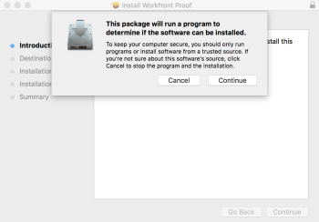

# Install the *Desktop Proofing Viewer* 

<!--
<MadCap:conditionalText data-mc-conditions="QuicksilverOrClassic.Draft mode">
with Automatic Updates
</MadCap:conditionalText>
-->

`<MadCap:conditionalText data-mc-conditions="QuicksilverOrClassic.Draft mode"> with Automatic Updates</MadCap:conditionalText>`

The *Desktop Proofing Viewer*, which is designed primarily for *proofing* interactive content, is an application that must be installed on your local machine.

>[!IMPORTANT]
>
>There are two versions of the *Desktop Proofing Viewer*: one that updates automatically and one that you must update manually. This article contains information about the version that updates automatically.

## System Requirements

This application&nbsp;is supported on the following operating systems:

* Windows 7 and later, 32-bit and 64-bit
* Mac OS X 10.9 and later, 64-bit

## Access requirements

You must have the following access to perform the steps in this article:

<table cellspacing="0"> 
 <col> 
 <col> 
 <tbody> 
  <tr> 
   <td role="rowheader"><em>Adobe Workfront</em> plan*</td> 
   <td> 
Current plan: Pro or Higher
 
or
 
Legacy plan: Select or Premium
 
For more information about proofing access with the different plans, see <a href="../../../administration-and-setup/manage-workfront/configure-proofing/access-to-proofing-functionality.md" class="MCXref xref">Access to proofing functionality in Workfront</a>.
 </td> 
  </tr> 
  <tr> 
   <td role="rowheader"><em>Adobe Workfront</em> license*</td> 
   <td> 
Current plan: <em>Work</em> or <em>Plan</em>
 
Legacy plan: Any (You must have proofing enabled for the user)
 </td> 
  </tr> 
 </tbody> 
</table>

&#42;To find out what plan, role, or *Proof Permission Profile* you have, contact your *Workfront* or *Workfront Proof administrator*.

## Install the *Desktop Proofing Viewer* 

<!--
<MadCap:conditionalText data-mc-conditions="QuicksilverOrClassic.Draft mode">
with automatic updates
</MadCap:conditionalText>
-->

`<MadCap:conditionalText data-mc-conditions="QuicksilverOrClassic.Draft mode"> with automatic updates </MadCap:conditionalText>`on Mac

If your *Adobe Workfront administrator* or *Workfront Proof administrator* has downloaded the app on your workstation and configured the *Desktop Proofing Viewer* as the default viewer for interactive *proofs*, you can finish the installation simply by opening an interactive *proof*from the Documents area.

If this is not the case, you can follow the steps below.

<ol> 
 <li value="1"> Do one of the following to download the app:  
  <ul>
   <li>If you are using the Production environment, click&nbsp;<a href="https://cdn.proofhq.com/nativeviewer/desktop_viewer/Workfront+Proof.pkg">Mac Production Download for the <em>Desktop Proofing Viewer</em>.</a></li>
   <li> If you are using the Preview environment, click&nbsp;<a href="https://cdn.preview.proofhq.com/nativeviewer/desktop_viewer/Workfront+Proof+Preview.pkg">Mac Preview Download for the <em>Desktop Proofing Viewer</em>.</a></li>
  </ul></li> 
 <li value="2">Open the file you have just downloaded to start the installation.</li> 
 <li value="3"> 
On the installation box that appears, click Continue, then click Install. 
 
  
 </li> 
 <li value="4"> Open an interactive <em>proof</em> from the Documents area. </li> 
</ol>

>[!NOTE]
>
>If the *Desktop Proofing Viewer* does not launch when you open an interactive *proof*, this probably means that your *Workfront* or *Workfront Proof administrator* needs to configure the *Desktop Proofing Viewer* as the default viewer for interactive *proofs*, as described in&nbsp; [Install the Desktop Proofing Viewer for your organization](../../../administration-and-setup/manage-workfront/configure-proofing/install-desktop-proofing-viewer-org.md).

## Install the *Desktop Proofing Viewer* 

<!--
<MadCap:conditionalText data-mc-conditions="QuicksilverOrClassic.Draft mode">
with automatic updates
</MadCap:conditionalText>
-->

`<MadCap:conditionalText data-mc-conditions="QuicksilverOrClassic.Draft mode"> with automatic updates</MadCap:conditionalText>` on Windows

If your *Workfront* or *Workfront Proof administrator* has downloaded the app on your workstation and configured the *Desktop Proofing Viewer* as the default viewer for interactive *proofs*, you can finish the installation simply by opening an interactive *proof* from the Documents area.

<ol> 
 <li value="1"> Do one of the following to download the app: 
  <ul>
   <li>In the Production environment, click&nbsp;<a href="https://cdn.proofhq.com/nativeviewer/desktop_viewer/Workfront+Proof.exe">Windows Production download for the <em>Desktop Proofing Viewer</em>.</a></li>
   <li>In the Preview environment, click&nbsp;<a href="https://cdn.preview.proofhq.com/nativeviewer/desktop_viewer/Workfront+Proof+Preview.exe">Windows Preview download for the <em>Desktop Proofing Viewer</em></a>.</li>
  </ul></li> 
 <li value="2">Open the file you have just downloaded to start the installation.</li> 
 <li value="3"> 
In the installation box that appears, open the file you have just downloaded to start the installation. 
 
  
 </li> 
 <li value="4"> 
In the security warning box that appears, click&nbsp;Run. The <em>Desktop Proofing Viewer</em> automatically installs and runs.&nbsp;
 </li> 
 <li value="5">(Conditional) If you install the application using Internet Explorer, refresh the launching page in the browser after the application installs.</li> 
 <li value="6"> Open an interactive <em>proof</em> from the Documents area.</li> 
</ol>

After the *Desktop Proofing Viewer* is installed, all interactive *proofs* open in the *Desktop Proofing Viewer*. If the *Desktop Proofing Viewer* does not launch when you open an interactive *proof*, this probably means that your *Workfront* or *Workfront Proof administrator* needs to configure the *Desktop Proofing Viewer* as the default viewer for interactive *proofs*, as described in&nbsp; [Install the Desktop Proofing Viewer for your organization](../../../administration-and-setup/manage-workfront/configure-proofing/install-desktop-proofing-viewer-org.md).
