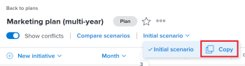
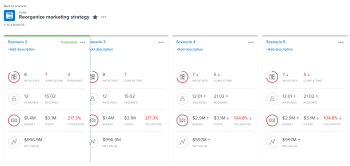

# Create and compare plan scenarios in the *`Adobe Workfront Scenario Planner`* {#create-and-compare-plan-scenarios-in-the-adobe-workfront-scenario-planner}

When you are planning your company's long-term strategy, there is a lot of information that you might not have or think of in the beginning. It takes time and experimentation to arrive at a final strategy that your stakeholders can accept. Conducting a "what if" analysis to create multiple scenarios for your plan can help you accurately predict and evaluate potential circumstances and ultimately develop the best possible plan.

## Access requirements {#access-requirements}

You must have the following:

<table class="TableStyle-TableStyle-HeaderRow" style="mc-table-style: url('../Resources/TableStyles/TableStyle-HeaderRow.css');caption-side: bottom;" cellspacing="15"> 
 <col class="TableStyle-TableStyle-HeaderRow-Column-Column1"> 
 <col class="TableStyle-TableStyle-HeaderRow-Column-Column1"> 
 <tbody> 
  <tr class="TableStyle-TableStyle-HeaderRow-Body-LightGray"> 
   <td class="TableStyle-TableStyle-HeaderRow-BodyE-Column1-LightGray"> 
Adobe Workfront<b> plan*</b> 
 </td> 
   <td class="TableStyle-TableStyle-HeaderRow-BodyD-Column1-LightGray">Business or higher</td> 
  </tr> 
  <tr class="TableStyle-TableStyle-HeaderRow-Body-MediumGray"> 
   <td class="TableStyle-TableStyle-HeaderRow-BodyE-Column1-MediumGray"> 
Adobe Workfront<b> license*</b> 
 </td> 
   <td class="TableStyle-TableStyle-HeaderRow-BodyD-Column1-MediumGray"> 
Review or higher
 </td> 
  </tr> 
  <tr class="TableStyle-TableStyle-HeaderRow-Body-LightGray"> 
   <td class="TableStyle-TableStyle-HeaderRow-BodyE-Column1-LightGray"><b>Product</b> </td> 
   <td class="TableStyle-TableStyle-HeaderRow-BodyD-Column1-LightGray"> 
You must purchase an additional license for the Adobe Workfront Scenario Planner to access functionality described in this article.
 
For information about obtaining the Workfront Scenario Planner, see <a href="access-needed-to-use-sp.md" class="MCXref xref">Access needed to use the Adobe Workfront Scenario Planner</a>. 
 </td> 
  </tr> 
  <tr class="TableStyle-TableStyle-HeaderRow-Body-MediumGray" data-mc-conditions=""> 
   <td class="TableStyle-TableStyle-HeaderRow-BodyE-Column1-MediumGray">Access level configurations* </td> 
   <td class="TableStyle-TableStyle-HeaderRow-BodyD-Column1-MediumGray"> 
Edit access or higher to the Scenario Planner
 
Note: If you still don't have access, ask your Workfront administrator if they set additional restrictions in your access level. For information on how a Workfront administrator can change your access level, see <a href="create-modify-access-levels.md" class="MCXref xref">Create or modify custom access levels</a>.
 </td> 
  </tr> 
  <tr class="TableStyle-TableStyle-HeaderRow-Body-LightGray" data-mc-conditions=""> 
   <td class="TableStyle-TableStyle-HeaderRow-BodyB-Column1-LightGray" style="text-align: left;"> 
Object permissions 
 </td> 
   <td class="TableStyle-TableStyle-HeaderRow-BodyA-Column1-LightGray"> 
Manage permissions to a plan
 
For information on requesting additional access to a plan, see <a href="request-access-to-plan.md" class="MCXref xref">Request access to a plan in the Adobe Workfront Scenario Planner</a>.
 </td> 
  </tr> 
 </tbody> 
</table>

&#42;To find out what plan, license type, or access you have, contact your *`Workfront administrator`*.

## Create scenarios {#create-scenarios}

A scenario is a copy of a plan. You can create as many scenarios as you need. However, we recommend that you keep the number of scenarios to a minimum so that you can easily compare them. 

1. Click the `Main Menu` icon , then click  *`Scenarios`*.

1.  Create a plan. 

   For information about creating plans, see [Create and edit plans in the Adobe Workfront Scenario Planner](create-and-edit-plans.md).

   The first plan you create is automatically saved as the "Initial scenario."

1.  Click the down-pointing arrow next to an existing scenario, then ` click the `Copy` icon.`

   

   This creates a new scenario with the same information as the copied scenario. It is automatically named "Scenario 2" if it's the second scenario of your plan, "Scenario 3" if it's the third, and so on. You cannot rename your scenarios.

1. Update your new scenario in any of the following ways:
    
    
    * Create, update, or delete initiatives
    
    
      >[!TIP] {type="tip"}
      >
      >When you delete an initiative in a scenario it is removed only from the selected scenario, not from all the scenarios.
    
    
      For information about creating initiatives, see [Create and edit initiatives in the Adobe Workfront Scenario Planner](create-and-edit-initiatives.md).
    
    * Update the priorities of your initiatives
    * Adjust people or budget information
    * Review and adjust initiative conflicts in your scenario
    
    
      For information about resolving conflicts, see [Resolve initiative conflicts in the Adobe Workfront Scenario Planner](resolve-conflicts-in-sp.md).
    
    
    
1. Click `Save Plan` to save your changes.

## Compare scenarios {#compare-scenarios}

After creating your scenarios, you can compare them to find the best one for your organization. 

1. Go to the plan for which you want to compare scenarios.
1.  Click `Compare scenarios`. The scenario comparison page displays. 

   All existing scenarios for the plan display in a side-by-side card format. The Initial scenario is always listed first and it is static. 

   

1.  (Optional) Scroll to the right to view all scenario cards. 

   The following information displays on a scenario card:

   >[!NOTE]
   >
   >When information differs between the initial scenario and additional scenarios, an up or down arrow displays next to the value that changed to indicate an increase or decrease in that value, compared to the initial scenario. 
   >
   >
   >   >
   >

   >
   >
   >For example, the budget, the number of job roles, the number of initiatives might change from one scenario to another. 

1.  Click the name of a scenario to access it and make changes to it. 

   For more information, see the [Create scenarios](#create) section in this article.

1.  Click `Add description` to add a description for the scenario 

   Or

   Click the description field to update it, then click anywhere on the screen to save your changes.

1.  (Optional) Click the `More` menu  to `Copy` or `Delete` the scenario. 

   

   When you copy a scenario, it automatically appears on the card page and is renamed according to this pattern: "Scenario <next number in order>." 

1.  (Conditional) If you clicked `Delete`, click `Yes, delete it` to confirm. 

   Deleted scenarios cannot be recovered. 

   For information about deleting scenarios, see [Delete plans in the Adobe Workfront Scenario Planner](delete-plans.md).

1. Click  `Save Plan` to save your scenarios and your plan. 

