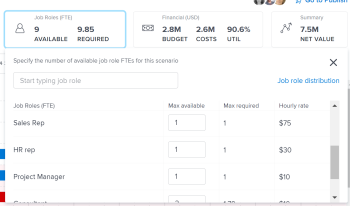

# Create and edit plans in the *`Adobe Workfront Scenario Planner`* {#create-and-edit-plans-in-the-adobe-workfront-scenario-planner}

You can create plans as part of using the *`Workfront Scenario Planner`*, when prioritizing your company's higher-level strategy. For more information about plans, see [Plans overview in the Adobe Workfront Scenario Planner](plans-overview.md). 

## Access requirements {#access-requirements}

You must have the following:

<table class="TableStyle-TableStyle-HeaderRow" style="mc-table-style: url('../Resources/TableStyles/TableStyle-HeaderRow.css');caption-side: bottom;" cellspacing="15"> 
 <col class="TableStyle-TableStyle-HeaderRow-Column-Column1"> 
 <col class="TableStyle-TableStyle-HeaderRow-Column-Column1"> 
 <tbody> 
  <tr class="TableStyle-TableStyle-HeaderRow-Body-LightGray"> 
   <td class="TableStyle-TableStyle-HeaderRow-BodyE-Column1-LightGray" style="font-weight: bold;"> 
Adobe Workfront plan*
 </td> 
   <td class="TableStyle-TableStyle-HeaderRow-BodyD-Column1-LightGray">Business or higher</td> 
  </tr> 
  <tr class="TableStyle-TableStyle-HeaderRow-Body-MediumGray"> 
   <td class="TableStyle-TableStyle-HeaderRow-BodyE-Column1-MediumGray" style="font-weight: bold;"> 
Adobe Workfront license*
 </td> 
   <td class="TableStyle-TableStyle-HeaderRow-BodyD-Column1-MediumGray"> 
Review or higher
 </td> 
  </tr> 
  <tr class="TableStyle-TableStyle-HeaderRow-Body-LightGray"> 
   <td class="TableStyle-TableStyle-HeaderRow-BodyE-Column1-LightGray" style="font-weight: bold;">Product</td> 
   <td class="TableStyle-TableStyle-HeaderRow-BodyD-Column1-LightGray"> 
You must purchase an additional license for the Adobe Workfront Scenario Planner to access functionality described in this article.
 
For information about obtaining the Workfront Scenario Planner, see <a href="access-needed-to-use-sp.md" class="MCXref xref">Access needed to use the Adobe Workfront Scenario Planner</a>. 
 </td> 
  </tr> 
  <tr class="TableStyle-TableStyle-HeaderRow-Body-MediumGray" data-mc-conditions=""> 
   <td class="TableStyle-TableStyle-HeaderRow-BodyE-Column1-MediumGray" style="font-weight: bold;">Access level configurations* </td> 
   <td class="TableStyle-TableStyle-HeaderRow-BodyD-Column1-MediumGray"> 
Edit access or higher to the Scenario Planner
 
Note: If you still don't have access, ask your Workfront administrator if they set additional restrictions in your access level. For information on how a Workfront administrator can change your access level, see <a href="create-modify-access-levels.md" class="MCXref xref">Create or modify custom access levels</a>.
 </td> 
  </tr> 
  <tr class="TableStyle-TableStyle-HeaderRow-Body-LightGray" data-mc-conditions=""> 
   <td class="TableStyle-TableStyle-HeaderRow-BodyB-Column1-LightGray" style="text-align: left;font-weight: bold;"> 
Object permissions 
 </td> 
   <td class="TableStyle-TableStyle-HeaderRow-BodyA-Column1-LightGray"> 
Manage permissions to a plan
 
For information on requesting additional access to a plan, see <a href="request-access-to-plan.md" class="MCXref xref">Request access to a plan in the Adobe Workfront Scenario Planner</a>.
 </td> 
  </tr> 
 </tbody> 
</table>

&#42;To find out what plan, license type, or access you have, contact your *`Workfront administrator`*.

## Create or edit plans {#create-or-edit-plans}

You can create a plan from scratch or you can edit an existing one that was shared with you. 

>[!NOTE]
>
>After you create a plan, you are considered the plan creator and owner. When a user is deactivated, the plan has no owner and is not visible to anyone unless previously shared with a link. 

This article describes how you can create a plan from scratch or you can edit an existing plan.

For all considerations about plans including the information available for a plan, see [Plans overview in the Adobe Workfront Scenario Planner](plans-overview.md). 

For information about deleting plans, see [Delete plans in the Adobe Workfront Scenario Planner](delete-plans.md).

To create or edit a plan: 

1.  Click the `Main Menu` icon , then click  *`Scenarios`*.

   A list of existing plans that you created displays in the *`Workfront Scenario Planner`*. 

1.  `(Optional)` `` `Click the `Filter` icon in the upper-right corner of the plan list, and select from the following:` 

   

1. (Optional) Click the `Search` icon  to type a keyword and quickly locate a plan in the list. 

1.  Click the name of an existing plan to edit it and continue with step 7. 

   Or

   Click `New Plan` in the upper-left corner to create a plan and continue with step 5. 

   

   The New Plan box displays. 

   

1.  (Conditional) When you create a new plan, specify the following information:

<table style="width: 100%;mc-table-style: url('../Resources/TableStyles/TableStyle-List-options-in-steps.css');" class="TableStyle-TableStyle-List-options-in-steps" cellspacing="0"> 
 <col class="TableStyle-TableStyle-List-options-in-steps-Column-Column1"> 
 <col class="TableStyle-TableStyle-List-options-in-steps-Column-Column2"> 
 <tbody> 
  <tr class="TableStyle-TableStyle-List-options-in-steps-Body-LightGray"> 
   <td class="TableStyle-TableStyle-List-options-in-steps-BodyE-Column1-LightGray" role="rowheader">Name</td> 
   <td class="TableStyle-TableStyle-List-options-in-steps-BodyD-Column2-LightGray">Type a name for the plan. This is a required field.</td> 
  </tr> 
  <tr class="TableStyle-TableStyle-List-options-in-steps-Body-MediumGray"> 
   <td class="TableStyle-TableStyle-List-options-in-steps-BodyD-Column1-MediumGray" role="rowheader" colspan="2"> 
Important: You cannot modify the following selections after you create and save the plan. 
 </td> 
  </tr> 
  <tr class="TableStyle-TableStyle-List-options-in-steps-Body-LightGray" data-mc-conditions=""> 
   <td class="TableStyle-TableStyle-List-options-in-steps-BodyE-Column1-LightGray" role="rowheader">FTE (Full Time Equivalent) or Hours  </td> 
   <td class="TableStyle-TableStyle-List-options-in-steps-BodyD-Column2-LightGray"> 
Select one of the following options to indicate how you want to estimate job role information for this plan: 
 
    <ul> 
     <li> 
FTE.&nbsp;This is the default 
 
For all calculations in the Scenario Planner, Workfront uses the following value: 1 FTE = 8 Hours. 
 </li> 
     <li> 
Hours 
 </li> 
    </ul> 
Important: The option you select here determines how job role information displays for the plan, the plan's scenarios, and initiatives.  
 </td> 
  </tr> 
  <tr class="TableStyle-TableStyle-List-options-in-steps-Body-MediumGray"> 
   <td class="TableStyle-TableStyle-List-options-in-steps-BodyE-Column1-MediumGray" role="rowheader">Start date</td> 
   <td class="TableStyle-TableStyle-List-options-in-steps-BodyD-Column2-MediumGray"> 
Select the month and year when you want the plan to start. You can select only months in this field. Workfront assumes that the start date of the plan is the first day of the selected month and the end date is the last day of the end of month in its duration. 
 </td> 
  </tr> 
  <tr class="TableStyle-TableStyle-List-options-in-steps-Body-LightGray"> 
   <td class="TableStyle-TableStyle-List-options-in-steps-BodyB-Column1-LightGray" role="rowheader">Duration</td> 
   <td class="TableStyle-TableStyle-List-options-in-steps-BodyA-Column2-LightGray"> 
From the drop-down menu select from the following durations:
 
    <ul> 
     <li>1 year. This is the default duration. </li> 
     <li>3 years</li> 
     <li> 
5 years
 </li> 
    </ul> </td> 
  </tr> 
 </tbody> 
</table>

1.  (Conditional) Click `Next`. 

   The timeline of the plan displays as the `Initial scenario`. 

   For information about creating additional scenarios, see [Create and compare plan scenarios in the Adobe Workfront Scenario Planner](create-and-compare-scenarios-for-a-plan.md).

1.  (Optional) From the timeline drop-down menu select one of the options in the following table to change the way you view the timeline of the plan.

   

1. (Optional) Scroll from left to right to view the entire duration of the plan. 
1.  (Optional) Click the `Today` indicator line to return to the current day. 

   

1.  Click the `Job Roles` box in the header of the plan to add job roles that will be available to execute the plan.

   The details of the Job&nbsp;Roles box display. 

   >[!TIP] {type="tip"}
   >
   >The role allocation unit (FTE or hours) that  *`Workfront`* uses for this plan displays in parentheses in the title of the box. 

   

1.  Click the `Start typing job role` field and select a role from the list or start typing the name of an `active` job role. 

   All `active` job roles in the system are listed when you click this field. 

   This adds the job role to the Job&nbsp;Roles column. 

1.  Update or review the following information for the job role:&nbsp;

<table style="width: 100%;mc-table-style: url('../Resources/TableStyles/TableStyle-List-options-in-steps.css');" class="TableStyle-TableStyle-List-options-in-steps" cellspacing="0"> 
 <col class="TableStyle-TableStyle-List-options-in-steps-Column-Column1"> 
 <col class="TableStyle-TableStyle-List-options-in-steps-Column-Column2"> 
 <tbody> 
  <tr class="TableStyle-TableStyle-List-options-in-steps-Body-LightGray"> 
   <td class="TableStyle-TableStyle-List-options-in-steps-BodyE-Column1-LightGray" role="rowheader"> 
Max available (for FTE) 
 
or 
 
Total available (for hours)  
 </td> 
   <td class="TableStyle-TableStyle-List-options-in-steps-BodyD-Column2-LightGray"> 
Depending on whether you selected to use hours or FTE for your plan, type the number of job role FTEs or hours that are available to execute work on the plan in the following fields: 
 
    <ul> 
     <li> 
Total available (for hours): Indicate the total number of hours for all months during the duration of the scenario. By default, Workfront divides the Total available number equally across all months in the duration of the scenario. 
 
Example: </b>"><b>Example: </b>If you enter 1200 hours for a Designer, this means the Designer is available for 100 hours for each month during the duration of the plan, when the plan Duration is 1 year. 
 </li> 
     <li> 
Max available (for FTE): Indicate the number of FTEs that the job role is available for each month during the duration of the plan. By default, Workfront assigns the Max available number to each month in the duration of the scenario. 
 
Example: </b>"><b>Example: </b>If you enter 1 FTE for a Consultant, this means the Consultant is available for 1 FTE for each month during the duration of the plan. 
 
You can enter a number lower than 1 FTE. 
 
Example: </b>"><b>Example: </b>A 0.5 Consultant job role would mean that a consultant would dedicate half of their FTE (typically, 4 hours, where 8 hours is 1 FTE) to working on this plan. For all calculations in the Scenario Planner, Workfront uses the following value: 1 FTE = 8 Hours. 
 </li> 
    </ul> </td> 
  </tr> 
  <tr class="TableStyle-TableStyle-List-options-in-steps-Body-MediumGray"> 
   <td class="TableStyle-TableStyle-List-options-in-steps-BodyE-Column1-MediumGray" role="rowheader"> 
Max required (for FTE)
 
or 
 
Total required (for hours) 
 </td> 
   <td class="TableStyle-TableStyle-List-options-in-steps-BodyD-Column2-MediumGray"> 
Depending on whether you selected to use hours or FTE for your plan, review the number of job role FTEs or hours that are required to complete the initiatives in the scenario. Review the following fields:
 
    <ul> 
     <li> 
Total required (for hours): The total number of hours required for all months during the duration of the plan.
 </li> 
     <li> 
Max required (for FTE): The maximum number of FTEs required for any of the months during the duration of the plan. 
 </li> 
    </ul> 
Tip: The maximum number of FTEs or the total number of hours required for that job role displays after you start adding initiatives.&nbsp;For information about adding initiatives to a plan, see <a href="create-and-edit-initiatives.md" class="MCXref xref">Create and edit initiatives in the Adobe Workfront Scenario Planner</a>.
 </td> 
  </tr> 
  <tr class="TableStyle-TableStyle-List-options-in-steps-Body-LightGray"> 
   <td class="TableStyle-TableStyle-List-options-in-steps-BodyB-Column1-LightGray" role="rowheader">Hourly rate</td> 
   <td class="TableStyle-TableStyle-List-options-in-steps-BodyA-Column2-LightGray"> 
This is the Cost Hour rate for the job role. The hourly rate displays in the currency of your system. For information about setting up Exchange Rates for your system, see <a href="set-up-exchange-rates.md" class="MCXref xref">Set up exchange rates</a>.
 </td> 
  </tr> 
 </tbody> 
</table>

1.  (Optional) Hover over the name of a job role or click tab after updating the role information, then click the `trash can icon`  to remove it from the plan. 
1.  Click `Job role distribution`. 

   The job role distribution panel displays for all months in the duration of the scenario. 

   

1.  Type the name of a job role to add it to the plan in the `Start typing job role field`, then click&nbsp;Enter when it appears on the list. This adds the job role to the Job&nbsp;Roles column. 
1.  Update or review the following information for each month of the scenario: 

<table style="width: 100%;mc-table-style: url('../Resources/TableStyles/TableStyle-List-options-in-steps.css');" class="TableStyle-TableStyle-List-options-in-steps" cellspacing="0"> 
 <col class="TableStyle-TableStyle-List-options-in-steps-Column-Column1"> 
 <col class="TableStyle-TableStyle-List-options-in-steps-Column-Column2"> 
 <tbody> 
  <tr class="TableStyle-TableStyle-List-options-in-steps-Body-LightGray"> 
   <td class="TableStyle-TableStyle-List-options-in-steps-BodyE-Column1-LightGray" role="rowheader">Job&nbsp;Roles (FTE or Hours)</td> 
   <td class="TableStyle-TableStyle-List-options-in-steps-BodyD-Column2-LightGray">Both the job role available for the scenario and those required for the initiatives on the scenario display in the job role distribution panel. There is an indication whether job role estimations are in FTEs or hours in the column header. </td> 
  </tr> 
  <tr class="TableStyle-TableStyle-List-options-in-steps-Body-MediumGray"> 
   <td class="TableStyle-TableStyle-List-options-in-steps-BodyE-Column1-MediumGray" role="rowheader"> 
Available (max &lt;number of FTEs&gt;) 
 
    
 
     
or
 
     
Available (total &lt;number of hours&gt;) 
 
    
 </td> 
   <td class="TableStyle-TableStyle-List-options-in-steps-BodyD-Column2-MediumGray"> 
Depending on whether you selected to use hours or FTE for your plan, review or update the monthly number of job role FTEs or hours available for the scenario in the following fields:
 
    <ul> 
     <li> 
Available (max &lt;number of FTEs&gt;):&nbsp;The number in parentheses displays the maximum number of roles available for any one of the months for the scenario. Review or update the number of FTEs for each month of the scenario. Changing the monthly allocation might update the number of FTEs in the parentheses. 
 </li> 
     <li> 
Available (total &lt;number of hours&gt;):&nbsp;The number in parentheses displays the total number of hours available for all the months in the scenario. Review or update the number of hours for each month of the scenario. Changing the monthly allocation updates the number of hours in the parentheses.  
 </li> 
    </ul> 
Manually updating the monthly job role allocations is another way of resolving job role conflicts between initiatives on the scenario. 
 
    
Tip: </b>">
     <b>Tip: </b> 
     
To update the monthly role availability for several months, type the number of hours or FTEs in the Available field of any month, then drag the corner of the field over the adjacent months to copy the same value for each month. Drop it to update all months.  
 
     
  
 
    
 </td> 
  </tr> 
  <tr class="TableStyle-TableStyle-List-options-in-steps-Body-LightGray"> 
   <td class="TableStyle-TableStyle-List-options-in-steps-BodyE-Column1-LightGray" role="rowheader"> 
Required (max &lt;number&gt;)
 
    
 
     
or
 
     
Required (total &lt;number&gt;)
 
    
 </td> 
   <td class="TableStyle-TableStyle-List-options-in-steps-BodyD-Column2-LightGray"> 
Depending on whether you selected to use hours or FTE for your plan, review the monthly number of job role FTEs or hours required for the scenario in the following fields:&nbsp;
 
    <ul> 
     <li> 
Required (max &lt;number of FTEs&gt;):&nbsp;The number in parentheses displays the maximum number of roles required for any one of the months for the scenario. 
 </li> 
     <li> 
Required (total &lt;number of hours&gt;):&nbsp;The number in parentheses displays the total number of hours required for all the months in the scenario.  
 </li> 
    </ul> 
Tip: You cannot modify the Required number of FTEs or hours for the job role. This number populates for the scenario after you start adding initiatives and their job role requirements. 
 </td> 
  </tr> 
  <tr class="TableStyle-TableStyle-List-options-in-steps-Body-MediumGray"> 
   <td class="TableStyle-TableStyle-List-options-in-steps-BodyE-Column1-MediumGray" role="rowheader">Difference</td> 
   <td class="TableStyle-TableStyle-List-options-in-steps-BodyD-Column2-MediumGray"> 
    
 
     
The monthly difference between the amounts of required and available job roles for the scenario. Workfront calculates the difference for each job role for each month using the following formula:
 
     
<code>Monthly role difference = Monthly required roles - Monthly available roles</code> (in FTEs or hours) 
 
     
Tip: When the difference displays a negative number, the scenario requires more job roles than the plan has available. Your resources are overallocated. 
 
    
 </td> 
  </tr> 
  <tr class="TableStyle-TableStyle-List-options-in-steps-Body-LightGray"> 
   <td class="TableStyle-TableStyle-List-options-in-steps-BodyB-Column1-LightGray" role="rowheader">Utilization %</td> 
   <td class="TableStyle-TableStyle-List-options-in-steps-BodyA-Column2-LightGray"> 
    
 
     
The percentage of utilization displays how many of the job roles available are actually used (or required) on the initiatives in the scenario. 
 
     
Workfront calculates the utilization per job role per month using the following formula: 
 
     
<code>Monthly role utilization % = Monthly required roles / Monthly available roles * 100</code> 
 
     
The utilization percentage might display in the following colors, depending on the allocation of your resources:
 
     <ul> 
      <li> 
<b>Green</b>: The available and required numbers of job roles match. The resources are fully allocated and the utilization percentage is 100%. 
 </li> 
      <li> 
<b>Red</b>: There are more required job roles than the plan has available. The resources are overallocated and the utilization percentage is higher than 100%.
 </li> 
      <li> 
<b>Blue</b>: There are more available job roles than they are required. The resources are underallocated and the utilization percentage is lower than 100%. 
 </li> 
     </ul> 
    
 
  
 </td> 
  </tr> 
 </tbody> 
</table>

1.  Click  `Apply` to save the monthly job role distribution

   Or

   Click `Cancel` to close the job role distribution list and return to the scenario. 

1.  Click the `Financial` box in the header of the plan, to add the budget for this plan. 

   The details of the Financial box display. 

   >[!TIP] {type="tip"}
   >
   >The currency that  *`Workfront`* uses for this plan displays in parentheses in the title of the box. 

1.  Specify the `Yearly budget`.

   >[!NOTE]
   >
   >If your plan spans multiple years, you must specify a budget amount for each year. 

1.  Press Enter to save the yearly budget, then Tab to move to the following year. 

   The yearly budget is automatically distributed equally for each month of the selected year. 

1.  Click `Advanced` to see the monthly budget distribution. The yearly and monthly budgets are always rounded numbers. When the budget amount cannot be distributed equally to all the months within a year because of decimals a `Remaining` indicator displays under the yearly budget distribution. 

   

1.  Manually adjust the monthly budgets to eliminate the exceeding amounts. 

   When the total of all monthly budget amounts is larger than the yearly budget, an `Exceeding` warning indicator displays under the yearly budget distribution. Manually adjust the monthly budget amounts until they are equal or lower to the available budget for the plan. 

   

1. Disable the `Include people costs` setting to exclude costs associated with job roles from counting towards the overall cost of the plan. Fixed Costs are always counting towards the overall cost of the plan. This setting is enabled by default and affects all scenarios on the plan. 
1.  Click anywhere outside the Financial box to close it. The information you entered is automatically saved.

   You can now start creating the initiatives on the plan, and adding scenarios. 

1.  (Recommended) Click `New initiative` to add a new initiative. 

   For information about adding initiatives, see the article [Create and edit initiatives in the Adobe Workfront Scenario Planner](create-and-edit-initiatives.md).

1.  (Optional) Make a copy of the existing scenario to create a new scenario of the same plan. For more information about creating and working with multiple scenarios, see [Create and compare plan scenarios in the Adobe Workfront Scenario Planner](create-and-compare-scenarios-for-a-plan.md). 
1.  Click `Save Plan`. 

   Your plan is created or updated.

1. (Optional) Click the `Favorites icon`  to the right of the plan name to add the plan to your list of Favorites. 

1. (Optional) Copy the URL of the plan and send it to any other user that might need to review or update it. They must have at least View access in their access level to be able to view the plan. They must have Edit access to edit it. If they must review financial information on the plan, like budgets, costs, and job role rates information, they must also have access to Financial Data in their Access level. For information about the access needed for the *`Scenario Planner`*, see [Access needed to use the Adobe Workfront Scenario Planner](access-needed-to-use-sp.md). 

