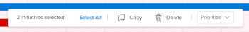

# Delete initiatives in the *Adobe Workfront Scenario Planner*

You can delete initiatives on a plan that you created or on a plan that someone shared with you. You cannot recover initiatives that you deleted.

## Access requirements

<table cellspacing="15"> 
 <col> 
 <col> 
 <tbody> 
  <tr> 
   <td> 
<em>Adobe Workfront</em><b> plan*</b> 
 </td> 
   <td><em>Business</em> or higher</td> 
  </tr> 
  <tr> 
   <td> 
<em>Adobe Workfront</em><b> license*</b> 
 </td> 
   <td> 
<em>Review</em> or higher
 </td> 
  </tr> 
  <tr> 
   <td><b>Product</b> </td> 
   <td> 
You must purchase an additional license for the <em>Adobe Workfront Scenario Planner</em> to access functionality described in this article. 
 
For information about obtaining the <em>Workfront Scenario Planner</em>, see <a href="../scenario-planner/access-needed-to-use-sp.md" class="MCXref xref">Access needed to use the Adobe Workfront Scenario Planner</a>. 
 </td> 
  </tr> <draft-comment>
   <tr data-mc-conditions=""> 
    <td>Access level configurations* </td> 
    <td> 
Edit access or higher to the <em>Scenario Planner</em>
 
Note: If you still don't have access, ask your <em>Workfront administrator</em> if they set additional restrictions in your access level. For information on how a <em>Workfront administrator</em> can change your access level, see <a href="../administration-and-setup/add-users/configure-and-grant-access/create-modify-access-levels.md" class="MCXref xref">Create or modify custom access levels</a>.
 </td> 
   </tr>
  </draft-comment>
  <tr data-mc-conditions=""> 
   <td>Access level configurations* </td> 
   <td> 
Edit access or higher to the <em>Scenario Planner</em>
 
Note: If you still don't have access, ask your <em>Workfront administrator</em> if they set additional restrictions in your access level. For information on how a <em>Workfront administrator</em> can change your access level, see <a href="../administration-and-setup/add-users/configure-and-grant-access/create-modify-access-levels.md" class="MCXref xref">Create or modify custom access levels</a>.
 </td> 
  </tr> <draft-comment>
   <tr data-mc-conditions=""> 
    <td> 
Object permissions 
 </td> 
    <td> 
Manage permissions to a plan
 
For information on requesting additional access to a plan, see <a href="../scenario-planner/request-access-to-plan.md" class="MCXref xref">Request access to a plan in the Adobe Workfront Scenario Planner</a>.
 </td> 
   </tr>
  </draft-comment>
  <tr data-mc-conditions=""> 
   <td> 
Object permissions 
 </td> 
   <td> 
Manage permissions to a plan
 
For information on requesting additional access to a plan, see <a href="../scenario-planner/request-access-to-plan.md" class="MCXref xref">Request access to a plan in the Adobe Workfront Scenario Planner</a>.
 </td> 
  </tr> 
 </tbody> 
</table>

## Delete initiatives

Consider the following when deleting initiatives:

* Deleting an initiative removes the required amount of job roles and the cost information associated with the initiative from the plan.
* Deleting an initiative that was created by importing a project does not delete the project associated with the initiative.
* `Deleting an initiative that has been published to a project at least once results in the following:`

  * `The initiative is deleted from the scenario but the *Scenario Planner* area remains in the Project Details section.` 
  * If the initiative you delete is the only published initiative on the scenario, the indicator that the plan has been published is also removed.

    For information about publishing initiatives to projects, see [Update or create projects by publishing initiatives in the Adobe Workfront Scenario Planner](../scenario-planner/publish-scenarios-update-projects.md).

    For information about creating initiatives by importing projects, see [Import projects to plans in the Adobe Workfront Scenario Planner](../scenario-planner/import-projects-to-plans.md) .

You can delete one initiative at a time, `or you can delete multiple initiatives in bulk.`

* [Delete one initiative](#delete) 
* [Delete initiatives in bulk](#delete3)

### Delete one initiative

<ol> 
 <li value="1"> 
 
Click the Main Menu icon , then click&nbsp;<em>Scenarios</em>.
 
 
A list of plans displays. 
 </li> 
 <li value="2">Click the name of a plan to open it, then locate the initiative you want to delete.</li> 
 <li value="3"> 
Do one of the following:
 
  <ul> 
   <li> 
Click the More menu  to the right of the initiative name, then click Delete > Yes, delete it. 
 </li> 
  </ul> 
  <ul> 
   <li> 
Select the box to the left of the initiative, then click Delete on the floating menu that appears at the bottom of the plan, then click Yes, delete it. 
 </li> 
  </ul> 
The initiative and its job role and cost information are deleted from the plan.
 </li> 
 <li value="4">Click Save Plan to save your changes. </li> 
</ol>

### Delete initiatives in bulk

<ol> 
 <li value="1"> 
Click the Main Menu icon , then click&nbsp;<em>Scenarios</em>.
 
A list of plans displays. 
 </li> 
 <li value="2">Click the name of a plan to open it, then locate the initiative you want to delete.</li> 
 <li value="3"> 
Select the boxes to the left of the initiatives that you want to delete, then click Delete from the menu that appears at the bottom of the plan, then click Yes, delete them. 
 
  
 
The initiatives and their job role and cost information are deleted from the plan.
 </li> 
 <li value="4">Click Save Plan to save your changes. </li> 
</ol>

