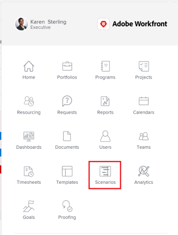

# Get started with the Adobe Workfront Scenario Planner

This is available only in the new Adobe Workfront experience and requires an additional license. For information about the Workfront Scenario Planner, see [The Adobe Workfront Scenario Planner overview](../scenario-planner/scenario-planner-overview.md). 

You can use the Adobe Workfront Scenario Planner to build enterprise-level plans that outline your company's overall strategic outcomes. You can define several initiatives for a plan and place them in various scenarios to find the optimal solution for executing the plan.

For a high-level overview of the Workfront Scenario Planner, see [The Adobe Workfront Scenario Planner overview](../scenario-planner/scenario-planner-overview.md).

## Approaches for using the Workfront Scenario Planner

There are two approaches to using the Workfront Scenario Planner:

* `A top-down approach`: As an executive, you can use the Workfront Scenario Planner to plan fluidly, review scenarios for your high-level initiatives, and gather feedback for the future in a cohesive way. Here, you can define the number of resources and the budget that your organization needs to deliver the strategic initiatives for your company. 
* `A bottom-up approach`: As a work manager, you can use the Workfront Scenario Planner to define departmental outcomes for the business. Here, you can start by sketching out the required departmental initiatives to achieve those outcomes while specifying the resources and the budget needed to achieve them. Regardless of what your organization manager's budget might be, you can communicate to them what your departmental needs are by defining the cost and resources needed for each initiative. After you complete this planning, the organization manager will evaluate all initiatives, create and inspect multiple scenarios and decide what would fit in the budget and what you must re-plan.

## Benefits of using the Workfront Scenario Planner

As a business manager, you need to plan the right set of initiatives at a higher scale, using a larger focus than the every-day tasks allow you to do. You need to indicate the value that these high-level initiatives bring to the organization, as well as prioritize your organization-wide resources for the right initiatives.

You must quickly and easily develop plausible scenarios and then determine the best path forward to help ensure you meet your business needs.

The following are benefits of the Workfront Scenario Planner to help you achieve this outcome:

* Free-form and ad-hoc: You can quickly create scenarios that define your organization's major initiatives with minimal, high-level input for resources needed.
* Visual and simple: You can quickly build a visual scheme of the plan you intend for your organization to follow that is simple and informative.
* Highlight dependencies: Surface the most important information, identify necessary changes and see suggestions for what staffing or monetary changes you might need to make to accomplish your strategy. 
* Determine the best path forward: Save and compare scenarios, facilitate collaboration and consensus, and commit your plan for execution. 
* Connect your strategy with your work: Importing projects as new initiatives for your plans.

## Locate the Workfront Scenario Planner in Workfront

<ol> 
 <li value="1"> 
 Click the Main Menu icon  in the upper-right corner, then click Scenarios. 
 
  
 
The Workfront Scenario Planner displays. 
 <note type="important">
   The Workfront Scenario Planner contains the plans you created. If you need to see another user's plan, they must share the URL of that plan with you. 
  </note> </li> 
 <li value="2"> 
(Optional) Click the name of a plan to open it and see the details.
 
Or
 
Click New Plan to add a new plan. 
 
For information about creating plans, see <a href="../scenario-planner/create-and-edit-plans.md" class="MCXref xref">Create and edit plans in the Adobe Workfront Scenario Planner</a>. 
 </li> 
</ol>

## Workfront Scenario Planner objects

The table below describes the Workfront Scenario Planner objects. `Your Workfront administrator can customize their name in your system by modifying a layout template and assigning it to users, teams, or groups. For information about customizing object names using a layout template, see` [Customize user interface terminology using a layout template](../administration-and-setup/customize-workfront/use-layout-templates/customize-terminology.md).

For information about Workfront objects, see [Understand objects in Adobe Workfront](../workfront-basics/navigate-workfront/workfront-navigation/understand-objects.md). 

| Plan |A parent object where you can roadmap your organization’s high-level, upcoming strategy for the next one, three, or five years. You can set the budget and the number of people that might be available in carrying out the plan to completion. |
|---|---|
| Scenario |A version of the same plan. You can create multiple copies or versions of the same plan to plot your initiatives differently in each one and see what makes the best sense for the plan that will become final.  |
| Initiative |A child object for a plan that defines, still at a high level, the actual work that needs to get done to achieve the strategy defined by the plan. You can add initiatives manually, or you can import them from existing projects. You can add the possible cost and number of people required to complete the initiatives. After you define all your initiatives, and associate them with cost and number of resources, should conflicts arise between the initiatives and the budget available for the plan, you can re-plan them to better align with each other and the plan. |

