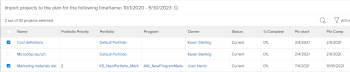
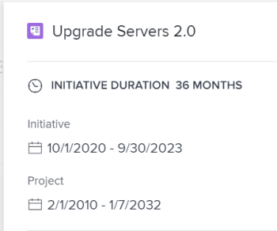
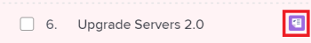

# Import projects to plans in the Adobe Workfront Scenario Planner

You can import existing projects into a plan. The imported projects are converted to initiatives and you can manage them within the plan as you would manage a new initiative. The original project remains linked to the new initiative.

## Access requirements

You must have the following:

<table cellspacing="15"> 
 <col> 
 <col> 
 <tbody> 
  <tr> 
   <td> 
Adobe Workfront<b> plan*</b> 
 </td> 
   <td>Business or higher</td> 
  </tr> 
  <tr> 
   <td> 
Adobe Workfront<b> license*</b> 
 </td> 
   <td> 
Review or higher
 </td> 
  </tr> 
  <tr> 
   <td><b>Product</b> </td> 
   <td> 
You must purchase an additional license for the Adobe Workfront Scenario Planner to access functionality described in this article.
 
For information about obtaining the Workfront Scenario Planner, see <a href="../scenario-planner/access-needed-to-use-sp.md" class="MCXref xref">Access needed to use the Adobe Workfront Scenario Planner</a>. 
 </td> 
  </tr> Access level configurations* Edit access or higher to the Scenario Planner Note: If you still don't have access, ask your Workfront administrator if they set additional restrictions in your access level. For information on how a Workfront administrator can change your access level, see Create or modify custom access levels. Object permissions Manage permissions to a plan For information on requesting additional access to a plan, see Request access to a plan in the Adobe Workfront Scenario Planner. 
 </tbody> 
</table>

&#42;To find out what plan, license type, or access you have, contact your Workfront administrator.

## Considerations about importing projects into plans as new initiatives

* You must create projects before you can import them into a plan as new initiatives. 
* You must have at least View permissions to the projects to be able to import them into a plan as new initiative. 
* You can import the same project into multiple plans. 
* The projects you want to import must have dates included in the time frame of your plan. You cannot import projects with a Planned Completion Date earlier than the start of the plan or a Planned Start Date later than the end of the plan. 
* You cannot import more than 100 projects at a time. 
* Some project information is also imported into the plan and becomes initiative information. For information about what project information is imported into the plan and becomes initiative information, see the [Project information imported into the plan](#project) section in this article. 
* Changes that occur on the linked projects do not affect the initiatives on the plan. 
* Changes that occur on the initiatives on the plan do not automatically affect the linked projects `Initiative changes affect the linked projects only when you publish the initiative from the plan.` `For information about how publishing initiatives affects the linked projects, see` ` [Update or create projects by publishing initiatives in the Adobe Workfront Scenario Planner](../scenario-planner/publish-scenarios-update-projects.md)`. 

* Deleting an initiative that has been created by importing a project does not delete the project. 
* Deleting a project linked to an initiative does not delete the initiative.

## Project information imported into the plan

When you import a project into a plan some project information is also imported into the plan and it becomes initiative information. The following table shows what project information becomes initiative information when you import a project into a plan: 

<table cellspacing="3"> 
 <col> 
 <col> 
 <tbody> 
  <tr> 
   <td>Project information</td> 
   <td>Initiative information </td> 
  </tr> 
  <tr> 
   <td>Project&nbsp;Name</td> 
   <td>Initiative name</td> 
  </tr> 
  <tr> 
   <td>Project Planned Dates</td> 
   <td> 
Initiative start and end months.
 
If a project starts or ends in the middle of a month, the imported dates are extended to cover a full month in the plan.&nbsp;For example, if the Project Planned Dates are March 20 - May 5, 2020, then the dates of the imported initiative are March - May, 2020.
 
If the Planned Start or Completion Date is beyond the duration of the plan, there is a visual indication that the imported initiative starts before or ends after the plan. 
 </td> 
  </tr> 
  <tr> 
   <td>Job roles assigned to tasks and issues</td> 
   <td> 
Initiative Job&nbsp;Roles. 
 
Note:  
If a user changes roles during the life of the project, the roles that are imported depend on the status of the assignment when you import the project. The following scenarios exist:
 
     <ul> 
      <li> 
If a user assigned to a task or an issue changed their role after they marked their assignment as Done, Workfront imports to the initiative the role the user fulfilled before they marked the assignment as Done.
 </li> 
      <li> 
If a user assigned to a task or issue changed the role during the life of the project but their assignment on the task or issue is not marked as Done when you import the project, Workfront imports only the current role of the assigned user. 
 </li> 
     </ul> 
For information about the status of an assignment, see "Assignment Status" in <a href="../workfront-basics/navigate-workfront/workfront-navigation/workfront-terminology-glossary.md" class="MCXref xref">Glossary of Adobe Workfront terminology</a>. 
 
 </td> 
  </tr> 
  <tr> 
   <td>Project Planned Hours associated with job roles assigned to tasks or issues</td> 
   <td> 
Depending on whether the plan is set up to use FTEs or hours, the Planned Hours from the tasks on the project become either Required FTEs or Required hours on the plan. 
 
For information about setting up a plan to use&nbsp;FTEs or hours, see <a href="../scenario-planner/create-and-edit-plans.md" class="MCXref xref">Create and edit plans in the Adobe Workfront Scenario Planner</a>. 
 
Consider the following:
 
    <ul> 
     <li> 
Workfront uses the job roles assigned to tasks and issues or the job roles that the users assigned to tasks or issues are associated with on the project and transfers them to the new initiative as Required Job&nbsp;Roles. 
 </li> 
     <li> 
When the plan is set up to use FTEs, the Planned Hours associated with the job roles on the tasks and issues of the project are first converted to FTE.&nbsp;This FTE is then assigned to the initiative’s job role. Planned Hours are equally distributed in Workfront. If a task or an issue spans multiple months, the amount of Planned Hours for each month in the duration of the initiative is converted in monthly FTE and transferred to each month of the initiative. 
 
Example: </b>"><b>Example: </b>For example, if a task is assigned to a job role for 80 Planned Hours in September, then the imported job role displays 0.5 FTE for the initiative in September.  
 </li> 
     <li> 
Workfront calculates the FTE of the Required Job&nbsp;roles associated with the initiative using the following formula:
 
<code>Required Job Role FTE (initiative) = Job Role assignment Planned Hours (</code><code>from tasks and issues on the project)/ 160</code> 
 
Tip: The Scenario Planner assumes that there are 160 working hours in a month.
 
For example, if a project has a Duration of 1200 minutes and a job role on the project is associated with 600 minutes of Planned Hours, their FTE is 0.5. When importing the project, the Required Job Role FTE on the newly created initiative is 0.5 for each month of the initiative. 
 </li> 
     <li>When a job role is assigned to a task on the project with zero Planned Hours, the Required FTE for the job role of the initiative is zero by default. </li> 
     <li>When a job role is assigned to a task on the project with a zero Duration, the Required FTE&nbsp;or hours for the job role of the initiative is zero by default, even if the task has Planned Hours. </li> 
    </ul> </td> 
  </tr> 
 </tbody> 
</table>

&nbsp;

## Import projects into a plan

>[!IMPORTANT]
>
>After importing projects into a plan, they become initiatives on the plan. Although the two items are linked, they exist as independent entities and do not automatically affect each other when they are updated. 
>
>The following occur:
>
>* Changes to the project never affect the initiative after you import the project into the plan.These changes include changes to the job role allocations. 
>* Changes to the initiative affect the information in the Scenario Planner area on the project only when you publish the initiative to the corresponding project. Otherwise, they do not affect the Planned Hours information for the tasks and issues of the project. 
>
>  `For information about how publishing initiatives affects the linked projects, see` ` [Update or create projects by publishing initiatives in the Adobe Workfront Scenario Planner](../scenario-planner/publish-scenarios-update-projects.md)`. 
>

<ol> 
 <li value="1">Click the Main&nbsp;Menu  in the upper-right corner of Workfront, then click&nbsp;Scenarios to access the Scenario Planner. </li> 
 <li value="2">Click the name of a plan where you want to import projects. </li> 
 <li value="3"> 
Click New Initiative, then click Import Projects. 
 
The Import Projects box displays. Projects that have dates included in the time frame of your plan display in a list.
 
  
 <note type="tip">
   Projects in any status display in the list.
  </note> </li> 
 <li value="4">(Optional)&nbsp;Click the Filter icon and select an available filter from the list to reduce the amount of projects on your list. By default, the list of projects is filtered by the user's currently selected project filter in a list of projects. </li> 
 <li value="5">(Optional) Click the Search icon  and add a keyword displayed on any field on the screen. The items containing the search word display in the list automatically and all items are hidden. </li> 
 <li value="6">(Conditional)&nbsp;Click the X icon to remove the search and display all projects. </li> 
 <li value="7"> 
Select up to 100 projects and click Import. 
 
The projects are imported as new initiatives. 
 
Notice the following:
 
  <ul> 
   <li>A project icon  displays to the right of the initiative name.</li> 
   <li> 
If the project timeline exceeds the duration of the plan, the bar of the initiative ends with a pointed margin to the left (when the Start Date is earlier than the plan's date) or to the right (when the End Date is later than the plan's date).
 
  
 </li> 
   <li> 
The number of months and job roles have been updated to match those of the project. 
 </li> 
  </ul> <note type="tip">
   The costs associated with the job roles update at the initiative level and are not imported from the project. 
  </note> </li> 
 <li value="8"> 
Click the bar representing the new initiative to open the initiative details panel to the right. 
 
  
 
In the Initiative Duration area review the following information: 
 
  <table cellspacing="0"> 
   <col> 
   <col> 
   <tbody> 
    <tr> 
     <td role="rowheader">Initiative Duration</td> 
     <td>This is the duration of the initiative in months. </td> 
    </tr> 
    <tr> 
     <td role="rowheader">Initiative</td> 
     <td>The Start and End dates of the initiative. </td> 
    </tr> 
    <tr> 
     <td role="rowheader">Project</td> 
     <td> 
The Planned Start and Completion dates of the linked project.
 <note type="tip">
       If the Project information is missing, the project was deleted.
      </note> </td> 
    </tr> 
   </tbody> 
  </table> </li> 
 <li value="9">Edit the name of the initiative. By default, it matches the name of the project. </li> 
 <li value="10">(Optional) Do one of the following:
  <ul>
   <li>Update job roles in the Required Job Roles section</li>
   <li>Update the Fixed Costs in the Costs section</li>
   <li>Click Update available job roles or Update available budget to resolve conflicts between the new initiative and other initiatives on the plan.</li>
  </ul></li> 
 <li value="11">(Conditional) Click Apply to save changes to your initiative. </li> 
 <li value="12">Click&nbsp;Save Plan to save the changes to your plan. </li> 
 <li value="13">(Optional) To update the changes you make to the initiative back to the project it was imported from, publish the project from the plan.&nbsp;For information about publishing plans, see <a href="../scenario-planner/publish-scenarios-update-projects.md" class="MCXref xref">Update or create projects by publishing initiatives in the Adobe Workfront Scenario Planner</a>. </li> 
 <li value="14"> 
(Optional) Click the project icon to access the linked project. 
 
  
 </li> 
</ol>

