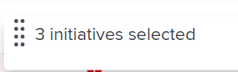
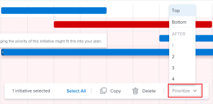

# Update initiative priorities in the *Adobe Workfront Scenario Planner*

Prioritizing initiatives is important because initiatives receive job roles and budget resources from the plan in the order they are listed on the plan.

You can prioritize initiatives on a plan that you created or on a plan that someone shared with you.

For information about creating plans, see [Create and edit plans in the Adobe Workfront Scenario Planner](../scenario-planner/create-and-edit-plans.md).

For information about creating initiatives, see [Create and edit initiatives in the Adobe Workfront Scenario Planner](../scenario-planner/create-and-edit-initiatives.md).

##  Access requirements

<table cellspacing="15"> 
 <col> 
 <col> 
 <tbody> 
  <tr> 
   <td> 
<em>Adobe Workfront</em><b> plan*</b> 
 </td> 
   <td><em>Business</em> or higher</td> 
  </tr> 
  <tr> 
   <td> 
<em>Adobe Workfront</em><b> license*</b> 
 </td> 
   <td> 
<em>Review</em> or higher
 </td> 
  </tr> 
  <tr> 
   <td><b>Product</b> </td> 
   <td> 
You must purchase an additional license for the <em>Adobe Workfront Scenario Planner</em> to access functionality described in this article.
 
For information about obtaining the <em>Workfront Scenario Planner</em>, see <a href="../scenario-planner/access-needed-to-use-sp.md" class="MCXref xref">Access needed to use the Adobe Workfront Scenario Planner</a>. 
 </td> 
  </tr> <draft-comment>
   <tr data-mc-conditions=""> 
    <td>Access level configurations* </td> 
    <td> 
Edit access or higher to the <em>Scenario Planner</em>
 
Note: If you still don't have access, ask your <em>Workfront administrator</em> if they set additional restrictions in your access level. For information on how a <em>Workfront administrator</em> can change your access level, see <a href="../administration-and-setup/add-users/configure-and-grant-access/create-modify-access-levels.md" class="MCXref xref">Create or modify custom access levels</a>.
 </td> 
   </tr>
  </draft-comment>
  <tr data-mc-conditions=""> 
   <td>Access level configurations* </td> 
   <td> 
Edit access or higher to the <em>Scenario Planner</em>
 
Note: If you still don't have access, ask your <em>Workfront administrator</em> if they set additional restrictions in your access level. For information on how a <em>Workfront administrator</em> can change your access level, see <a href="../administration-and-setup/add-users/configure-and-grant-access/create-modify-access-levels.md" class="MCXref xref">Create or modify custom access levels</a>.
 </td> 
  </tr> <draft-comment>
   <tr data-mc-conditions=""> 
    <td> 
Object permissions 
 </td> 
    <td> 
Manage permissions to a plan
 
For information on requesting additional access to a plan, see <a href="../scenario-planner/request-access-to-plan.md" class="MCXref xref">Request access to a plan in the Adobe Workfront Scenario Planner</a>.
 </td> 
   </tr>
  </draft-comment>
  <tr data-mc-conditions=""> 
   <td> 
Object permissions 
 </td> 
   <td> 
Manage permissions to a plan
 
For information on requesting additional access to a plan, see <a href="../scenario-planner/request-access-to-plan.md" class="MCXref xref">Request access to a plan in the Adobe Workfront Scenario Planner</a>.
 </td> 
  </tr> 
 </tbody> 
</table>

## Update initiative priorities

When you change the priority of initiatives, you modify their listing order on the plan.

We recommend that you place more urgent initiatives at the top of a plan and the more fluid ones - that could be done any time and only if resources are available - at the bottom of the plan.

>[!NOTE]
>
>*Workfront* allocates plan resources to initiatives in the order they are listed on the plan.&nbsp;
>
>For example, if the plan has 3 available Engineers and Initiative 1 and Initiative 2 each require 2 Engineers to complete and they are both scheduled for the same time frame, *Workfront* associates 2 Engineers with Initiative 1 and one remaining available Engineer with Initiative 2. In this case Initiative 2 shows as having a conflict, because it is missing one Engineer. Sometimes, changing the priority of your initiatives is the only way to avoid conflicts on a plan.

To update initiative priority:

<ol> 
 <li value="1"> 
Click the Main Menu icon , then click&nbsp;<em>Scenarios</em>.
 
A list of plans displays.
 </li> 
 <li value="2">Click the name of a plan to open it, then locate the initiatives you want to prioritize.</li> 
 <li value="3"> 
  
 
   
Click the box to the left of one or more of the initiatives' name and do one of the following:
 
   <ul> 
    <li> 
Click the handle to the left of one of the selected initiatives' names, then drag it up or down in the list to change the initiative's priority.
 
<em>Workfront</em> displays the number of selected initiatives.
 
  
 </li> 
    <li> 
Click the Prioritize box at the bottom of the plan, then choose from the following options:
 
     <ul> 
      <li> 
Top: Moves the selected initiatives to the top of the initiative list.&nbsp;The selected initiatives are listed first on the plan.
 </li> 
      <li> 
Bottom:&nbsp;Moves the selected initiatives to the bottom of the initiative list.&nbsp;The selected initiatives are listed last on the plan.
 </li> 
      <li> 
Select a number: Moves the selected initiatives after the initiative you indicate here. 
 
  
 </li> 
     </ul> 
<em>Workfront</em> immediately places the selected initiatives where you indicate and the numbers of all initiatives update accordingly. 
 </li> 
   </ul> 
  
 </li> 
 <li value="4"> 
Click Save Plan to save your changes. 
 </li> 
</ol>

