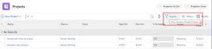
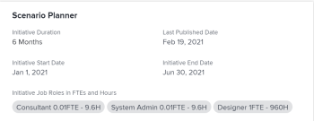
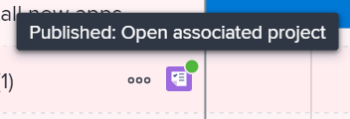
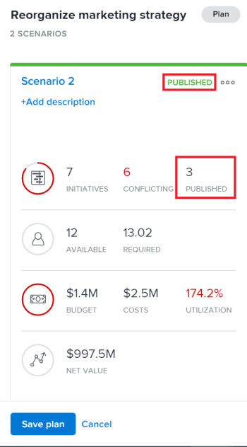

# Update or create projects by publishing initiatives in the `Adobe Workfront Scenario Planner`

Publishing a scenario from the `Adobe Workfront Scenario Planner` accomplishes the following:

* Creates projects from the initiatives on the scenario and links them together.
* Updates projects already linked to initiatives on the scenario with information from the linked initiative. Projects can also be linked to initiatives when you import them in to a plan. For information, see [Import projects to plans in the Adobe Workfront Scenario Planner](../scenario-planner/import-projects-to-plans.md)

## Access requirements

You must have the following:

<table cellspacing="15"> 
 <col> 
 <col> 
 <tbody> 
  <tr> 
   <td> 
Adobe Workfront plan*
 </td> 
   <td>Business or higher</td> 
  </tr> 
  <tr> 
   <td> 
Adobe Workfront license*
 </td> 
   <td> 
Review or higher
 </td> 
  </tr> 
  <tr> 
   <td>Product </td> 
   <td> 
You must purchase an additional license for the Adobe Workfront Scenario Planner to access functionality described in this article.
 
For information about obtaining the Workfront Scenario Planner, see <a href="../scenario-planner/access-needed-to-use-sp.md" class="MCXref xref">Access needed to use the Adobe Workfront Scenario Planner</a>. 
 </td> 
  </tr> Access level* Edit for Scenario Planner and Projects Note: If you still don't have access, ask your Workfront administrator if they set additional restrictions in your access level. For information on how a Workfront administrator can change your access level, see Create or modify custom access levels. Object permissions Manage permissions for the plan Manage permissions for published projects For information on requesting additional access to projects, see Request access to objects in Adobe Workfront. For information on requesting additional access to a plan, see Request access to a plan in the Adobe Workfront Scenario Planner. 
 </tbody> 
</table>

&#42;To find out what plan, license type, or access you have, contact your `Workfront administrator`.

For additional information about access to the `Workfront Scenario Planner`, see [Access needed to use the Adobe Workfront Scenario Planner](../scenario-planner/access-needed-to-use-sp.md).

## Prerequisites

Before you begin:

* You must use `the new Adobe Workfront experience` to be able to access the `Scenario Planner`. 

* You must create and save a plan before you can publish initiatives from it.

## Considerations about publishing initiatives to projects

<ul> 
 <li>You can publish only one scenario from a plan. </li> 
 <li>One initiative can be linked to only one project.</li> 
 <li> 
One project can be linked to more than one initiative when the initiatives belong to different plans. 
 <note type="tip">
   When a project exists on multiple plans and you publish information to the project from all plans, the latest publish overwrites the existing Scenario Planner information on the project.  
  </note> </li> 
 <li> 
If initiatives were created on the plan by importing projects to the plan, publishing the initiative also updates the linked projects with initiative information. 
 <note type="tip">
   You can import the same project into multiple plans. Publishing might overwrite initiative information on a project that is linked to multiple initiatives. 
  </note> 
For information about creating initiatives by importing projects, see <a href="../scenario-planner/import-projects-to-plans.md" class="MCXref xref">Import projects to plans in the Adobe Workfront Scenario Planner</a>. 
 </li> 
 <li> 
Any changes made to the project do not transfer to the linked initiative. 
 </li> 
</ul>

&nbsp;

## Publish initiatives

>[!IMPORTANT]
>
>If you make any changes to initiatives on the plan, including resolve conflicts, you must republish the initiative in order for the new information to be visible on the project. This information displays on the projects linked to initiatives only when you publish the corresponding the initiative. For information about resolving conflicts between initiatives, see [Resolve initiative conflicts in the Adobe Workfront Scenario Planner](../scenario-planner/resolve-conflicts-in-sp.md)

<ol> 
 <li value="1"> 
Click the Main Menu icon  in the upper-right corner of Workfront, then click Scenarios
 </li> 
 <li value="2"> 
(Optional and conditional) If you want to publish from an existing plan, click the Filter icon  in the upper-right corner of the plan and select one of the following options:
 
  <table cellspacing="0"> 
   <col> 
   <col> 
   <tbody> 
    <tr> 
     <td role="rowheader">All</td> 
     <td>Displays all plans that you own or are shared with you. This is the default. </td> 
    </tr> 
    <tr> 
     <td role="rowheader">My plans</td> 
     <td>Displays plans that you created.</td> 
    </tr> 
    <tr> 
     <td role="rowheader">Shared with me</td> 
     <td> 
Displays plans you did not create but are shared with you.
 <note type="important">
       You must have Manage permissions to plans shared with you to be able to publish them. 
      </note> </td> 
    </tr> 
   </tbody> 
  </table> 
  
 </li> 
 <li value="3"> 
(Optional)&nbsp;Click the Search icon  and start typing the name of a plan to quickly find it in the list.
 </li> 
 <li value="4"> 
(Conditional)&nbsp;To publish from a new plan, create a plan.
 
 For information about creating plans, see <a href="../scenario-planner/create-and-edit-plans.md" class="MCXref xref">Create and edit plans in the Adobe Workfront Scenario Planner</a> . 
 </li> 
 <li value="5"> 
(Optional) Click the name of an existing plan and create new scenarios for the plan.
 
For information about creating scenarios for a plan, see <a href="../scenario-planner/create-and-compare-scenarios-for-a-plan.md" class="MCXref xref">Create and compare plan scenarios in the Adobe Workfront Scenario Planner</a>. 
 </li> 
 <li value="6"> 
(Optional) Update the initiatives of an existing or a new plan or create new ones.
 
For information about creating initiatives, see <a href="../scenario-planner/create-and-edit-initiatives.md" class="MCXref xref">Create and edit initiatives in the Adobe Workfront Scenario Planner</a>.
 </li> 
 <li value="7">Click Save plan. </li> 
 <li value="8"> 
Select the scenario you want to publish from the Initial scenario drop-down menu, then click Go to Publish  in the upper-right corner.
 
Or
 
Click Compare scenarios, hover over the scenario card that you want to publish from, then click Go to Publish . 
 
The Publish initiatives page displays, showing a list of all initiatives in the scenario. If any of the initiatives was previously published, the project icon  displays after their name and the Last published date is populated in the list. 
 <note type="tip">
   Initiatives that have been created by importing projects also display the project icon 
    to the right of their name
  </note> 
  
 </li> 
 <li value="9"> 
(Optional and conditional) If you want to publish from an existing plan, click the Filter icon  in the upper-right corner of the plan and select one of the following options:
 
  <table cellspacing="0"> 
   <col> 
   <col> 
   <tbody> 
    <tr> 
     <td role="rowheader">All</td> 
     <td>Displays all initiatives of the selected scenario. </td> 
    </tr> 
    <tr> 
     <td role="rowheader">Published</td> 
     <td>Displays initiatives that you or another user published before. </td> 
    </tr> 
    <tr> 
     <td role="rowheader">Unpublished</td> 
     <td> 
Displays unpublished initiatives. 
 </td> 
    </tr> 
   </tbody> 
  </table> 
  
 </li> 
 <li value="10"> 
(Optional)&nbsp;Click the Search icon  and start typing the name of an initiative to quickly find it in the list.
 </li> 
 <li value="11"> 
Select one or multiple initiatives to publish and create or update projects from them, then click Publish initiatives. 
 
This creates a new project from each selected initiatives or updates the existing connected projects, if the published initiatives were already linked to a project. 
 <note type="tip">
   New projects have the same name as the published initiatives. 
  </note> </li> 
 <li value="12"> 
(Conditional) Do one of the following: 
 
  <ul> 
   <li> 
If you published one initiative, click See associated project to open the project created or updated from the initiative. 
 </li> 
   <li> 
If you published more than one initiative, click&nbsp;See associated projects to open a list of projects published from initiatives. Workfront applies the Scenario Planner Projects filter to the list of projects by default. The projects published most recently display at the top of the list. 
 
  
 </li> 
  </ul> </li> 
 <li value="13"> 
Go to the following areas to view initiative information on the project:
 
  
 
   <ul> 
    <li> 
<b>The Updates section</b>: An update publishes to indicate that the project was created or updated from the initiative. The update contains the name of the initiative that created or updated the project and the linked name of the plan that contains the initiative. You can click the name of the plan in the update to open the plan in the Scenario Planner. 
 
  
 </li> 
    <li> 
<b>The Overview area of the Project Details section</b>: A new Scenario Planner section is created in this area that contains information from the linked initiative. 
 <note type="tip">
      This information is visible only when viewing Project&nbsp;Details in 
      the new Adobe Workfront experience. 
     </note> 
  
 
The following initiative information is published in the Scenario Planner area of the Project&nbsp;Details section:
 
 
      <table cellspacing="0"> 
       <col> 
       <col> 
       <tbody> 
        <tr> 
         <td role="rowheader">Initiative Duration* </td> 
         <td>The duration of the corresponding initiative when the project is linked to an initiative. This field is not editable. </td> 
        </tr> 
        <tr> 
         <td role="rowheader">Last Published Date* </td> 
         <td>The date when the project was last published from a corresponding initiative. </td> 
        </tr> 
        <tr> 
         <td role="rowheader">Initiative Start Date* </td> 
         <td>The first day of the start month of the initiative, when the project is linked to an initiative. </td> 
        </tr> 
        <tr> 
         <td role="rowheader">Initiative End Date* </td> 
         <td>The last day of the end month of the initiative, when the project is linked to an initiative.&nbsp; </td> 
        </tr> 
        <tr> 
         <td role="rowheader">Initiative Job&nbsp;Roles in FTEs and Hours* </td> 
         <td> 
Information about the associated job roles and their time allocations for the initiative.&nbsp;This includes:
 
          <ul> 
           <li>Job&nbsp;Role name</li> 
           <li>Number of FTEs</li> 
           <li> 
Number of Hours for all&nbsp;FTEs
 
You can estimate the amount of job roles needed for your plan or initiative using hours or FTEs.&nbsp;
 
For more information, see <a href="../scenario-planner/create-and-edit-plans.md" class="MCXref xref">Create and edit plans in the Adobe Workfront Scenario Planner</a>. 
 </li> 
          </ul> <note type="tip">
           If the number of job role is different for each month in the initiative, this field displays the maximum amount of roles needed for the initiative. For example, if you need 1 Consultant for January and 2 for February, the column displays 2FTE and the corresponding amount of hours for 2 FTEs for all months. 
          </note> </td> 
        </tr> 
       </tbody> 
      </table> 
 <note type="note"> 
      
All users with View access to the project can see the Scenario Planner section in the Overview area. You can control whether this area displays in the Details section by using a layout template. If users do not have a layout template associated with them, this area displays by default. 
 
      <ul> 
       <li> 
For information about adding or removing areas in the Details section using a layout template, see <a href="../administration-and-setup/customize-workfront/use-layout-templates/customize-details-view-layout-template.md" class="MCXref xref">Customize the Details view using a layout template</a>. 
 </li> 
       <li> 
For more information about viewing information in the Overview area of the Project&nbsp;Details, see <a href="../manage-work/projects/manage-projects/understand-project-overview-area.md" class="MCXref xref">Manage information in the project Overview area</a>.
 </li> 
      </ul> 
     </note> </li> 
    <li> 
<b>The Role Allocation panel in the</b>Workload Balancer<b> or the task list of the project</b>: Information about role allocation on the initiative populates in this area, in addition to role allocations on the project. 
 
 For more information, see <a href="../scenario-planner/overview-reconcile-allocations-between-projects-initiatives.md" class="MCXref xref">Overview of reconciling resource allocations between projects and initiatives </a>. 
 
  
 
Any changes to the dates or resources of the project do not affect the corresponding initiative or any of the areas on the project that contain initiative information. 
 </li> 
    <li> 
<b>The Resource Budgeting area of the Business Case of the project</b>: A new option for managing project resources using Scenario Planner information is added in the Resource Budgeting area of the Business Case of the project. 
 
For more information, see <a href="../manage-work/projects/define-a-business-case/budget-resources-in-business-case-use-scenario-planner.md" class="MCXref xref">Budget resources in the Business Case using the Adobe Workfront Scenario Planner</a>. 
 
  
 </li> 
   </ul> 
  
 </li> 
 <li value="14"> 
(Optional) Review the following information in the Scenario Planner after you published a scenario: 
 
  <ul> 
   <li>The published scenario becomes the first scenario after you publish initiatives from it. </li> 
   <li>You cannot publish from any other scenario after you have published a scenario at least once. </li> 
   <li>The Go to Publish option is removed from all other scenarios after at least one initiative has been published from a scenario. </li> 
   <li> 
A green indicator displays next to the published initiatives' project icons in the plan. 
 
  
 </li> 
   <li> 
A green "Published"&nbsp;indicator displays at the top of the scenario and on the scenario card and the Published field is populated on the scenario card indicating the number of initiatives in the scenario that have been published. 
 
  
 <note type="tip">
     If all the projects published from the scenario's initiatives are deleted, the indication that the scenario has been published is removed. For information, see 
     <a href="../manage-work/projects/manage-projects/delete-projects.md" class="MCXref xref">Delete projects </a>. 
    </note> </li> 
  </ul> </li> 
 <li value="15"> 
(Optional) Update information on the initiative and repeat the process described above to republish the initiative and update initiative information on the linked project. 
 
For information about editing initiatives, see <a href="../scenario-planner/create-and-edit-initiatives.md" class="MCXref xref">Create and edit initiatives in the Adobe Workfront Scenario Planner</a>. 
 </li> 
</ol>

&nbsp;
