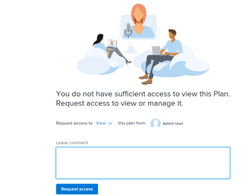

# Request access to a plan in the `Adobe Workfront Scenario Planner`

You can request access to a plan in the `Adobe Workfront Scenario Planner` when the link to the plan is shared with you.

## Access requirements

You must have the following:

<table cellspacing="15"> 
 <col> 
 <col> 
 <tbody> 
  <tr> 
   <td> 
Adobe Workfront<b> plan*</b> 
 </td> 
   <td>Business or higher</td> 
  </tr> 
  <tr> 
   <td> 
Adobe Workfront<b> license*</b> 
 </td> 
   <td> 
Review, Work, or Plan
 </td> 
  </tr> 
  <tr> 
   <td>Product* </td> 
   <td> 
You must purchase an additional license for the Adobe Workfront Scenario Planner to access functionality described in this article.
 
For information about obtaining the Workfront Scenario Planner, see <a href="../scenario-planner/access-needed-to-use-sp.md" class="MCXref xref">Access needed to use the Adobe Workfront Scenario Planner</a>. 
 </td> 
  </tr> Access level configurations* View access or higher to the Scenario Planner Note: If you still don't have access, ask your Workfront administrator if they set additional restrictions in your access level. For information on how a Workfront administrator can change your access level, see Create or modify custom access levels. 
 </tbody> 
</table>

&#42;To find out what plan, license type, or access you have, or if your company has purchased the `Workfront Scenario Planner`, contact your `Workfront administrator`.

## Prerequisites

Before you can request access to a plan in the `Scenario Planner`,you must have the following:

* A link to the plan.

>[!NOTE]
>
>If you do not have access level rights to the `Scenario Planner` and you try to access a plan from a link, you cannot request access to the plan. Instead, a screen displays informing you to contact the `Workfront administrator`.

## Request access for plans in the `Workfront Scenario Planner`

If you do not already have permissions to a plan&nbsp;and you navigate to it from a link shared with you,&nbsp;a screen displays to inform you that you do not&nbsp;have permissions to view the plan. You are prompted to request permissions from the plan creator.

>[!TIP]
>
>You can only request permissions from the owner or creator of a plan. You cannot request permissions from other users who also have access to the plan.

To request permissions:

<ol> 
 <li value="1"> 
Click a link to a plan. 
 
  
 </li> 
 <li value="2"> 
In the Request access to drop-down menu, indicate what level of permissions you wish to be granted.&nbsp;Select from the following:
 
  <ul> 
   <li>View</li> 
   <li> 
Manage
 </li> 
  </ul> 
You cannot request a permission that is higher than your access level to the Scenario Planner. For example, you cannot request Manage permissions if you have View access to the Scenario Planner. 
 
For information about the different levels of permissions, see <a href="../scenario-planner/share-a-plan.md" class="MCXref xref">Share a plan in the Adobe Workfront Scenario Planner</a>. 
 
For information on a Workfront administrator can manage access to the Scenario Planner, see <a href="../administration-and-setup/add-users/configure-and-grant-access/grant-access-sp.md" class="MCXref xref">Grant access to Scenario Planner</a>. 
 </li> 
 <li value="3"> 
(Optional) Enter a comment or request in the Leave comment box, then click Request access. 
 
The following happens:&nbsp;
 
  <ul> 
   <li>Workfront sends an email notification to the plan owner where they can grant the permissions requested.  </li> 
   <li> 
After the plan owner grants the permissions requested, you receive an email that the permissions have been granted if your Workfront administrator has the Object share to user notification enabled in your system and you enable the Someone shares an object with me email notification in your profile. 
 
  
 </li> 
   <li>You can also grant permissions to plans from the Home area and from the Workfront mobile app. </li> 
  </ul> 
For information about enabling system notifications, see <a href="../administration-and-setup/manage-workfront/emails/configure-event-notifications-for-everyone-in-the-system.md" class="MCXref xref">Configure event notifications for everyone in the system</a>.
 
For information about enabling notifications in your profile, see <a href="../workfront-basics/using-notifications/notifications-misc-information.md" class="MCXref xref">Notifications: Miscellaneous information</a>. 
 </li> 
</ol>

