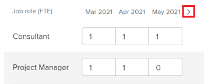
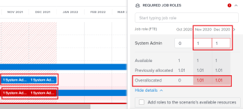
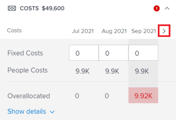
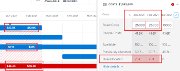

# Resolve initiative conflicts in the *Adobe Workfront Scenario Planner*

When initiatives conflict with one another they are competing for the same resources. The resources you have available for a scenario are not enough to cover all of the resources required by all initiatives in the scenario.

This can happen in any of the following cases:

* The number of job roles required for the initiative is larger than the number of roles budgeted for the plan. 
* The costs of the initiative is larger than the budget amount available for the plan.

## Access requirements

You must have the following:

<table cellspacing="15"> 
 <col> 
 <col> 
 <tbody> 
  <tr> 
   <td> 
<em>Adobe Workfront</em><b> plan*</b> 
 </td> 
   <td><em>Business</em> or higher</td> 
  </tr> 
  <tr> 
   <td> 
<em>Adobe Workfront</em><b> license*</b> 
 </td> 
   <td> 
<em>Review</em> or higher
 </td> 
  </tr> 
  <tr> 
   <td><b>Product</b> </td> 
   <td> 
You must purchase an additional license for the <em>Adobe Workfront Scenario Planner</em> to access functionality described in this article.
 
For information about obtaining the <em>Workfront Scenario Planner</em>, see <a href="../scenario-planner/access-needed-to-use-sp.md" class="MCXref xref">Access needed to use the Adobe Workfront Scenario Planner</a>. 
 </td> 
  </tr> <draft-comment>
   <tr data-mc-conditions=""> 
    <td>Access level configurations* </td> 
    <td> 
Edit or higher to the <em>Scenario Planner</em>
 
Note: If you still don't have access, ask your <em>Workfront administrator</em> if they set additional restrictions in your access level. For information on how a <em>Workfront administrator</em> can change your access level, see <a href="../administration-and-setup/add-users/configure-and-grant-access/create-modify-access-levels.md" class="MCXref xref">Create or modify custom access levels</a>.
 </td> 
   </tr>
  </draft-comment>
  <tr data-mc-conditions=""> 
   <td>Access level configurations* </td> 
   <td> 
Edit or higher to the <em>Scenario Planner</em>
 
Note: If you still don't have access, ask your <em>Workfront administrator</em> if they set additional restrictions in your access level. For information on how a <em>Workfront administrator</em> can change your access level, see <a href="../administration-and-setup/add-users/configure-and-grant-access/create-modify-access-levels.md" class="MCXref xref">Create or modify custom access levels</a>.
 </td> 
  </tr> <draft-comment>
   <tr data-mc-conditions=""> 
    <td> 
Object permissions 
 </td> 
    <td> 
Manage permissions to a plan
 
For information on requesting additional access to a plan, see <a href="../scenario-planner/request-access-to-plan.md" class="MCXref xref">Request access to a plan in the Adobe Workfront Scenario Planner</a>.
 </td> 
   </tr>
  </draft-comment>
  <tr data-mc-conditions=""> 
   <td> 
Object permissions 
 </td> 
   <td> 
Manage permissions to a plan
 
For information on requesting additional access to a plan, see <a href="../scenario-planner/request-access-to-plan.md" class="MCXref xref">Request access to a plan in the Adobe Workfront Scenario Planner</a>.
 </td> 
  </tr> 
 </tbody> 
</table>

&#42;To find out what plan, license type, or access you have, contact your *Workfront administrator*.

## Resolve conflicts overview

* A conflict is also understood as an overallocation of the job roles or the budget of a scenario. 
* When&nbsp;*Workfront* detects a conflict, the bar corresponding to the conflicting month during the initiative's duration displays in red. This can happen in any of the following cases:

  * The number of job roles required monthly for an initiative is larger than the number of roles budgeted for the plan after all previous initiatives have used the resources budgeted for the plan.
  * The monthly costs of the initiative are larger than the budget available for the plan after all previous initiatives have used the plan's budget to cover their costs.

` `**Tip: **`` By default, the *Scenario Planner* assumes that you have budgeted for 0 job roles and $0 or the equivalent of $0 in your system's currency for a scenario, unless you specified otherwise. The number of job roles indicates the number of FTEs (Full Time Equivalents) `or hours` budgeted for the job role .

For all calculations in the *Scenario Planner*, *Workfront* uses the following value: 1 FTE = 8 Hours.

For information about updating the available roles for a plan and a budget see [Create and edit plans in the Adobe Workfront Scenario Planner](../scenario-planner/create-and-edit-plans.md).

* You can resolve a conflict by doing one of the following:

  * Adding the missing required resources automatically from the initiatives on the scenario. This article describes how to resolve conflicts using this option. 
  * Adjusting the job role and budget resources for the scenario, by editing the plan. For more information, see [Create and edit plans in the Adobe Workfront Scenario Planner](../scenario-planner/create-and-edit-plans.md).

## Resolve conflicts between initiatives

<ol> 
 <li value="1"> 
Go to a plan for which you want to resolve conflicts.
 
For information about creating plans, see <a href="../scenario-planner/create-and-edit-plans.md" class="MCXref xref">Create and edit plans in the Adobe Workfront Scenario Planner</a>.
 
For information about creating initiatives, see <a href="../scenario-planner/create-and-edit-initiatives.md" class="MCXref xref">Create and edit initiatives in the Adobe Workfront Scenario Planner</a>. 
 </li> 
 <li value="2"> 
(Optional)&nbsp;From the Initial scenario drop-down menu, select the scenario you want to review. 
 <note type="tip">
   A plan may have several scenarios. When looking at the plan's conflicts,&nbsp;
   <em>Workfront</em> is referring to the resources currently available on the selected scenario and those required on that scenario's initiatives. For information about scenarios, see 
   <a href="../scenario-planner/create-and-compare-scenarios-for-a-plan.md" class="MCXref xref">Create and compare plan scenarios in the Adobe Workfront Scenario Planner</a>. 
  </note> </li> 
 <li value="3"> 
Ensure that Show conflicts is enabled. It is enabled by default. 
 
  
 
The first conflicting initiative displays the months that have conflicts in red and a warning icon displays next to the initiative name. 
 
The background of all initiatives starting with the first conflicting one displays in red on the plan's chart. 
 
When an initiative displays a conflict, it means that the number of job role for at least one specific role, the costs incurred, or both exceed the number of job roles or the budget defined for the plan for a specific month. 
 
  
 </li> 
 <li value="4"> 
Do one of the following to understand more about the conflicts that might exist:
 
  <ul> 
   <li> 
Hover over the warning icon next to the initiative name to understand whether you have a job role or a budget conflict. 
 
  
 
Depending on whether you overallocated job roles or overestimated costs for your initiative you might see one of the following options when hovering over the warning icon:
 
    <ul> 
     <li> 
Show job role conflict details
 </li> 
     <li> 
Show budget conflict details
 </li> 
     <li> 
Show job role and budget details
 </li> 
    </ul> </li> 
  </ul> 
  <ul> 
   <li> 
When viewing the plan by month, hover over a month in the plan's timeline to view the required resources for that month and whether the conflicts for the month are people or cost-related. 
 
  
 
Review the following monthly information at the plan-level: 
 
    <ul> 
     <li> 
The number of available, required, and overallocated job roles for the month for all initiatives planned for that month
 </li> 
     <li> 
The available, required, and overallocated costs for the month for all the initiatives planned for that month
 <note type="tip">
       The Available costs are the scenario's budget for that month. 
      </note> </li> 
    </ul> </li> 
   <li> 
Hover over an initiative's red bar for a month to display the additional information box about the conflict that occurs that month.&nbsp;
 
  
 
Review the following fields in the additional information box at the initiative's level:
 
    <table cellspacing="0"> 
     <col> 
     <col> 
     <tbody> 
      <tr> 
       <td role="rowheader">Month when the conflict occurs</td> 
       <td>Displays in the title of the additional information box.</td> 
      </tr> 
      <tr> 
       <td role="rowheader">The initiative name</td> 
       <td>Displays in the title of the additional information box.</td> 
      </tr> 
      <tr> 
       <td role="rowheader">Job&nbsp;Roles</td> 
       <td> 
The job roles associated with this initiative that are overallocated for the selected month. The following columns display information for each job role that is required for the selected month and that conflicts with the number of job roles available for that month:
 
        <ul> 
         <li> 
Available: The number of each job role available from the scenario for the selected month.
 </li> 
         <li> 
Required: The number of each job role required for the initiative for the selected month.
 </li> 
         <li> 
Overallocated: The difference between the number required on the initiative and the number available from the scenario. 
 </li> 
        </ul> <note type="tip">
         Sometimes, the number of Available roles matches or is higher than the number of Required roles, but the 
         <em>Scenario Planner</em> still shows an overallocation.&nbsp;This means that there are higher-ranking initiatives that already used the job roles available on the plan for the same month. 
        </note> </td> 
      </tr> 
      <tr> 
       <td role="rowheader">Costs</td> 
       <td> 
The costs of the initiative for the month selected. The following columns display information for the costs needed and the budget available of the selected month:
 
        <ul> 
         <li> 
Available: The budget available from the plan for the selected month .
 </li> 
         <li> 
Required: The costs associated with this initiative for the selected month.
 </li> 
         <li> 
Overallocated: The difference between the costs of the initiative and the budget available from the plan. 
 </li> 
        </ul> <note type="tip">
         Sometimes, the Available costs match or are higher than the Required cost of the initiative for the selected month and the 
         <em>Scenario Planner</em> still shows an overallocation of cost.&nbsp;This means that there are higher-ranking initiatives that already use the available budget on the plan for the same month. 
        </note> </td> 
      </tr> 
     </tbody> 
    </table> </li> 
  </ul> </li> 
 <li value="5"> 
Do one of the following to open the initiative details panel and view more information about where the conflicts occur and to resolve them:
 
  <ul> 
   <li> 
Click the warning icon next to the initiative's name.
 </li> 
   <li> 
Click the bar of an initiative.
 </li> 
   <li> 
Click the More icon  to the right of the initiative’s name, then click Edit.
 
The initiative details panel displays on the right. 
 
When you do not have enough people or budget available for your initiative, a red warning icon displays next to following sections: 
 </li> 
   <li> 
Required Job&nbsp;Roles
 </li> 
   <li> 
Costs
 </li> 
  </ul> </li> 
 <li value="6"> 
(Conditional)&nbsp;For initiatives that have job role conflicts, go to the Required Job&nbsp;Roles section to view all job roles required for your initiative. Identify which job roles might be overallocated.&nbsp;Review the number of FTE or hours needed for each job role for each month of the initiative. The box with the FTE or hours number for months that have overallocations displays in a red outline. 
 
  
 </li> 
 <li value="7"> 
(Optional) Click the right-pointing arrow next to the months in the initiative's timeline to view which additional months display job role conflicts. 
 
  
 </li> 
 <li value="8"> 
(Optional) Click&nbsp;Show details under the job role that displays a conflict to see where the conflicts appear and to highlight the conflicting months in the plan's chart area. Additional information displays for each job role.
 
The following fields display for each job role:
 
  <table cellspacing="0"> 
   <col> 
   <col> 
   <tbody> 
    <tr> 
     <td role="rowheader">Available</td> 
     <td> 
The number of job roles available from the plan for each month. 
 </td> 
    </tr> 
    <tr> 
     <td role="rowheader">Previously allocated</td> 
     <td>The number of job roles already allocated from the plan's budget to higher-ranking initiatives for a specific month. </td> 
    </tr> 
    <tr> 
     <td role="rowheader">Overallocated</td> 
     <td> 
The difference between the number of required job roles on the initiative and the number available from the plan after higher-ranking initiatives also used some of the roles. <em>Workfront</em> calculates the number of Overallocated job roles using the following formula:
 
<code>Overallocated roles = (Roles Previously Allocated to higher initiatives + Required roles for current initiative) - Monthly available roles from the plan</code> 
 </td> 
    </tr> 
   </tbody> 
  </table> <note type="tip">
   On the plan's chart, the months where the job roles are allocated display the name and the number of roles needed for each initiative where they are needed. You must select the Month view to see the name of the job roles
  </note> 
  
 </li> 
 <li value="9"> 
Do one of the following to resolve job role conflicts:
 
  <ul style="list-style-type: circle;"> 
   <li> 
Manually adjust the number of job roles for each month of the initiative to a lower number.
 </li> 
   <li> 
Hover over the name of the job role and click the delete icon   to remove the job role from the initiative. 
 </li> 
   <li> 
Select Add roles to the scenario's available resources, then click Apply. 
 
This adds the missing number of job role FTEs or hours to the scenario's Available field. 
 <note type="note">
     The roles you add to resolve the conflicts modify the Available job roles for the selected scenario and not for all the scenarios in the plan. 
    </note> 
An upward-pointing green arrow  displays for the month in the timeline of the plan to indicate that more resources were added to the plan that month. You must select the Month view to see this indicator. 
 </li> 
   <li> 
(Conditional) Close the details panel and give the initiative a higher priority to receive budget resources from the plan first, if possible. For information about updating initiative priority, see <a href="../scenario-planner/prioritize-initiatives.md" class="MCXref xref">Update initiative priorities in the Adobe Workfront Scenario Planner</a>.
 </li> 
  </ul> </li> 
 <li value="10">(Optional) Click Hide details to close the additional details box, then click&nbsp;Apply to save the changes you make to job roles. </li> 
 <li value="11"> 
(Conditional) For initiatives that have costs conflicts, go to the Costs section in the initiative details panel to review costs for every month of the initiative's duration. Identify which months might not have enough money in the plan's budget to cover the costs for the selected initiative. The box with the insufficient available budget displays in a red outline.
 </li> 
 <li value="12"> 
(Optional) Click the right-pointing arrow next to the months in the initiative's timeline to view additional months that have insufficient budget to cover the costs. 
 
  
 </li> 
 <li value="13"> 
(Optional) Click&nbsp;Show details under the cost information to see where the conflict appears and to highlight the conflicting months on the plan's chart.&nbsp;The following additional fields display for each type of cost: 
 
  <table cellspacing="0"> 
   <col> 
   <col> 
   <tbody> 
    <tr> 
     <td role="rowheader">Available</td> 
     <td> 
The costs available from the plan's Budget for each month. 
 </td> 
    </tr> 
    <tr> 
     <td role="rowheader">Previously allocated</td> 
     <td>The amount of money already allocated from the plan's budget to higher-ranking initiatives. </td> 
    </tr> 
    <tr> 
     <td role="rowheader">Overallocated</td> 
     <td> 
The monthly difference between the costs needed for the initiative and the amount of money available from the plan's budget after higher-ranking initiatives also used some of the available budget. <em>Workfront</em> calculates the number of Overallocated costs using the following formula:
 
<code>Overallocated costs = (Costs Previously Allocated to higher initiatives + Required costs for the current initiative) - Monthly available budget from the plan</code> 
 
<em>Workfront</em> calculates the Required costs for the current initiative for each month using the following formula:
 
<code>Required initiative costs = Initiative Fixed Costs + Initiative People Costs</code> 
 </td> 
    </tr> 
   </tbody> 
  </table> <note type="tip">
   On the plan's chart, the months where the costs are insufficient display the name and the number of roles still needed for the initiative. You must select the Month view to view the cost amounts. 
  </note> 
  
 <note type="note">
   If you disabled the Include people cost setting for the plan's Budget box when you created the plan, the People Costs line does not display for any initiative in any scenario. In this case, 
   <em>Workfront</em> does not take People Costs into calculations to determine cost conflicts. For information about creating a plan, see 
   <a href="../scenario-planner/create-and-edit-plans.md" class="MCXref xref">Create and edit plans in the Adobe Workfront Scenario Planner</a>. 
  </note> </li> 
 <li value="14"> 
Do one of the following to resolve costs conflicts:
 
  <ul style="list-style-type: circle;"> 
   <li> 
Manually adjust the number of Fixed Costs for each month of the initiative to a lower number.
 </li> 
   <li> 
In the Required Job Roles section, manually adjust the number of job roles for the month with a People Costs budget, if possible. This reduces the number of People Costs. 
 <note type="tip">
     You cannot manually adjust People Costs. 
    </note> </li> 
   <li> 
Select Add amount to the scenario's budget, then click Apply. 
 
This adds the insufficient amount to the scenario's budget for the months where it was missing which also updates the overall scenario budget. 
 <note type="note">
     The amount you add to resolve the cost conflicts modify the Budget for the selected scenario and not for all the scenarios in the plan. 
    </note> </li> 
   <li> 
(Conditional) Close the details panel and give the initiative a higher priority to receive budget resources from the plan first, if possible. For information about updating initiative priority, see <a href="../scenario-planner/prioritize-initiatives.md" class="MCXref xref">Update initiative priorities in the Adobe Workfront Scenario Planner</a>.
 </li> 
  </ul> </li> 
 <li value="15"> 
Click Apply when you make any changes to the Costs section. 
 </li> 
 <li value="16">Click Save plan to save your changes. </li> 
</ol>

&nbsp;
