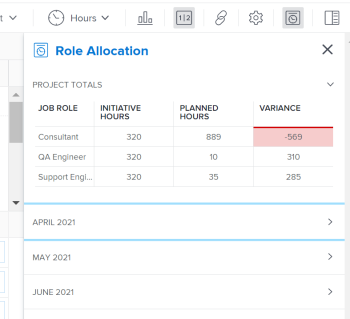

# Show role allocation for projects and initiatives in the `Workload Balancer`

>[!IMPORTANT]
>
>Your organization must purchase an additional license for the `Adobe Workfront Scenario Planner` so that you can view initiative information on a project. For information about obtaining the `Workfront Scenario Planner`, see [Access needed to use the Adobe Workfront Scenario Planner](../scenario-planner/access-needed-to-use-sp.md).

After you connect projects and initiatives, you can manage their resource allocation side-by-side to ensure they

match. This avoids overallocating or underutilizing them.

This article describes how you can reconcile resources using the Role Allocation panel in `Workload Balancer` of a project.

For general information about reconciling resources between projects and initiatives, including prerequisites, see [Overview of reconciling resource allocations between projects and initiatives](../scenario-planner/overview-reconcile-allocations-between-projects-initiatives.md).

## Access requirements

You need to following: 

<table cellspacing="15"> 
 <col> 
 <col> 
 <tbody> 
  <tr> 
   <td> 
Adobe Workfront<b> plan*</b> 
 </td> 
   <td>Business or higher</td> 
  </tr> 
  <tr> 
   <td> 
Adobe Workfront<b> license*</b> 
 </td> 
   <td> 
Review or higher
 </td> 
  </tr> 
  <tr> 
   <td><b>Product</b> </td> 
   <td> 
You must purchase an additional license for the Adobe Workfront Scenario Planner to access functionality described in this article.
 
For information about obtaining the Workfront Scenario Planner, see <a href="../scenario-planner/access-needed-to-use-sp.md" class="MCXref xref">Access needed to use the Adobe Workfront Scenario Planner</a>. 
 </td> 
  </tr> Access level configurations* View or higher access to Projects Note: If you still don't have access, ask your Workfront administrator if they set additional restrictions in your access level. For information on how a Workfront administrator can change your access level, see Create or modify custom access levels. Object permissions View or higher permissions to the project For information on requesting additional access to a plan, see Request access to a plan in the Workfront Scenario Planner. For information about requesting additional access to a project, see Request access to objects in Adobe Workfront. 
 </tbody> 
</table>

&#42;To find out what plan, license type, or access you have, contact your `Workfront administrator`.

## Show role allocation for projects and initiatives in the `Workload Balancer`

If your company has purchased a `Workfront Scenario Planner` license, you can reconcile the resource allocations between the initiative and the project linked to it in the project-level `Workload Balancer`.

<ol> 
 <li value="1"> 
(Conditional) Connect a project with an initiative using one of the methods described in the following articles:
 
  <ul> 
   <li> 
<a href="https://one.workfront.com/s/document-item?bundleId=the-new-workfront-experience&topicId=Content%2FScenario_Planner%2Fimport-projects-to-plans.htm&_LANG=enus" target="_top">Import projects to plans in the Adobe Workfront Scenario Planner</a> 
 </li> 
   <li> 
<a href="https://one.workfront.com/s/document-item?bundleId=the-new-workfront-experience&topicId=Content%2FScenario_Planner%2Fpublish-scenarios-update-projects.htm&_LANG=enus" target="_top">Update or create projects by publishing initiatives in the Adobe Workfront Scenario Planner</a> 
 </li> 
  </ul> <note type="important">
   If you make changes to resources on the initiative, you must re-publish the scenario that the initiative belongs to in order for the latest resource information from the initiative to update on the project. 
  </note> </li> 
 <li value="2"> 
Go to the project where you want to review the allocation of job roles for the project as well as for the associated initiative. 
 </li> 
 <li value="3"> Click Workload Balancer in the left panel. 
You might have to click Scheduling, then Switch to Workload Balancer. 
 </li> 
 <li value="4"> 
Do one of the following:
 
  <ul> 
   <li> 
Click Month to view the Workload Balancer by month, click the drop-down menu next to a month in the timeline , then click&nbsp;More. 
 </li> 
   <li> 
Click the Show role allocation icon  in the upper-right corner of the toolbar. 
 </li> 
  </ul> 
The Role&nbsp;Allocation panel displays.
 
  
 
Warning: </b>"><b>Warning: </b>Although you can view the Role Allocation panel even if your organization did not purchase a Workfront Scenario Planner license, you cannot view information about initiatives' job roles. 
 </li> 
 <li value="5"> 
Review the following information in the Project Totals area of the Role Allocation panel: 
 
  <table cellspacing="0"> 
   <col> 
   <col> 
   <tbody> 
    <tr> 
     <td role="rowheader">Job&nbsp;Role</td> 
     <td> 
The names of the job roles associated with any of the following:
 
      <ul> 
       <li> 
tasks on the project
 </li> 
       <li> 
issues on the project
 </li> 
       <li> 
initiative linked to the project
 </li> 
      </ul> </td> 
    </tr> 
    <tr> 
     <td role="rowheader">Initiative Hours</td> 
     <td>The number of required hours associated with each job role on the initiative for the total duration of the initiative. </td> 
    </tr> 
    <tr> 
     <td role="rowheader">Planned Hours</td> 
     <td>The number of Planned Hours associated with each job role in the tasks or issues on the project for the total duration of the project. </td> 
    </tr> 
    <tr> 
     <td role="rowheader">Variance</td> 
     <td> 
The difference between the hours required on the initiative and the planned hours associated with work on the project.&nbsp;Workfront calculates the Variance using this formula:
 
<code>Role Allocation Variance = Initiative Hours - Planned Hours</code> 
 
When resources are planned for more hours than required on the initiative, the Variance is negative and it displays in red. This means your resources are overallocated. 
 </td> 
    </tr> 
   </tbody> 
  </table> 
  
Tip: </b>">
   <b>Tip: </b> 
   
Planned Hours from the project do not display in the following scenarios: 
 
   <ul> 
    <li> 
When tasks or issues are not assigned to job roles, or users with a job role associated with them.
 </li> 
    <li> 
When tasks or issues have a Duration of zero. 
 </li> 
   </ul> 
  
 
&nbsp;
 </li> 
 <li value="6"> 
(Optional) If the Variance column shows that your resources are overallocated, adjust one of the following:
 
  <ul> 
   <li> 
Lower the number of Planned Hours for one job role that shows overallocated or add more resources to the tasks and distribute more Planned Hours to the new resources. You can update assignments or the number of Planned Hours on tasks or issues when editing them.&nbsp;For more information see the following articles:
 
    <ul> 
     <li> 
<a href="../manage-work/tasks/manage-tasks/edit-tasks.md" class="MCXref xref">Edit tasks</a> 
 </li> 
     <li> 
<a href="../manage-work/issues/manage-issues/edit-issues.md" class="MCXref xref">Edit issues</a> 
 </li> 
    </ul> <note type="note">
     You must have additional access and permissions to edit tasks and issues.
    </note> </li> 
   <li> 
Increase the number of required hours for role that shows the overallocation on the initiative. For more information, see<a href="https://one.workfront.com/s/document-item?bundleId=the-new-workfront-experience&topicId=Content%2FScenario_Planner%2Fcreate-and-edit-initiatives.htm&_LANG=enus" target="_top"> Create and edit initiatives in the Adobe Workfront Scenario Planner</a>. 
 <note type="note">
     You must have additional access and permissions to edit plans. 
    </note> </li> 
  </ul> </li> 
 <li value="7"> 
(Optional) Click the drop-down icon to expand one of the months in the Role Allocation panel or in the timeline of the Workload Balancer. 
 
  
 
The same type of information displayed in the Project Totals area also displays for each month. 
 <note type="tip">
   The months listed in the Role Allocation panel are the months in the timeline displayed on the screen in the 
   Workload Balancer. Scroll back and forward on the timeline to view additional months. 
  </note> </li> <!--
 --> 
</ol>

&nbsp;
