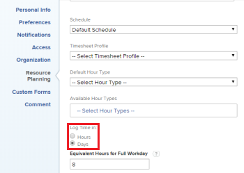

# Configure whether time is logged in hours or days

As a user with a Planner license, you can configure&nbsp;whether you log time in *Adobe Workfront* in hours or days. System administrators can configure this setting for individual users or for multiple users in their organization. By default, users log time in hours. For information about how to&nbsp;log time in *Workfront*, see [Log time](../../timesheets/create-and-manage-timesheets/log-time.md).

>[!NOTE]
>
>We recommend logging time in the same way, either hours or days, across the organization to ensure reporting accuracy.

## Access requirements

You must have the following access to perform the steps in this article:

<table cellspacing="0"> 
 <col> 
 </col> 
 <col> 
 </col> 
 <tbody> 
  <tr> 
   <td role="rowheader"><em>Adobe Workfront</em> plan*</td> 
   <td> 
Any
 </td> 
  </tr> 
  <tr> 
   <td role="rowheader"><em>Adobe Workfront</em> license*</td> 
   <td> 
<em>Plan</em> 
 </td> 
  </tr> <draft-comment>
   <tr data-mc-conditions=""> 
    <td role="rowheader">Access level configurations*</td> 
    <td> 
Planners can configure time for themselves. Only a <em>Workfront administrator</em> can configure time for other users.
 </td> 
   </tr>
  </draft-comment>
  <tr data-mc-conditions=""> 
   <td role="rowheader">Access level configurations*</td> 
   <td> 
Planners can configure time for themselves. Only a <em>Workfront administrator</em> can configure time for other users.
 </td> 
  </tr> 
 </tbody> 
</table>

&#42;To find out what plan, license type, or access you have, contact your *Workfront administrator*.

<ol> 
 <li value="1">Do either of the following, depending on your objective and your access level in the system: 
  <ul>
   <li>Planner user configuring time logging for yourself: <draft-comment>
     <MadCap:conditionalText data-mc-conditions="QuicksilverOrClassic.Quicksilver">
      Click the Main Menu icon. Click your user avatar, then click the 
      More icon next to your name and select 
      Edit.
     </MadCap:conditionalText>
    </draft-comment><MadCap:conditionalText data-mc-conditions="QuicksilverOrClassic.Quicksilver">
     Click the Main Menu icon. Click your user avatar, then click the 
     More icon next to your name and select 
     Edit.
    </MadCap:conditionalText></li>
   <li>System administrator configuring time logging for others: Begin editing one or more user accounts, as described in <a href="../../administration-and-setup/add-users/create-and-manage-users/edit-a-users-profile.md" class="MCXref xref">Edit a user's profile</a>.</li>
  </ul></li> 
 <li value="2"> 
In the resulting dialog box, in the Resource Planning section, locate the Log Time in option.
 
  
 </li> 
 <li value="3">(Conditional) If you are a system administrator editing multiple users simultaneously, select Log Time in.</li> 
 <li value="4">Select from the following options for logging time:  
  <table cellspacing="0">
   <col>
   <col>
   <tbody>
    <tr>
     <td role="rowheader">Hours:</td>
     <td>Users specify hours when logging time in <em>Workfront</em>.</td>
    </tr>
    <tr>
     <td role="rowheader">Days:</td>
     <td> Users specify days when logging time in <em>Workfront</em>.</td>
    </tr>
   </tbody>
  </table></li> 
 <li value="5"> 
(Conditional) If you selected to log time in days, in the Equivalent Hours for Full Workday field, type the number of hours that equal a full day. One day on a user's timesheet is the equivalent of the number of hours you enter here.
 
Consider the following when configuring this setting: 
 
  <ul> 
   <li>This option is not available when configuring to log time in hours.</li> 
   <li>This option is used only for the purpose of logging time. This option is not related to the Schedule option that is also available when editing a user. The Schedule option is used when calculating timelines and in other areas of <em>Workfront</em>. (For more information about using the Schedule option, see <a href="../../administration-and-setup/set-up-workfront/configure-timesheets-schedules/create-schedules.md" class="MCXref xref">Create a schedule</a>.)&nbsp;</li> 
  </ul> </li> 
 <li value="6">Click Save Changes.</li> 
</ol>

