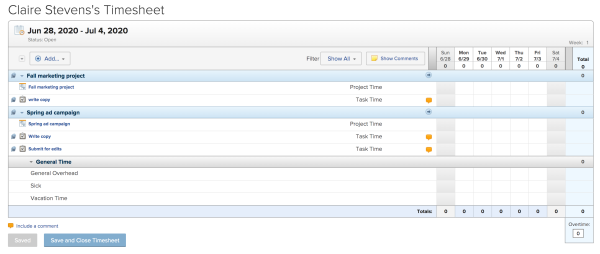
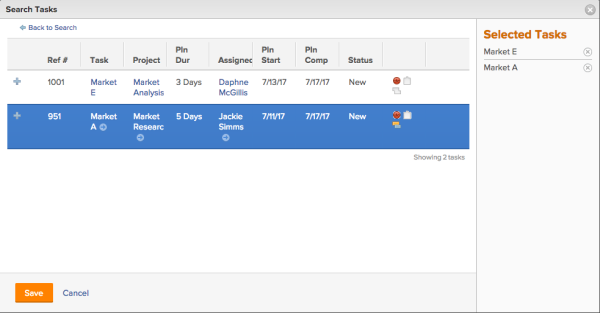
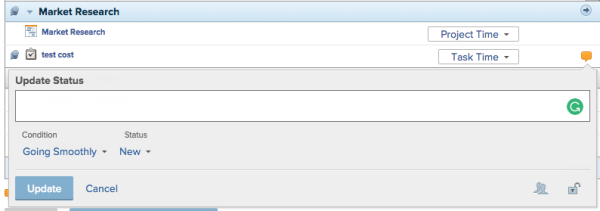
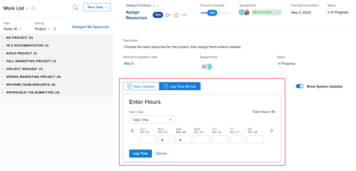
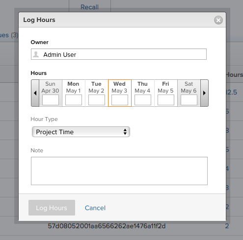

# Log Time {#log-time}

## Understand Hour Types {#understand-hour-types}

There are two sets of hour types in `Workfront`:

* **General time:** Time that is not associated with a project, such as sick time or administration. You can log general time only on the timesheet.
*  **Project-specific time:** Time logged on projects, tasks, and issues. You can log project-specific time from all locations discussed in this section.

  When logging time in `Workfront`, the project-specific hour types that are available depend on configuration options set at the system, project, and user levels. (The following default project-specific hour types are always available: Project Time, Task Time, and Issue Time.)

  The system administrator determines which project-specific hour types are made available, as described in the "Defining Which Hour Types Are Available" section in [Hour types](hour-types.md).

Consider the following when logging time in `Workfront`:

* All time logged through tools other than the timesheet appear in the timesheet for the corresponding time period.
* Time logged in the timesheet is immediately applied to the task, issue, or project.
* Timesheets include the total time for all logged dates. Weekends are always included, even when timeline calculations have been configured to exclude them (as described in [Set project preferences](set-project-preferences.md)).
* The maximum number of items displayed in a timesheet is 45. If there are more than ;45 items, only the most recently updated items are displayed.

## Logging Time {#logging-time}

You can log time in the following areas in `Workfront`:

* [Timesheet](#timesheet) 
* [Home](#home) 
* [Project, Task, or Issue](#project,-task,-issue) 
* [Mobile App](#mobile-app) 

### Timesheet {#timesheet}

You can log general hours or project-specific hours on a timesheet.

>[!NOTE]
>
>Review users assigned to a Timesheet Profile can see the Timesheets tab and log general hours. However, they cannot log hours on any tasks or issues assigned to them that appear on the timesheet.

1. Click the **Main Menu** icon  in the upper-right corner of `Workfront`.

1. Click Timesheets, then select a timesheet.
1.    
  
   

1. (Optional) To add a project, task, or issue to the timesheet, click the **Add** drop-down menu in the upper-left corner of the timesheet, then select whether you want to add a project, task, or issue to the timesheet. 
    
    
    1. In the Search dialog box, in the **Quick Search** field, specify the name of the project, task, or issue you want to add, then click **Search**.
    
    1. In the search results, click the **Plus** icon next to any projects, tasks, or issues you want to add.  
       The selected, projects, tasks, or issues are displayed in the area on the right side of the dialog box. For example, when selecting tasks, the selected tasks appear in the **Selected Tasks** area.  
           
    
    
    1. (Optional) Click the (x) icon next to any items in the **Selected Projects**, **Selected Tasks**, or **Selected Issues** area if you do not want to add the item to the timesheet.  
    
    
       >[!IMPORTANT] {type="important"}
       >
       >After you manually add an item to the timesheet and log time on it, the item cannot be removed from the timesheet. Items are removed from the timesheet only after the timeframe of the project, task, or issue is past.
    
    
    
    1. Click **Save**.
    
    

1.  (Optional) You can remove an item (project, task, or issue) from the timesheet if you manually added the item (as described in Step 2), and if you have not yet logged time against it.

   If the item is included in the timesheet because the timesheet preferences in your `Workfront` system are configured to pre-populate the timesheet (as described in [Timesheet and hour preferences](timesheet-and-hour-preferences.md)), the items cannot be removed from the timesheet.

   To remove an item from the timesheet that was manually added: 

    
    
    1. Ensure that no time is logged against the item.
    1. Click the **Pin** icon next to the item to unpin the item from the timesheet.
    1. Refresh the page.  
       The item is removed from the timesheet.
    
    

1.  Click the drop-down menu next to the item on the timesheet where you want to add time, then select the appropriate hour type.

   Hour types are available depending on what has been defined at the system, project, and user levels, as described in [Define Hour Types and Availability for Timesheets](define-hour-types-and-availability.md).

   The hour type cannot be changed after a timesheet is closed.

1. (Conditional) If your `Workfront administrator` has enabled the **Assign job roles to hour entries manually** setting, select a **Job Role** from the drop-down menu. The Role specified when you are assigned to the object displays by default. If you are not assigned a Role on the object, your Primary Role displays as the default. For more information on this setting, see the article [Timesheet and hour preferences](timesheet-and-hour-preferences.md) . 

1. Specify the amount of time you want to log on any given day. 

   You log time in either hours or days. This setting is configured by users with a Plan license or the system administrator, as described in [Configuring Whether Time Is Logged in Hours or Days](config-time-logged-hrs-days.md).
1. Click the **Status Comment** icon to include a comment, update the condition, or update the status.  
   

1.  (Optional) Click **Include a comment** to include a comment on the timesheet.

   Comments are displayed in the Recent Updates section below the timesheet. (For more information about comments on timesheets, see [View and manage comments on a timesheet](view-and-manage-comments-timesheets.md).

1. Click any of the following options:
    
    
    * **Save for Later:** Save your changes and keep the timesheet open to be updated at a later time. 
    * **Save and Close Timesheet:** Save the timesheet and close it so that it can no longer be edited. (You can open the timesheet after closing it by clicking **Re-Open** .)
    
    
      The hour type cannot be changed after a timesheet is closed.  

    
    * **Submit for Approval:** (This option is available only if there is an approver on the timesheet) Save your changes and submit for approval. (You can open the timesheet after closing it by clicking **Recall**.) 
    
    
    

### Home {#home}

You can log project-specific time in Home.

For general information about using the Home area, see [Using the Home Area.](https://support.workfront.com/hc/en-us/sections/115000712854)

To log time on a work item from the Home area:

1. In the **Work List** area, select the item where you want to log time.
1. In the right panel, click **Log Time**.  
  
     

1.  In the **Enter Hours** drop-down menu, select the appropriate hour type.  
   Hour types are available depending on what has been defined at the system, project, and user levels, as described in [Define Hour Types and Availability for Timesheets](define-hour-types-and-availability.md).
1.  (Conditional) If your `Workfront administrator` has enabled the **Assign job roles to hour entries manually** setting, select a **Job Role** from the drop-down menu. The Role specified when you are assigned to the object displays by default. If you are not assigned a Role on the object, your Primary Role displays as the default. For more information on this setting, see the article [Timesheet and hour preferences](timesheet-and-hour-preferences.md)
1. Specify the time you want to log, then click **Log Time**.

### Project, Task, or Issue {#project-task-or-issue}

You can log project-specific time on a project, task, or issue.

#### Permissions Required for Logging Time {#permissions-required-for-logging-time}

In order to log hours on a project, task, or issue, you need to have specific permissions. You can log time in two places on a project, task, or issue:

* [Updates Tab](#updates-tab) 
* [Hours Tab](#hours-tab) 

Updates Tab

The following are required before you can log hours on the Updates tab of a project, task, or issue:

* You must have a Work or Plan license.
* You must have at least Contribute permissions to the project, task, or issue with access to Log Hours.  
  For more information about granting permissions on projects, see [Share a project](share-a-project.md).

* If you want to log time directly to a project, your `Workfront administrator` must enable the Log time directly on projects setting under Timesheet & Hours > Preferences.  
  For more information about allowing users to log hours directly to projects, see [Timesheet and hour preferences](timesheet-and-hour-preferences.md).

Hours Tab

The following are required before you can log hours on the Hours tab of a project, task, or issue:

* You must be the system administrator.

Or you must have all of the following:

* You must have a Plan license with administrative access to Timesheets & hours. For more information about granting administrative access to Timesheets & hours, see [Assign users administrative access](assign-users-administrative-access.md).
* You must have at least Contribute permissions to the project with access to Log Hours. For more information about granting permissions on projects, see [Share a project](share-a-project.md).
* If you want to log time directly to a project, your `Workfront administrator`must enable the Log time directly on projects setting under Timesheet & Hours > Preferences. For more information about allowing users to log hours directly to projects, see [Timesheet and hour preferences](timesheet-and-hour-preferences.md).

To log time on a project, task, or issue:

1. Navigate to a project, task, or issue.
1. In the left panel, select **Hours**.
1. Click **Log Time**. 

   The Log Hours dialog box displays.

1.  Specify the following information:

    
    
    * **Owner:** Your name displays in this field, by default.   
      If you are logging the hours for another user, specify their name.
    
    * **Hours**: Enter the number of hours for the project, task, or issue.
    *  **Hour Type**: Select an Hour Type from the drop-down menu, if it is different than the one displayed by default.
    
    
      Depending on what hour types are configured in your system, the options here might vary. For more information about configuring hour types, see [Define Hour Types and Availability for Timesheets](define-hour-types-and-availability.md).  

    
    *  **Job Role**: (Conditional) If your `Workfront administrator` has enabled the **Assign job roles to hour entries manually** setting, select a **Job Role** from the drop-down menu.The Role specified when you are assigned to the object displays by default. If you are not assigned a Role on the object, your Primary Role displays as the default. For more information on this setting, see the article [Timesheet and hour preferences](timesheet-and-hour-preferences.md)<![CDATA[					    ]]>
    
    
          
    

    
    
    

1. Click **Log Hours**.

### Mobile App {#mobile-app}

You can log time from the `Workfront` mobile app.
