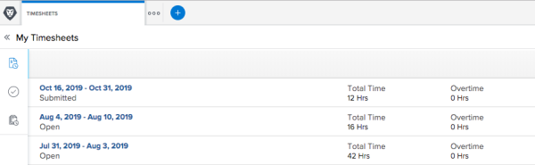

# Timesheet Approvals {#timesheet-approvals}

The process of approving timesheets provides&nbsp;managers with visibility into the work hours of their direct reports. Approvers can verify that&nbsp;all time recorded has been allocated in the correct areas and that&nbsp;a sufficient number of hours have been recorded for the period.

`Workfront` provides the ability to configure timesheet approvals to support in this area.

## Designate Timesheet Approvers {#designate-timesheet-approvers}

Typically, timesheets are approved by functional managers or human resources personnel. (Timesheets are not normally approved by project managers.)&nbsp;

A timesheet approver is defined when creating the Timesheet Profile.&nbsp;You must have a Plan license to be designated as an approver.

For more information about designating timesheet approvers, see the [Create or Edit a Timesheet Profile](create-timesheet-profiles.md#creating-a-timesheet-profile) section in the [Create Timesheet Profiles](create-timesheet-profiles.md).

## Submit a Timesheet for Approval {#submit-a-timesheet-for-approval}

* [Submit a Timesheet for Approval](#submitting-a-timesheet-for-approval) 
* [View the Status of a submitted Timesheet](#viewing-the-status-of-a-submitted-timesheet) 

### Submit a Timesheet for Approval {#submit-a-timesheet-for-approval-1}

After&nbsp;a timesheet approver is set&nbsp;(as described in [Designate Timesheet Approvers](#designating-a-timesheet-approver)), the **Submit**&nbsp;button at the bottom of the timesheet changes to a **Submit for Approval**&nbsp;button. At the end of the timesheet period each user clicks&nbsp;**Submit for Approval**, which launches the timesheet approval process. When a timesheet has been submitted for approval, the approver sees the timesheet listed in the **Approvals**&nbsp;area on the **My Work**&nbsp;page.

### View the Status of a submitted Timesheet {#view-the-status-of-a-submitted-timesheet}

You can view the status of a timesheet after it has been submitted.

If the system&nbsp;administrator has&nbsp;enable the 'Timesheet Approval to User' and the 'Timesheet Rejection to User' event handlers, the user who submitted the timesheet is notified after the timesheet is approved or rejected. Without these notifications, the only indication a timesheet owner has of a rejected timesheet is to go to the 'My Timesheets' report (which displays all timesheets belonging to the logged-in user that have not been closed) to review the status of the active timesheets.

To view the status of a timesheet:

1. Click the **Main Menu** icon  in the upper-right corner of `Workfront`.

1. Click **Timesheets**.
1. In the left panel, click **My Timesheets**.  
     

## Recall a Timesheet {#recall-a-timesheet}

You can recall a timesheet that has already been submitted for approval. Only timesheets that haven't been approved can be recalled.&nbsp;

To recall a timesheet:

1. Click the **Main Menu** icon  in the upper-right corner of `Workfront`.

1. Click **Timesheets**.
1. In the left panel, click **My Timesheets**.
1. Select a timesheet with a status of Submitted.
1. Click **Recall**.

## Approve a Timesheet {#approve-a-timesheet}

You can approve any timesheets that have been submitted where you have been designated as an approver. You must have a Plan license to be designated as an approver.

If the system administrator has enabled the 'Timesheet Submission to Approver' event handler (automated email), the assigned approver receives an email notification stating that a timesheet is awaiting approval. For information about how system administrators can enable this email notification, see [Enable and disable event notifications](enable-and-disable-event-notification.md).

To approve a timesheet:

1. Click the **Main Menu** icon  in the upper-right corner of `Workfront`.

1. Click Timesheets.
1. In the left panel, click **Timesheets I Approve**.
1. Click the timesheet you want to approve.
1.  Click **Approve**.

   Or

   If you want to reject the timesheet, click **Reject**.

