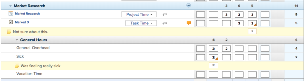
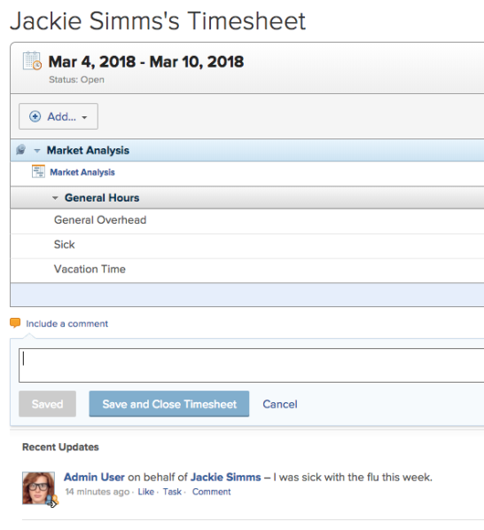
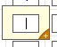

# View and manage comments on a timesheet {#view-and-manage-comments-on-a-timesheet}

## View comments on a Timesheet {#view-comments-on-a-timesheet}

You can configure comments that are made on individual&nbsp;hour entries to be displayed in the timesheet. (The option to show and hide comments does not affect comments made on the overall timesheet. For more information, see&nbsp; [Make comments on a Timesheet](#making-comments-on-a-timesheet).)

By default, comments are hidden the first time you&nbsp;access a timesheet.

To show comments on a timesheet:

1. Click the **Main Menu** icon  in the upper-right corner of `Workfront`.

1. Click **Timesheets**.
1. In the left panel, click **All Timesheets**.
1. Go to the timesheet where you want to display comments.
1.  Click **Show Comments**&nbsp;in the upper-right corner of the timesheet.

   

   Comments are displayed and highlighted in yellow below the hour entry where they were made.

      

## Make comments on a Timesheet {#make-comments-on-a-timesheet}

* [Comment on the overall Timesheet](#commenting-on-an-overall-timesheet) 
* [Comment on an individual hour entry in a Timesheet](#commenting-on-an-individual-hour-entry-in-a-timesheet) 

### Comment on the overall Timesheet {#comment-on-the-overall-timesheet}

You can make general comments about the timesheet.

1. Click the **Main Menu** icon  in the upper-right corner of `Workfront`.

1. Click **Timesheets**.
1. In the left panel, click **All Timesheets**.
1. Go to the timesheet where you want to make a comment.
1.  Below the timesheet, click **Include a comment**.

   

1.  Specify your comment, then click **Save**.

   Your comment is displayed in the **Recent Updates** area.

### Comment on an individual hour entry in a Timesheet {#comment-on-an-individual-hour-entry-in-a-timesheet}

1. Click the **Main Menu** icon  in the upper-right corner of `Workfront`.

1. Click **Timesheets**.
1. In the left panel, click **All Timesheets**.
1. Go to the timesheet where you want to make a comment.
1.  Click in the entry field where you want to make a comment.

   

1.  Clicking the '+' icon.

   

1.  Specify your comment, then click **Save**.

   After a comment is submitted, a notch appears on the record in the box, indicating that a comment was made.

   

1. (Optional) To configure comments to be displayed in the timesheet, see [View comments on a Timesheet](#viewing-comments-on-a-timesheet).

