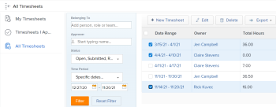

# Export a list of timesheets

As a people manager or timesheet approver, you might need to download a list of timesheets to quickly view information about the timesheets of the people you are responsible for. You can do this by exporting a list of timesheets.

## Access requirements

You must have the following access to perform the steps in this article:

<table cellspacing="0"> 
 <col> 
 <col> 
 <tbody> 
  <tr> 
   <td role="rowheader"><em>Adobe Workfront</em> plan*</td> 
   <td> 
Any
 </td> 
  </tr> 
  <tr> 
   <td role="rowheader"><em>Adobe Workfront</em> license*</td> 
   <td> 
<em>Review</em> or higher
 </td> 
  </tr> 
  <tr> 
   <td role="rowheader">Access level configurations*</td> 
   <td> 
View access or higher to Tasks and Issues
 
Note: If you still don't have access, ask your <em>Workfront administrator</em> if they set additional restrictions in your access level. For information on how a <em>Workfront administrator</em> can modify your access level, see <a href="../../administration-and-setup/add-users/configure-and-grant-access/create-modify-access-levels.md" class="MCXref xref">Create or modify custom access levels</a>.
 </td> 
  </tr> 
  <tr> 
   <td role="rowheader">Object permissions</td> 
   <td> 
View or higher permissions on the timesheets
 
For information on requesting additional access, see <a href="../../workfront-basics/grant-and-request-access-to-objects/request-access.md" class="MCXref xref">Request access to objects in Adobe Workfront</a>.
 </td> 
  </tr> 
 </tbody> 
</table>

&#42;To find out what plan or license type you have, contact your *Workfront administrator*.

## Export a list of timesheets

<ol> <draft-comment>
  <li value="1" data-mc-conditions="QuicksilverOrClassic.Quicksilver">Click the Main Menu icon  in the upper-right corner of <em>Adobe Workfront</em>.</li>
 </draft-comment>
 <li value="1" data-mc-conditions="QuicksilverOrClassic.Quicksilver">Click the Main Menu icon  in the upper-right corner of <em>Adobe Workfront</em>.</li> <draft-comment>
  <li value="2" data-mc-conditions="QuicksilverOrClassic.Quicksilver">Click Timesheets.</li>
 </draft-comment>
 <li value="2" data-mc-conditions="QuicksilverOrClassic.Quicksilver">Click Timesheets.</li> <draft-comment>
  <li value="3" data-mc-conditions="QuicksilverOrClassic.Quicksilver">Click All Timesheets in the left panel.</li>
 </draft-comment>
 <li value="3" data-mc-conditions="QuicksilverOrClassic.Quicksilver">Click All Timesheets in the left panel.</li> 
 <li value="4"> 
Set the filter options, then click&nbsp;Filter.
 
For more information, see the section <a href="../../administration-and-setup/set-up-workfront/configure-timesheets-schedules/manage-timesheets-for-all-users.md#filtering-timesheets" class="MCXref xref">Filter timesheets</a> in the article <a href="../../administration-and-setup/set-up-workfront/configure-timesheets-schedules/manage-timesheets-for-all-users.md" class="MCXref xref">Manage timesheets for all users</a>.
 </li> 
 <li value="5"> 
Select the timesheets for export, and click Export. 
 
 <draft-comment>
    
   </draft-comment> 
 </li> 
 <li value="6">Select the type of file that you want to export the list of timesheets to from the following options:
  <ul>
   <li>PDF Ladscape</li>
   <li>PDF Portrait</li>
   <li>PDF&nbsp;Other Sizes</li>
   <li>Excel</li>
   <li>Excel (xlsx)</li>
   <li>Tab&nbsp;Delimited</li>
  </ul>
The selected file is downloaded to your computer and includes the following timesheet information:

  <ul>
   <li>
Date Range
</li>
   <li>
Owner name
</li>
   <li>
Total Hours
</li>
   <li>
Overtime amount
</li>
   <li>
Approvers names
</li>
   <li>
Status
</li>
  </ul></li> 
</ol>

