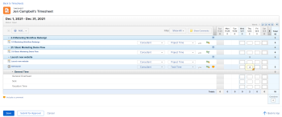
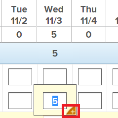
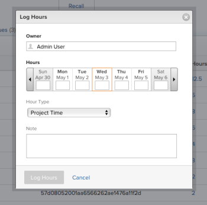

# Log time

The highlighted information on this page refers to functionality not yet generally available. It is available only in the Preview Sandbox environment.

You can log time for work items in&nbsp;*Adobe Workfront* to indicate the amount of hours you spend working on them. You can also log time that is not related to work, like vacation, sick time, or time you spend in meetings. The time you log displays in your timesheet.

For more information about the type of hours you can log in *Workfront*, see [Manage hour types](../../administration-and-setup/set-up-workfront/configure-timesheets-schedules/hour-types.md).

## Access requirements

You must have the following access to perform the steps in this article and log Project&nbsp;Specific hours:

<table cellspacing="0"> 
 <col> 
 <col> 
 <tbody> 
  <tr> 
   <td role="rowheader"><em>Adobe Workfront</em> plan*</td> 
   <td> 
Any
 </td> 
  </tr> 
  <tr> 
   <td role="rowheader"><em>Adobe Workfront</em> license*</td> 
   <td> 
<em>Review</em> or higher
 </td> 
  </tr> 
  <tr> 
   <td role="rowheader">Access level configurations*</td> 
   <td> 
Edit access to the type of work item you log time for 
 
For example, you need Edit access to Issues, to log time for issues
 
Note: If you still don't have access, ask your <em>Workfront administrator</em> if they set additional restrictions in your access level. For information on how a <em>Workfront administrator</em> can modify your access level, see <a href="../../administration-and-setup/add-users/configure-and-grant-access/create-modify-access-levels.md" class="MCXref xref">Create or modify custom access levels</a>.
 </td> 
  </tr> 
  <tr> 
   <td role="rowheader">Object permissions</td> 
   <td> 
Contribute or higher permissions on the work item you log time for that includes permissions to Log Hours
 
For information on requesting additional access, see <a href="../../workfront-basics/grant-and-request-access-to-objects/request-access.md" class="MCXref xref">Request access to objects in Adobe Workfront</a>.
 </td> 
  </tr> 
 </tbody> 
</table>

&#42;To find out what plan, license type, or access you have, contact your *Workfront administrator*.

## Considerations when logging time in *Workfront*

* You can log time for projects, tasks, or issues, or you can log time directly in your timesheet.

  For information about creating timesheets, see [Create a single-use timesheet](../../timesheets/create-and-manage-timesheets/create-tmshts.md). 

* All time logged through tools other than the timesheet appear in the timesheet for the corresponding time period.
* Time logged in the timesheet is immediately applied to the task, issue, or project.
* Timesheets include the total time for all logged dates. Weekends are always included, even when timeline calculations have been configured to exclude them (as described in [Configure system-wide project preferences](../../administration-and-setup/set-up-workfront/configure-system-defaults/set-project-preferences.md)).
* The maximum number of items displayed in a timesheet is 45. If there are more than 45 items whose dates match the timesheet timeframe, only the most recently updated items display.

## Log time

You can log time in the following areas in *Workfront*:

* [Timesheet](#timesheet) 
* [Home](#home) 
* [Project, task, or issue](#project,-task,-issue) 
* [Mobile app](#mobile-app)

### Timesheet

You can log general hours or project-specific hours on a timesheet.

>[!NOTE]
>
>Review users assigned to a Timesheet Profile can see the Timesheets tab and log general hours. However, they cannot log hours on any tasks or issues assigned to them that appear on the timesheet.

<ol> <draft-comment>
  <li value="1" data-mc-conditions="QuicksilverOrClassic.Quicksilver">Click the Main Menu icon  in the upper-right corner of <em>Adobe Workfront</em>.</li>
 </draft-comment>
 <li value="1" data-mc-conditions="QuicksilverOrClassic.Quicksilver">Click the Main Menu icon  in the upper-right corner of <em>Adobe Workfront</em>.</li> 
 <li value="2"> <draft-comment>
   
Click Timesheets. Your current timesheet displays by default. If you don't have a current timesheet, the My Timesheets section displays.

  </draft-comment>
Click Timesheets. Your current timesheet displays by default. If you don't have a current timesheet, the My Timesheets section displays.
 
  
 </li> 
 <li value="3">(Optional) To add a project, task, or issue to the timesheet, click the Add drop-down menu in the upper-left corner of the timesheet, then select whether you want to add a project, task, or issue to the timesheet.
  <ol style="list-style-type: lower-alpha;">
   <li value="1">In the Search dialog box, in the Quick Search field, specify the name of the project, task, or issue you want to add, then click Search. Or Click More options, and select options from the fields to find the objects you need.</li>
   <li value="2">In the search results, click the Plus icon  next to any projects, tasks, or issues you want to add. The selected, projects, tasks, or issues are displayed in the area on the right side of the dialog box. For example, when selecting tasks, the selected tasks appear in the Selected Tasks area. <draft-comment>
     
    </draft-comment></li>
   <li value="3">(Optional) Click the (x) icon next to any items in the Selected Projects, Selected Tasks, or Selected Issues area if you do not want to add the item to the timesheet. </li>
   <li value="4">
Click Save.
<note type="important">
     The selected items display in the timesheet.&nbsp;The items you manually add to the timesheet are pinned by default and are not automatically removed from the timesheet. 
     <em>Workfront</em> removes only unpinned items that do not have hours logged when the dates of the items exceed the work range of the timesheet.&nbsp;For information about the timesheet work range, see 
     <a href="../../administration-and-setup/set-up-workfront/configure-timesheets-schedules/timesheet-and-hour-preferences.md" class="MCXref xref">Configure timesheet and hour preferences</a>.
    </note></li>
  </ol></li> 
 <li value="4"> 
(Optional) You can remove an item (project, task, or issue) from the timesheet if you manually added the item (as described in Step 2), and if you have not yet logged time against it.
 
If the item is included in the timesheet because the timesheet preferences in your <em>Workfront</em> system or group are configured to pre-populate the timesheet (as described in <a href="../../administration-and-setup/set-up-workfront/configure-timesheets-schedules/timesheet-and-hour-preferences.md" class="MCXref xref">Configure timesheet and hour preferences</a>), the items cannot be removed from the timesheet.
 
To remove an item from the timesheet that was manually added:
 
  <ol style="list-style-type: lower-alpha;"> 
   <li value="1">Ensure that no time is logged against the item.</li> 
   <li value="2">Click the Pin icon next to the item to unpin the item from the timesheet.</li> 
   <li value="3">Refresh the page. The item is removed from the timesheet.</li> 
  </ol> </li> 
 <li value="5"> 
(Conditional) If your <em>Workfront administrator</em> has enabled the Assign job roles to hour entries manually setting, select a job role from the drop-down menu. The role specified when you are assigned to the work item displays by default. If you are not assigned a role on the object, your Primary Role displays as the default. For more information on this setting, see the article <a href="../../administration-and-setup/set-up-workfront/configure-timesheets-schedules/timesheet-and-hour-preferences.md" class="MCXref xref">Configure timesheet and hour preferences</a>.
 
  
 <note type="note">
   If you change roles during a timesheet period, a blank line with attached hours appears on the timesheet because hours were reported under both roles. Continue reporting hours and submitting your timesheet as usual, and the blank line will no longer appear in the next timesheet period.
  </note> </li> 
 <li value="6"> 
(Optional)&nbsp;Click the new hour entry icon to add hours on the same work item for a different role or with a different Hour&nbsp;Type than the previous hour entry. 
 
  
 </li> 
 <li value="7"> 
Click the drop-down menu next to the item on the timesheet where you want to add time, then select the appropriate hour type.
 
Hour types are available depending on what has been defined at the system, project, and user levels, as described in <a href="../../timesheets/create-and-manage-timesheets/define-hour-types-and-availability.md" class="MCXref xref">Define hour types and availability for timesheets</a>.
 
The hour type cannot be changed after a timesheet is closed.
 </li> 
 <li value="8"> 
Specify the amount of time you want to log on any given day. The timesheet row for which you log time is highlighted in light blue. 
 
 
 
You log time in either hours or days. This setting is configured by users with a Plan license or the system administrator, as described in <a href="../../timesheets/config-timesheet-prefs/config-time-logged-hrs-days.md" class="MCXref xref">Configure whether time is logged in hours or days</a>.
 </li> 
 <li value="9"> 
(Optional)&nbsp;Click the hour entry comment icon to add a comment to an hour entry, then click&nbsp;Save.
 
  
 </li> 
 <li value="10"> 
(Optional) Click Show Comments in the toolbar to display hour entry comments under the work item. 
 
  
 </li> 
 <li value="11"> 
Click the Update Status icon to include a comment for the work item, update the condition, or update the status of the work item, then click Done. You may also include others in your comment or lock it so that only users in your Company can see it.  
 
Your update displays in the Updates area of the work item associated with the logged time. 
 <note type="tip">
   You cannot comment on projects or General Time hour entries.
  </note> </li> 
 <li value="12"> 
(Optional) Click Include a comment to include a comment on the timesheet below the timesheet.
 
Comments display in the Recent Updates section below the timesheet. For more information about comments on timesheets, see <a href="../../timesheets/create-and-manage-timesheets/view-and-manage-comments-timesheets.md" class="MCXref xref">View and manage comments on a timesheet</a>.
 </li> 
 <li value="13"> 
(Optional)&nbsp;Click&nbsp;Back to top in the lower-right corner to return to the top of the timesheet.
 </li> 
 <li value="14">Click any of the following options:
  <ul>
   <li>Save:&nbsp;Save your changes and keep the timesheet open.</li>
   <li>
Save + Close: Save the timesheet and close it so that it can no longer be edited. You can open the timesheet after closing it by clicking Re-Open.
<note type="tip">
     The hour type cannot be changed after a timesheet is closed.
    </note></li>
   <li>Submit for Approval: This option is available only if there is an approver on the timesheet. Save your changes and submit for approval. You can open the timesheet after closing it by clicking Recall, if an approval has not been granted yet. For more information, see <a href="../../timesheets/create-and-manage-timesheets/submit-timesheet-for-approval.md" class="MCXref xref">Submit a timesheet for approval</a>.</li>
   <li>Cancel: Clicking Cancel before saving the timesheet removes all currently entered time that has not been saved. The timesheet remains open. </li>
   <li>Reject: This option displays when you are a timesheet approver and the timesheet has been submitted to you for approval. Clicking it changes the status of the timesheet to&nbsp;Rejected and the timesheet remains open. </li>
   <li>Approve: This option displays when you are a timesheet approver and the timesheet has been submitted to you for approval.&nbsp;Clicking it changes the status of the timesheet to Approved and closes the timesheet. </li>
  </ul></li> 
 <li value="15"> 
(Conditional) If you have either closed or submitted your timesheet for approval, click one of the following options:
 
  <ul> 
   <li>Re-Open: This option is available for timesheets that you have already closed and which have no approvers, or timesheets that have already been approved. Reopen the timesheet to modify hour entries. </li> 
   <li>Recall: This option is available for timesheets that have been submitted for approval but have not been approved or rejected yet. Click&nbsp;Recall to reopen the timesheet and modify hour entries. </li> 
  </ul> </li> 
</ol>

### Home

You can log project-specific time in Home.

For general information about using the Home area, see [Use the Home area](../../workfront-basics/using-home/using-the-home-area/use-the-home-area.md).

To log time on a work item from the Home area:

<ol> 
 <li value="1">In the Work List area, select the item where you want to log time.</li> 
 <li value="2">In the right panel, click Log Time.  <draft-comment>
   
  </draft-comment> </li> 
 <li value="3"> 
In the Enter Hours drop-down menu, select the appropriate hour type. Hour types are available depending on what has been defined at the system, project, and user levels, as described in <a href="../../timesheets/create-and-manage-timesheets/define-hour-types-and-availability.md" class="MCXref xref">Define hour types and availability for timesheets</a>.
 </li> 
 <li value="4"> 
(Conditional) If your <em>Workfront administrator</em> has enabled the Assign job roles to hour entries manually setting, select a job role from the drop-down menu. The role specified when you are assigned to the work item displays by default. If you are not assigned a role on the object, your Primary Role displays as the default. For more information on this setting, see the article <a href="../../administration-and-setup/set-up-workfront/configure-timesheets-schedules/timesheet-and-hour-preferences.md" class="MCXref xref">Configure timesheet and hour preferences</a>.
 </li> 
 <li value="5">Specify the time you want to log, then click Log Time.</li> 
</ol>

### Project, task, or issue

You can log project-specific time on a project, task, or issue.

#### Permissions required for logging time

In order to log hours on a project, task, or issue, you need to have specific permissions. You can log time in two places on a project, task, or issue:

* [Updates tab](#updates-tab) 
* [Hours tab](#hours-tab)

Updates tab

The following are required before you can log hours on the Updates tab of a project, task, or issue:

* You must have a Work or Plan license.
* You must have at least Contribute permissions to the project, task, or issue with access to Log Hours.  
  For more information about granting permissions on projects, see [Share a project in Adobe Workfront](../../workfront-basics/grant-and-request-access-to-objects/share-a-project.md).

* If you want to log time directly to a project, your *Workfront administrator* must enable the Log time directly on projects setting under Timesheet & Hours > Preferences.  
  For more information about allowing users to log hours directly to projects, see [Configure timesheet and hour preferences](../../administration-and-setup/set-up-workfront/configure-timesheets-schedules/timesheet-and-hour-preferences.md).

Hours tab

The following are required before you can log hours on the Hours tab of a project, task, or issue:

* You must be the system administrator.

Or you must have all of the following:

* You must have a Plan license with administrative access to Timesheets & hours. For more information about granting administrative access to Timesheets & hours, see [Grant users administrative access to certain areas](../../administration-and-setup/add-users/configure-and-grant-access/grant-users-admin-access-certain-areas.md).
* You must have at least Contribute permissions to the project with access to Log Hours. For more information about granting permissions on projects, see [Share a project in Adobe Workfront](../../workfront-basics/grant-and-request-access-to-objects/share-a-project.md).
* If you want to log time directly to a project, your *Workfront administrator*must enable the Log time directly on projects setting under Timesheet & Hours > Preferences. For more information about allowing users to log hours directly to projects, see [Configure timesheet and hour preferences](../../administration-and-setup/set-up-workfront/configure-timesheets-schedules/timesheet-and-hour-preferences.md).

To log time on a project, task, or issue:

<ol> 
 <li value="1">Navigate to a project, task, or issue.</li> <draft-comment>
  <li value="2" data-mc-conditions="QuicksilverOrClassic.Quicksilver">In the left panel, select Hours.</li>
 </draft-comment>
 <li value="2" data-mc-conditions="QuicksilverOrClassic.Quicksilver">In the left panel, select Hours.</li> 
 <li value="3">Click Log Time. 
The Log Hours dialog box displays.
</li> 
 <li value="4"> 
Specify the following information:
 
  <ul> 
   <li>Owner: Your name displays in this field, by default.  If you are logging the hours for another user, specify their name.</li> 
   <li>Hours: Enter the number of hours for the project, task, or issue.</li> 
   <li> 
Hour Type: Select an Hour Type from the drop-down menu, if it is different than the one displayed by default.
 
Depending on what hour types are configured in your system, the options here might vary. For more information about configuring hour types, see <a href="../../timesheets/create-and-manage-timesheets/define-hour-types-and-availability.md" class="MCXref xref">Define hour types and availability for timesheets</a>. 
 </li> 
   <li> Job Role: (Conditional) If your <em>Workfront administrator</em> has enabled the Assign job roles to hour entries manually setting, select a Job Role from the drop-down menu.The Role specified when you are assigned to the object displays by default. If you are not assigned a Role on the object, your Primary Role displays as the default. For more information on this setting, see the article <a href="../../administration-and-setup/set-up-workfront/configure-timesheets-schedules/timesheet-and-hour-preferences.md" class="MCXref xref">Configure timesheet and hour preferences</a>.<![CDATA[					    ]]>

</li> 
  </ul> </li> 
 <li value="5">Click Log Hours.</li> 
</ol>

### Mobile app

You can log time from the *Workfront* mobile app.
