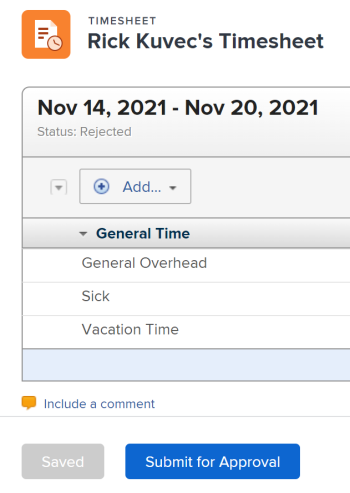

# Submit a timesheet for approval

Submitting your timesheet provides&nbsp;your manager with visibility into your work hours. Approvers can verify that&nbsp;all time recorded has been allocated in the correct areas and that&nbsp;a sufficient number of hours have been recorded for the period.

## Access requirements

You must have the following access to perform the steps in this article:

<table cellspacing="0"> 
 <col> 
 <col> 
 <tbody> 
  <tr> 
   <td role="rowheader"><em>Adobe Workfront</em> plan*</td> 
   <td> 
Any
 </td> 
  </tr> 
  <tr> 
   <td role="rowheader"><em>Adobe Workfront</em> license*</td> 
   <td> 
<em>Review</em> or higher
 </td> 
  </tr> 
  <tr> 
   <td role="rowheader">Access level configurations*</td> 
   <td> 
View access or higher to Tasks and Issues
 
Note: If you still don't have access, ask your <em>Workfront administrator</em> if they set additional restrictions in your access level. For information on how a <em>Workfront administrator</em> can modify your access level, see <a href="../../administration-and-setup/add-users/configure-and-grant-access/create-modify-access-levels.md" class="MCXref xref">Create or modify custom access levels</a>.
 </td> 
  </tr> 
  <tr> 
   <td role="rowheader">Object permissions</td> 
   <td> 
View or higher permissions on tasks and issues
 
For information on requesting additional access, see <a href="../../workfront-basics/grant-and-request-access-to-objects/request-access.md" xmlns:MadCap="http://www.madcapsoftware.com/Schemas/MadCap.xsd" class="MCXref xref">Request access to objects in Adobe Workfront</a>.
 </td> 
  </tr> 
 </tbody> 
</table>

&#42;To find out what plan, license type, or access you have, contact your *Workfront administrator*.

## Submit a timesheet for approval

* [Submit a timesheet for approval](#submitting-a-timesheet-for-approval) 
* [View the status of a submitted timesheet](#viewing-the-status-of-a-submitted-timesheet)

### Submit a timesheet for approval

After a timesheet approver is set (as described in the section [Designate timesheet approvers](../../timesheets/create-and-manage-timesheets/timesheet-approvals.md#designating-a-timesheet-approver) in the article [Approve a timesheet](../../timesheets/create-and-manage-timesheets/timesheet-approvals.md)), the `Save and Close Timesheet` button at the bottom of the timesheet changes to a `Submit for Approval`&nbsp;button.

To submit a timesheet for approval:

<ol> 
 <li value="1"> 
Go to a timesheet that has been configured to have an approver. 
 </li> 
 <li value="2"> 
Log time, as described in <a href="../../timesheets/create-and-manage-timesheets/log-time.md" xmlns:MadCap="http://www.madcapsoftware.com/Schemas/MadCap.xsd" class="MCXref xref">Log time</a>.
 </li> 
 <li value="3"> 
Click Submit for Approval to launch the timesheet approval process. 
 
  
 
The Save for Later and Submit for Approval buttons are replaced by the Recall button. The status of the timesheet changes to Submitted. 
 
When your timesheet is submitted for approval, the approver sees the timesheet listed in the Approvals&nbsp;area on the Home page. The following things might occur: 
 
  <ul> 
   <li> 
If they approve it, the Recall button changes to Re-Open and the timesheet status updates to Closed. 
 </li> 
   <li> 
If they reject it, Save for Later and Submit for Approval buttons replace the Recall button and the timesheet status updates to Rejected.
 </li> 
  </ul> </li> 
 <li value="4"> 
(Optional)&nbsp;Click&nbsp;Recall if you need to reopen the timesheet and update your time. For information, see <a href="#recalling-a-timesheet" xmlns:MadCap="http://www.madcapsoftware.com/Schemas/MadCap.xsd" class="MCXref xref">Recall a timesheet</a>.
 </li> 
</ol>

### View the status of a submitted timesheet

You can view the status of a timesheet after it has been submitted.

If the system&nbsp;administrator has&nbsp;enabled the "Timesheet Approval to User" and the "Timesheet Rejection to User" event handlers, you are notified after the timesheet is approved or rejected. Without these notifications, the only indication you have of a rejected timesheet is to go to the My Timesheets report (which displays all timesheets belonging to the logged-in user that have not been closed) to review the status of the active timesheets.

To view the status of a timesheet:

<ol> <draft-comment>
  <li xmlns:MadCap="http://www.madcapsoftware.com/Schemas/MadCap.xsd" value="1" data-mc-conditions="QuicksilverOrClassic.Quicksilver">Click the Main Menu icon  in the upper-right corner of <em>Adobe Workfront</em>.</li>
 </draft-comment>
 <li xmlns:MadCap="http://www.madcapsoftware.com/Schemas/MadCap.xsd" value="1" data-mc-conditions="QuicksilverOrClassic.Quicksilver">Click the Main Menu icon  in the upper-right corner of <em>Adobe Workfront</em>.</li> <draft-comment>
  <li xmlns:MadCap="http://www.madcapsoftware.com/Schemas/MadCap.xsd" value="2" data-mc-conditions="QuicksilverOrClassic.Quicksilver">Click Timesheets.</li>
 </draft-comment>
 <li xmlns:MadCap="http://www.madcapsoftware.com/Schemas/MadCap.xsd" value="2" data-mc-conditions="QuicksilverOrClassic.Quicksilver">Click Timesheets.</li> <draft-comment>
  <li xmlns:MadCap="http://www.madcapsoftware.com/Schemas/MadCap.xsd" value="3" data-mc-conditions="QuicksilverOrClassic.Quicksilver">In the left panel, click My Timesheets.  </li>
 </draft-comment>
 <li xmlns:MadCap="http://www.madcapsoftware.com/Schemas/MadCap.xsd" value="3" data-mc-conditions="QuicksilverOrClassic.Quicksilver">In the left panel, click My Timesheets.  </li> 
</ol>

## Recall a timesheet

You can recall a timesheet that has already been submitted for approval. Only timesheets that haven't been approved can be recalled.

To recall a timesheet:

<ol> <draft-comment>
  <li xmlns:MadCap="http://www.madcapsoftware.com/Schemas/MadCap.xsd" value="1" data-mc-conditions="QuicksilverOrClassic.Quicksilver">Click the Main Menu icon  in the upper-right corner of <em>Adobe Workfront</em>.</li>
 </draft-comment>
 <li xmlns:MadCap="http://www.madcapsoftware.com/Schemas/MadCap.xsd" value="1" data-mc-conditions="QuicksilverOrClassic.Quicksilver">Click the Main Menu icon  in the upper-right corner of <em>Adobe Workfront</em>.</li> <draft-comment>
  <li xmlns:MadCap="http://www.madcapsoftware.com/Schemas/MadCap.xsd" value="2" data-mc-conditions="QuicksilverOrClassic.Quicksilver">Click Timesheets.</li>
 </draft-comment>
 <li xmlns:MadCap="http://www.madcapsoftware.com/Schemas/MadCap.xsd" value="2" data-mc-conditions="QuicksilverOrClassic.Quicksilver">Click Timesheets.</li> <draft-comment>
  <li xmlns:MadCap="http://www.madcapsoftware.com/Schemas/MadCap.xsd" value="3" data-mc-conditions="QuicksilverOrClassic.Quicksilver">In the left panel, click My Timesheets.</li>
 </draft-comment>
 <li xmlns:MadCap="http://www.madcapsoftware.com/Schemas/MadCap.xsd" value="3" data-mc-conditions="QuicksilverOrClassic.Quicksilver">In the left panel, click My Timesheets.</li> 
 <li value="4">Select a timesheet with a status of Submitted.</li> 
 <li value="5">Click Recall.</li> 
</ol>

