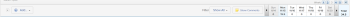
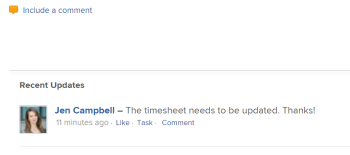

# Understand the Timesheet layout {#understand-the-timesheet-layout}

The highlighted information on this page refers to functionality not yet generally available. It is available only in the Preview Sandbox environment.

This article describes the layout of timesheets in *`Adobe Workfront`*, allowing you to better understand how to customize and utilize timesheets to record time.&nbsp;

Timesheet and Hour Preferences control what appears on a timesheet. This provides an overview of all available options.&nbsp;For information, see [Configure timesheet and hour preferences](timesheet-and-hour-preferences.md). 

For information about how to log time on a time sheet, see [Log time](log-time.md).

## Title {#title}

Identifies the start and end dates of the timesheet and includes the status of the timesheet.&nbsp;

## Object name {#object-name}

Identifies the projects, tasks and issues in the section where the items are associated. Clicking the blue header row collapses the projects.

Tasks, Issues, and Projects where time is recorded outside the timesheet or items planned during the timeframe of the timesheet appear here automatically, allowing users to record time.&nbsp;

## Toolbar {#toolbar}

Using the toolbar you can add objects to the timesheet, filter, the timesheet, and show comments. You can also navigate between weeks within the timesheet, if it contains more than one week. 

For more information, see the [Timesheet](log-time.md#timesheet) section in [Log time](log-time.md).

## Footer  {#footer}

You can use the Save, Save + Close, Submit for Approval, Cancel and Back to top buttons in this area to either save, recall, reopen the timesheet, or to navigate back to the top of the timesheet. This area remains sticky as you scroll vertically within the timesheet. For more information, see the [Timesheet](log-time.md#timesheet) section in [Log time](log-time.md).

## Job&nbsp;Roles {#job-roles}

You can select a different job role to associate with the hour entries. Your *`Workfront administrator`* must enable the `Assign job roles to hour entries manually` setting. The Role specified when you are assigned to the object displays by default. If you are not assigned a Role on the object, your Primary Role displays as the default. For more information on this setting, see the article [Configure timesheet and hour preferences](timesheet-and-hour-preferences.md).

## Hour Type {#hour-type}

You can select different hour types on an item in this area. This is a customized field set by the *`Workfront administrator`*.

## Expenses area {#expenses-area}

You can add expenses to tasks from the timesheet. Your *`Workfront administrator`* must enable the Add expenses from a timesheet setting in the Timesheets and Hours Preferences area.&nbsp;For information, see [Configure timesheet and hour preferences](timesheet-and-hour-preferences.md). 

## Timesheet Comments area {#timesheet-comments-area}

You can make comments on a timesheet to communicate with your timesheet approvers or other users. 

Any comments made on the timesheet display in this area. `This area displays under the timesheet and above the timesheet's footer.` For more information, see [View and manage comments on a timesheet](view-and-manage-comments-timesheets.md).

## Work item Comments area {#work-item-comments-area}

You can comment on tasks or issues displayed in a timesheet. 

The comments you enter in the timesheet display in the Updates area of the task or the issue. 

You cannot comment on projects or General Time hour entries.

For more information, see [View and manage comments on a timesheet](view-and-manage-comments-timesheets.md).

## Hours {#hours}

The timesheet provides input fields for each task item and day of the timesheet range to record time spent working on the item.&nbsp;You can also input any overtime hours or general hours in this area. The creator of the timesheet or of the timesheet profile associated with you must disable the Hide overtime setting for the Overtime field to display in the timesheet.&nbsp;For more information, see the following articles:

*  [Create a single-use timesheet](create-tmshts.md) 
*  [Create, edit, and assign timesheet profiles](create-timesheet-profiles.md) 

## Totals {#totals}

Review the sum of all hours entered on the timesheet, summarized by day as well as by object.
