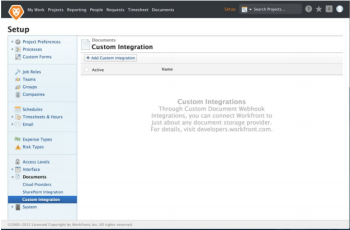

# Register a Webhook Integration {#register-a-webhook-integration}

## Registering a Webhook Integration {#registering-a-webhook-integration}

*`Adobe Workfront administrators`* can add a custom webhook integration for their company by navigating to Setup > Documents > Custom Integrations within *`Workfront`*. From the Custom Integration page within Setup,&nbsp;administrators can view a list of existing document Webhook integrations. From this page, integrations can be added, edited, enabled, and disabled.

To add an integration, click `Add Custom Integration`.  
  
  

### Available Fields {#available-fields}

When adding an integration, the administrator will enter values for the following fields.

<table style="height: 192px;width: 775px;mc-table-style: url('../../Resources/TableStyles/TableStyle-HeaderRow.css');" class="TableStyle-TableStyle-HeaderRow" cellspacing="15"> 
 <col class="TableStyle-TableStyle-HeaderRow-Column-Column1"> 
 <col class="TableStyle-TableStyle-HeaderRow-Column-Column1"> 
 <thead> 
  <tr class="TableStyle-TableStyle-HeaderRow-Head-Header1"> 
   <th class="TableStyle-TableStyle-HeaderRow-HeadE-Column1-Header1">Field Name</th> 
   <th class="TableStyle-TableStyle-HeaderRow-HeadD-Column1-Header1">Description</th> 
  </tr> 
 </thead> 
 <tbody> 
  <tr class="TableStyle-TableStyle-HeaderRow-Body-LightGray"> 
   <td class="TableStyle-TableStyle-HeaderRow-BodyE-Column1-LightGray">Name</td> 
   <td class="TableStyle-TableStyle-HeaderRow-BodyD-Column1-LightGray">The name of this integration.</td> 
  </tr> 
  <tr class="TableStyle-TableStyle-HeaderRow-Body-MediumGray"> 
   <td class="TableStyle-TableStyle-HeaderRow-BodyE-Column1-MediumGray">Base API URL</td> 
   <td class="TableStyle-TableStyle-HeaderRow-BodyD-Column1-MediumGray"> 
The location of the callback API. When making calls to the external system,Workfront will simply append the endpoint name to this address. For example, if the admin entered the Base API URL, “ https://www.mycompany.com/api/v1 ”, Workfront would using the following URL to get a document’s metadata: https://www.mycompany.com/api/v1/metadata?id=1234.
 </td> 
  </tr> 
  <tr class="TableStyle-TableStyle-HeaderRow-Body-LightGray"> 
   <td class="TableStyle-TableStyle-HeaderRow-BodyE-Column1-LightGray">Request parameters</td> 
   <td class="TableStyle-TableStyle-HeaderRow-BodyD-Column1-LightGray"> 
Optional values to be appended to the querystring of every API call. For example, access_type=offline.&nbsp;
 </td> 
  </tr> 
  <tr class="TableStyle-TableStyle-HeaderRow-Body-MediumGray"> 
   <td class="TableStyle-TableStyle-HeaderRow-BodyE-Column1-MediumGray">Authentication Type</td> 
   <td class="TableStyle-TableStyle-HeaderRow-BodyD-Column1-MediumGray">OAuth2 or ApiKey</td> 
  </tr> 
  <tr class="TableStyle-TableStyle-HeaderRow-Body-LightGray"> 
   <td class="TableStyle-TableStyle-HeaderRow-BodyE-Column1-LightGray">Authentication URL</td> 
   <td class="TableStyle-TableStyle-HeaderRow-BodyD-Column1-LightGray"> 
(OAuth2 Only) The full URL used for user authentication. Workfront will&nbsp;navigate users to this address as part of the OAuth provisioning process. Note: Workfront will append a “state” parameter to the query string. The provider must pass this back to Workfront by appending it to the Workfront Redirect URI.
 </td> 
  </tr> 
  <tr class="TableStyle-TableStyle-HeaderRow-Body-MediumGray"> 
   <td class="TableStyle-TableStyle-HeaderRow-BodyE-Column1-MediumGray">Token Endpoint URL</td> 
   <td class="TableStyle-TableStyle-HeaderRow-BodyD-Column1-MediumGray"> 
(OAuth2 Only) The full API URL used to retrieve OAuth2 tokens. This is hosted by the webhook provider or external document provider
 </td> 
  </tr> 
  <tr class="TableStyle-TableStyle-HeaderRow-Body-LightGray"> 
   <td class="TableStyle-TableStyle-HeaderRow-BodyE-Column1-LightGray">Client ID</td> 
   <td class="TableStyle-TableStyle-HeaderRow-BodyD-Column1-LightGray">(OAuth2 Only) The OAuth2 Client ID for this integration</td> 
  </tr> 
  <tr class="TableStyle-TableStyle-HeaderRow-Body-MediumGray"> 
   <td class="TableStyle-TableStyle-HeaderRow-BodyE-Column1-MediumGray">Client Secret</td> 
   <td class="TableStyle-TableStyle-HeaderRow-BodyD-Column1-MediumGray"> 
(OAuth2 Only) The OAuth2 Client Secret for this integration
 </td> 
  </tr> 
  <tr class="TableStyle-TableStyle-HeaderRow-Body-LightGray"> 
   <td class="TableStyle-TableStyle-HeaderRow-BodyE-Column1-LightGray">Workfront Redirect URI</td> 
   <td class="TableStyle-TableStyle-HeaderRow-BodyD-Column1-LightGray">(OAuth2 Only) This is a read-only field and is generated by Workfront. This&nbsp;value is used to register this integration with the external document provider. Note: As described above for Authentication URL, the provider must append the “state” parameter and its value to the querystring when performing the redirect.</td> 
  </tr> 
  <tr class="TableStyle-TableStyle-HeaderRow-Body-MediumGray"> 
   <td class="TableStyle-TableStyle-HeaderRow-BodyB-Column1-MediumGray">ApiKey</td> 
   <td class="TableStyle-TableStyle-HeaderRow-BodyA-Column1-MediumGray"> 
(ApiKey Only) Used to make authorized API calls to the webhook provider. The API key issued by the webhook provider.
 </td> 
  </tr> 
 </tbody> 
</table>

