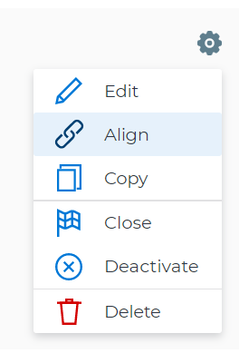
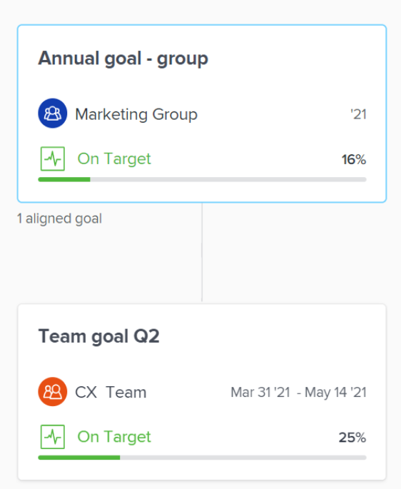

# Align goals by connecting them in `Workfront Align` {#align-goals-by-connecting-them-in-workfront-align}

Your company must have a `Workfront Align` license in addition to a `Workfront` license to use this functionality. Contact your `Workfront` account manager to learn about a `Workfront Align` license. 

`Workfront Align` is available only in `the new Workfront experience`. 

For additional information about access to `Workfront Align`, see [Access needed to use Workfront Align](access-needed-for-wf-align.md).
If you are an individual contributor who has a personal goal, you may want to align it to your team's goals in order to effectively display the progress of your own goal in the larger context of your organization's strategy. 

You can create alignment between goals by connecting goals to one another. This is a bottom-up approach to aligning goals. 

When everyone in your organization has their goals aligned to your organization's goals, they can clearly see how their individual contributions and team efforts help to move the needle forward on larger, company-level priorities. For more information about the best practices for aligning goals, see [Goal alignment overview in Workfront Align](goal-alignment-overview.md).

You can manually align two goals or you can convert results and activities of an existing goal to another goal.&nbsp;The converted result or activity becomes the child goal of the original goal. 

This article describes how you can align goals to one another by connecting them. For information about aligning goals by converting results and activities to goals, see [Align goals by converting results and activities to goals in Workfront Align](align-goals-by-converting-results-activities.md). 

1.  Create two goals that you want to align. For information about creating goals, see [Create goals in Workfront Align](create-goals.md).
1.  (Optional)&nbsp;Activate the goals that you want to align.&nbsp;You can align goals that have a Draft, Active, or Inactive status. For information about activating goals, see [Activate goals in Workfront Align](activate-goals.md).
1.  Go to the goal that you want to align (child goal) to another goal (parent goal) and click its name to open the **Goal&nbsp;Details** panel.&nbsp;

   For example, if you want Goal 2 to influence the progress of Goal 1, you must go to Goal 2. 

1.  Click the **gear icon**  in the upper-right corner of the right panel, then click&nbsp;**Align**. 

   

1.  Start typing the name of an existing goal or the name of an owner in the **Align to** field, then select it when it appears in the list. Only goals that are from the same or future period display in the list. 
1.  Click&nbsp;**Save**. 

   The goal you started with (Goal 2) is now the child goal of the goal you aligned it with (Goal 1).   
   The aligned goals display connected in the `Goal Alignment section` with Goal 2 as secondary to&nbsp;Goal 1. 

   

1.  (Optional) To view the goals in the `Goal Alignment section`, do one of the following:&nbsp;

    
    
    * Click the `Goal Alignment` section in the left panel and find the goal in the Personal or Company tabs. 
    *  Click the `Goal List`, `Check-in`, or `Pulse` sections in the left panel, then click the **Alignment icon**  next to the goal name to go directly to the goal in the `Goal Alignment section`. 
    
    
   For information about the `Goal Alignment section`, see [Navigate the Goal Alignment chart in Workfront Align](navigate-goal-alignment-chart.md). 

1.  (Optional)&nbsp;Add activities and results to either goal to indicate their progress. For information about adding activities and results, see the following articles:

    
    
    * [Add activities to goals in Workfront Align](add-activities-to-goals.md) 
    * [Add results to goals in Workfront Align](add-results-to-goals.md) 
    
    

1. (Optional)&nbsp;Remove the alignment between two goals, when you consider that no longer is relevant to your organization's overall strategy For information about removing alignment between goals, see [Remove goal alignment in Workfront Align](remove-goal-alignment.md).

