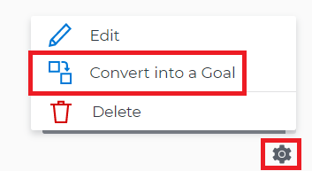

# Align goals by converting results and activities to goals in  `Workfront Align` {#align-goals-by-converting-results-and-activities-to-goals-in-workfront-align}

Your company must have a `Workfront Align` license in addition to a `Workfront` license to use this functionality. Contact your `Workfront` account manager to learn about a `Workfront Align` license. 

`Workfront Align` is available only in `the new Workfront experience`. 

For additional information about access to `Workfront Align`, see [Access needed to use Workfront Align](access-needed-for-wf-align.md).
You can manually align two goals or you can convert the results and activities of an existing goal to another goal.&nbsp;The converted result or activity becomes the child goal of the original goal. For information about manually aligning two goals, see [Align goals by connecting them in Workfront Align](align-goals-by-connecting-them.md). 

Sometimes, a result or an activity may have a larger scope than anticipated and it would make more sense that they would become goals. You can convert results and activities of an existing goal to a new goal.&nbsp;This is a bottom-up approach to aligning goals.

Consider the following when converting results and activities to goals:

* The converted result or activity becomes the child goal of the original goal, and the two goals become aligned.
* The converted result or activity is removed from the original goal and added as a result or activity to the newly created goal. 
* The newly created goal becomes the single progress indicator for the original goal, if there are no additional results or activities on the original goal. 

To convert a result or activity to a goal:&nbsp;

1. Go to a goal that has a result or an activity that you want to convert to a goal.
1. Click the name of the goal to open the **Goal&nbsp;Details** panel.
1. Expand the **Results** or **Activities** right-pointing arrows to see a list of results or activities for the goal. 

1.  Click the **gear icon **  to the right of the result or activity name that you want to convert, then click **Convert into a Goal**. 

   

1. (Optional) Remove the name of the original activity or result owner from the **Goal Owner** field and replace it with another user, team, group, or your organization's name. By default, `Workfront` selects the owner of the result or the activity as the goal owner. 

1. Click&nbsp;**Convert**. The activity or result displays as an aligned goal in the Goal&nbsp;Details panel of the original goal and the original activity or result is removed from the original goal and transferred to the second goal. By default, the new goal has the same name as the original converted result or activity. 
1. (Optional) Click the name of the new goal to open the **Goal Details** panel and edit the name of the goal. For information about editing any information for an existing goal, see [Edit goals in Workfront Align](edit-goals.md). 

