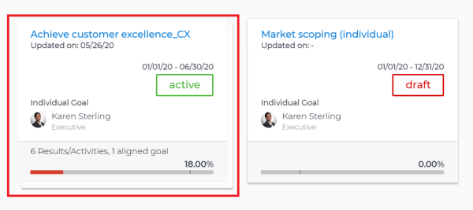
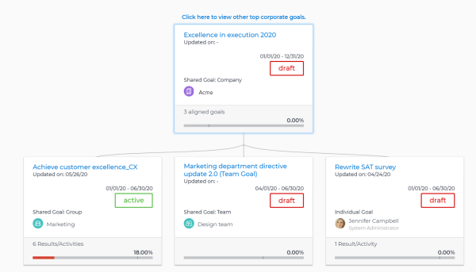
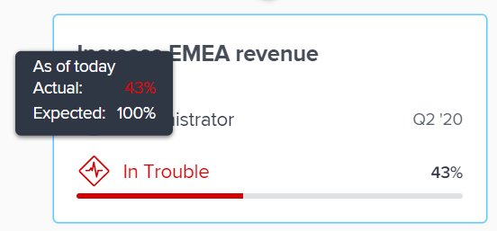

# Navigate the `Goal Alignment` chart in `Workfront Align` {#navigate-the-goal-alignment-chart-in-workfront-align}

Your company must have a `Workfront Align` license in addition to a `Workfront` license to use this functionality. Contact your `Workfront` account manager to learn about a `Workfront Align` license. 

`Workfront Align` is available only in `the new Workfront experience`. 

For additional information about access to `Workfront Align`, see [Access needed to use Workfront Align](access-needed-for-wf-align.md).
Use the `Goal Alignment` section to display a holistic view of goal alignment across the entire organization in a flowchart. Aligned goals display on cards that interconnect in a hierarchical tree.

For information about goal alignment and how to achieve it, also see the following articles:

* [Goal alignment overview in Workfront Align](goal-alignment-overview.md) 
* [Align goals by connecting them in Workfront Align](align-goals-by-connecting-them.md) 

To navigate the `Goal Alignment` section:

1.  Click the **Main&nbsp;Menu** icon  >**Align**, then click the **Alignment icon**  in the left panel

   Or

   From a list of goals, click the **Alignment icon**  to the right of the goal Status to see it in the `Goal Alignment` section.

   Goals in a status of Draft or Active display on the `Goal Alignment` section on cards. 

   The Personal tab in the `Goal Alignment` section displays by default. Goals where you are the owner display in the Personal tab.

1.  (Optional) Click the&nbsp;**Company** tab to view goals that are assigned to your organization and their aligned goals. 

   Goals that are aligned to other goals display with additional stacked cards behind the top goal card. 

   

1.  (Optional) Select a different period from the upper-right drop-down menu.&nbsp;The default is the current quarter. You can only select one time period at a time to view goals that are due during that period. Select from quarters or yearly periods for the current year and up to two more years. 
1. (Optional) Start typing the name of an owner who is designated as a goal owner in the **Search for owner's name** field, the select it when it appears in the list. Goals assigned to the owner you indicate and their aligned goals display in the `Goal Alignment` section. 

1.  Click a stack of aligned goals to display all the goals in that alignment. 

   

   The following information displays on a goal card:

<table style="width: 100%;mc-table-style: url('../../Resources/TableStyles/TableStyle-List-options-in-steps.css');" class="TableStyle-TableStyle-List-options-in-steps" cellspacing="0"> 
 <col class="TableStyle-TableStyle-List-options-in-steps-Column-Column1"> 
 <col class="TableStyle-TableStyle-List-options-in-steps-Column-Column2"> 
 <tbody> 
  <tr class="TableStyle-TableStyle-List-options-in-steps-Body-LightGray"> 
   <td class="TableStyle-TableStyle-List-options-in-steps-BodyE-Column1-LightGray">Goal name</td> 
   <td class="TableStyle-TableStyle-List-options-in-steps-BodyD-Column2-LightGray">The name of the goal. </td> 
  </tr> 
  <tr class="TableStyle-TableStyle-List-options-in-steps-Body-MediumGray"> 
   <td class="TableStyle-TableStyle-List-options-in-steps-BodyE-Column1-MediumGray">Updated on date </td> 
   <td class="TableStyle-TableStyle-List-options-in-steps-BodyD-Column2-MediumGray">The date when the goal was last updated</td> 
  </tr> 
  <tr class="TableStyle-TableStyle-List-options-in-steps-Body-LightGray"> 
   <td class="TableStyle-TableStyle-List-options-in-steps-BodyE-Column1-LightGray">Time period dates </td> 
   <td class="TableStyle-TableStyle-List-options-in-steps-BodyD-Column2-LightGray"> 
This is the period for which the goal is open.&nbsp;The goal must be achieved by the end date of the period. Workfront Align calculates progress on the goal based on the duration of the goal's period and the current date.
 </td> 
  </tr> 
  <tr class="TableStyle-TableStyle-List-options-in-steps-Body-MediumGray"> 
   <td class="TableStyle-TableStyle-List-options-in-steps-BodyE-Column1-MediumGray">Status</td> 
   <td class="TableStyle-TableStyle-List-options-in-steps-BodyD-Column2-MediumGray">Active and Draft goals display in the Goal&nbsp;Alignment section.</td> 
  </tr> 
  <tr class="TableStyle-TableStyle-List-options-in-steps-Body-LightGray"> 
   <td class="TableStyle-TableStyle-List-options-in-steps-BodyE-Column1-LightGray">Owner name</td> 
   <td class="TableStyle-TableStyle-List-options-in-steps-BodyD-Column2-LightGray">The name of the user, team, group, or the organization designated as the goal&nbsp;Owner. </td> 
  </tr> 
  <tr class="TableStyle-TableStyle-List-options-in-steps-Body-MediumGray"> 
   <td class="TableStyle-TableStyle-List-options-in-steps-BodyE-Column1-MediumGray">Progress indicators</td> 
   <td class="TableStyle-TableStyle-List-options-in-steps-BodyD-Column2-MediumGray">The number of progress indicators for the goal.&nbsp;Progress indicators can be aligned goals, results, or activities. </td> 
  </tr> 
  <tr class="TableStyle-TableStyle-List-options-in-steps-Body-LightGray"> 
   <td class="TableStyle-TableStyle-List-options-in-steps-BodyB-Column1-LightGray">Goal Progress bar</td> 
   <td class="TableStyle-TableStyle-List-options-in-steps-BodyA-Column2-LightGray"> 
The goal progress indicates how much of the goal has currently been achieved.&nbsp;This is an automatic calculation of the average of the progress of all aligned goals, results, and activities for the goal based on the time elapsed since the start of the goal's time period. For information about calculating progress on goals, see <a href="calculate-goal-progress.md" class="MCXref xref">Calculate goal progress in Workfront Align</a>. 
 
The actual progress of the goal by the current date. The following colors indicate the progress status of the goal:
 
    <ul> 
     <li value="1">Green: the goal is on time and will be achieved on time.</li> 
     <li value="2">Yellow:&nbsp;the goal is behind and might not be achieved on time.</li> 
     <li value="3">Red: the goal is at risk and will not be achieved on time. </li> 
    </ul> </td> 
  </tr> 
 </tbody> 
</table>

1.  (Optional) Hover over the progress bar to understand where the goal progress should be in the current day. 

   

   The following information displays:

<table style="width: 100%;mc-table-style: url('../../Resources/TableStyles/TableStyle-List-options-in-steps.css');" class="TableStyle-TableStyle-List-options-in-steps" cellspacing="0"> 
 <col class="TableStyle-TableStyle-List-options-in-steps-Column-Column1"> 
 <col class="TableStyle-TableStyle-List-options-in-steps-Column-Column2"> 
 <tbody> 
  <tr class="TableStyle-TableStyle-List-options-in-steps-Body-LightGray"> 
   <td class="TableStyle-TableStyle-List-options-in-steps-BodyE-Column1-LightGray">As of date</td> 
   <td class="TableStyle-TableStyle-List-options-in-steps-BodyD-Column2-LightGray">The date of the last progress update.</td> 
  </tr> 
  <tr class="TableStyle-TableStyle-List-options-in-steps-Body-MediumGray"> 
   <td class="TableStyle-TableStyle-List-options-in-steps-BodyE-Column1-MediumGray">Progress </td> 
   <td class="TableStyle-TableStyle-List-options-in-steps-BodyD-Column2-MediumGray">The actual progress (a percentage) of the goal by the current date as calculated by taking into account all the progress indicators on the goal. Goal progress indicators are aligned goals, activities, and results. </td> 
  </tr> 
  <tr class="TableStyle-TableStyle-List-options-in-steps-Body-LightGray"> 
   <td class="TableStyle-TableStyle-List-options-in-steps-BodyB-Column1-LightGray">Expected</td> 
   <td class="TableStyle-TableStyle-List-options-in-steps-BodyA-Column2-LightGray"> 
The expected progress (a percentage) of the goal by the current date assuming that you will achieve the goal on time.
 </td> 
  </tr> 
 </tbody> 
</table>

   For information about how `Workfront Align` calculates progress on goals, see [Calculate goal progress in Workfront Align](calculate-goal-progress.md).

1. Click a stack of cards to further expand the aligned goals.
1. Click the name of a goal on a card to open the Goal&nbsp;Details panel and edit information about or check in on the goal. For information about editing existing goals, see [Edit goals in Workfront Align](edit-goals.md). For information about checking in on goals, see [Check in on goals in Workfront Align](check-in-goals.md).

1. Click the top goal card of the current level to return to the previous level of the chart.

