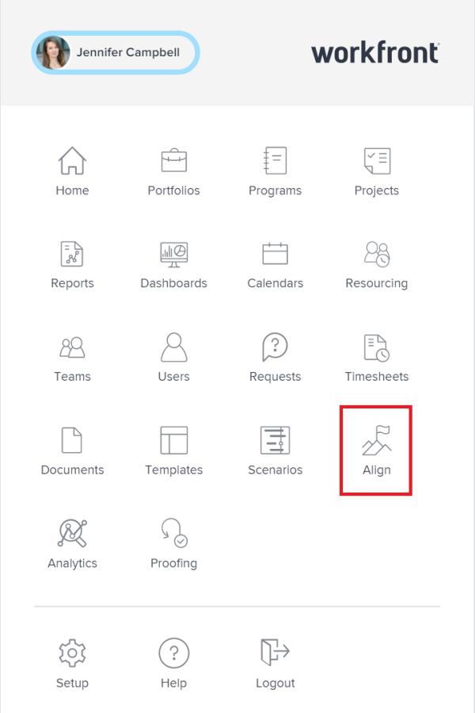

# Access goals in `Workfront Align` {#access-goals-in-workfront-align}

Your company must have a `Workfront Align` license in addition to a `Workfront` license to use this functionality. Contact your `Workfront` account manager to learn about a `Workfront Align` license. 

`Workfront Align` is available only in `the new Workfront experience`. 

For additional information about access to `Workfront Align`, see [Access needed to use Workfront Align](access-needed-for-wf-align.md).

## Access `Workfront Align` {#access-workfront-align}

1.   Click the **Main Menu** icon  in the upper-right corner, then click **Align**. 

   

   The `Goal List` displays. 

   >[!IMPORTANT] {type="important"}
   >
   >The `Goal List` displays goals that you or anyone else created. 

1.  (Optional) Click the name of a goal to open or edit it. 

   Or

   Click **Add Goal** in the upper-right corner to add a new goal. 

   For information about creating goals, see [Create goals in Workfront Align](create-goals.md). 

## Access and manage individual goals {#access-and-manage-individual-goals}

You must access an individual goal to perform the following actions as you manage your goals:

* Edit it
* Add a result or activity to it
* Edit results and activities associated with it
* Activate it
* Deactivate it
* Delete it
* Align it
* Convert results or activities to other goals
* Update it by checking in on it

To access an individual goal in `Workfront Align`:

1.  Click the **Main Menu** icon  in the upper-right corner of `Workfront`, then click **Align**. 

   The `Goal List` displays by default. 

1.  Click the name of a goal in the list to access it

   Or

   Click one of the following options in the left panel:

    
    
    * Goal Alignment
    * `Check-in` 
    *  `Pulse` 
    
    

   >[!NOTE]
   >
   >Depending on what action you want to perform on the individual goal, you might choose to select different sections every time. For information about the differences between the `Workfront Align` sections, see [Overview of the Workfront Align sections](overview-of-wf-align-sections.md). 

1.  Click the name of a goal in the `Goal List` or `Check-in` or `Pulse` sections, or in a card on the `Goal Alignment section`.&nbsp;

   The Goal Details panel displays on the right. You can update the goal, its results, and activities in the Goal Details panel. For information about updating goals using the Goal&nbsp;Details panel, see [Update goals in the Goal Details panel in Workfront Align](update-goals-in-goal-details-panel.md).

