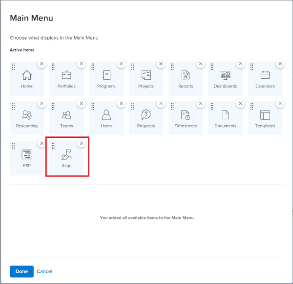

# Access needed to use `Workfront Align` {#access-needed-to-use-workfront-align}

Your `Workfront administrator` must ensure the following conditions are all met before you can access `Workfront Align`:

* Your organization must purchase a `Workfront Align` license, in addition to a `Workfront` license. Contact your `Workfront` Account Representative to learn about `Workfront Align` licenses. 

* Assign you any of the following types of `Workfront` licenses:
    
    
    * Plan
    * Work
    * Review
    * Request
    
    

  >[!NOTE]
  >
  >Users with an External license type cannot access `Workfront Align`.

*  Enroll you in `the new Workfront experience`.&nbsp;
* Assign you a layout template that includes the Align area in the Main Menu. 

## Obtain `Workfront Align` organization access {#obtain-workfront-align-organization-access}

Your organization must purchase an additional license, in addition to the `Workfront` license, for your users to be able to access `Workfront Align`. After your organization purchases the additional license, `Workfront` enables `Workfront Align` for your account. For information about purchasing a license for `Workfront Align` contact your `Workfront` account manager. 

##  Add `Workfront Align` to a layout template {#add-workfront-align-to-a-layout-template}

Your `Workfront administrator` must assign you a Layout Template that includes the Align area in the Main Menu so you can access `Workfront Align`.

For information about updating a Layout Template see [Create and manage Layout Templates](create-and-manage-layout-templates.md).

For information about assigning users to a Layout Template, see [Assign users to a Layout Template in the new Workfront experience](assign-users-to-layout-template.md).

## Enroll users in `the new Workfront experience` {#enroll-users-in-the-new-workfront-experience}

For information about enrolling users in `the new Workfront experience`, see [Enroll users in the new Workfront experience](enroll-users-new-workfront-experience.md).
