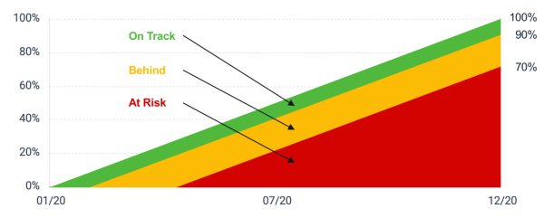

# Calculate goal progress in `Workfront Align` {#calculate-goal-progress-in-workfront-align}


Your company must have a `Workfront Align` license in addition to a `Workfront` license to use this functionality. Contact your `Workfront` account manager to learn about a `Workfront Align` license. 


`Workfront Align` is available only in `the new Workfront experience`. 


For additional information about access to `Workfront Align`, see [Access needed to use Workfront Align](access-needed-for-wf-align.md).


## Overview of goal progress and threshold  
{#overview-of-goal-progress-and-threshold}

After you activate a goal, `Workfront Align` starts calculating its progress and displays the following progress indicators:


* [Actual percent complete](#actual) 
* [Expected percent complete](#expected) 
* [Progress status](#progress) 


### Actual percent complete {#actual-percent-complete}

`Workfront Align` automatically calculates the actual percent complete of a goal based on the percent complete average of the goal progress indicators.&nbsp;


The following items are considered progress indicators for goals: 


*  Results


  For information about adding results to goals, see [Add results to goals in Workfront Align](add-results-to-goals.md).

*  Activities


  For information about adding activities including projects to goals, see [Add activities to goals in Workfront Align](add-activities-to-goals.md). 

*  Aligned children goals


  For information about parent and children goals, see [Align goals by connecting them in Workfront Align](align-goals-by-connecting-them.md).


  `Workfront Align` calculates the actual percent complete using the following formula:


  ```
  Actual percent complete of goal = SUM(Percent complete of goal progress indicators)* 100 / Number of progress indicators
  ```


  For example, if a goal has a Result that is 20% complete, a Manual Progress Bar that is 30% complete, a project what is 10% complete and a children goal that is 40% complete, the goal percent complete is 25%. 


### Expected percent complete {#expected-percent-complete}

`Workfront Align` automatically calculates the expected percent complete of a goal based on the total number of days in the duration of the goal as well as on the number of days that have passed since the goal start date. 


`Workfront Align` calculates the expected percent complete using the following formula:


```
Expected percent complete of goal = Number of days since the goal start date * 100/ Number of days in the goal duration
```


### Progress status  {#progress-status}

`Workfront Align` calculates a progress status percentage and assigns a progress status label to goals, based on what&nbsp;percentage from the Expected percent complete has been achieved at the current moment in time. The color of the goal percent complete bar changes to indicate the progress status of the goal. 


`Workfront Align` calculates the progress status percentage of a goal using the following formula:


```
Goal progress status percentage = Actual percent complete * 100 / Expected percent complete
```


For example, if the Expected percent complete is 53% at the current time and the Actual percent complete is 30%, the Goal progress percent complete is 56%. `Workfront Align` labels this goal with a Progress status of "At Risk".


The following chart illustrates the relationship between the progress status labels and the progress status percentage: 





The table below lists the goal progress status labels and the goal progress status percentages associated with each label. 


>[!IMPORTANT] {type="important"}
>
>Goal progress status labels in  `Workfront Align` are completely independent from `Workfront` progress status or condition labels for tasks and projects. 


<table style="width: 100%;mc-table-style: url('../../Resources/TableStylesheets/Standard.css');" class="TableStyle-Standard" cellspacing="3"> 
 <col class="TableStyle-Standard-Column-Column1"> 
 <col class="TableStyle-Standard-Column-Column1"> 
 <col class="TableStyle-Standard-Column-Column1"> 
 <col class="TableStyle-Standard-Column-Column1"> 
 <tbody> 
  <tr class="TableStyle-Standard-Body-LightGray"> 
   <td class="TableStyle-Standard-BodyE-Column1-LightGray" style="font-weight: bold;">Name of progress status</td> 
   <td class="TableStyle-Standard-BodyE-Column1-LightGray" style="font-weight: bold;">Definition of progress status</td> 
   <td class="TableStyle-Standard-BodyE-Column1-LightGray"><b>Goal progress status percentage </b> </td> 
   <td class="TableStyle-Standard-BodyD-Column1-LightGray" style="font-weight: bold;">Color of percent complete bar</td> 
  </tr> 
  <tr class="TableStyle-Standard-Body-MediumGray"> 
   <td class="TableStyle-Standard-BodyE-Column1-MediumGray" style="font-weight: bold;">New</td> 
   <td class="TableStyle-Standard-BodyE-Column1-MediumGray"> <p>The goal is newly created and it is not recording progress yet. A goal progress displays as New until someone checks in on it for the first time. </p> <p>For information about checking a goal in, see <a href="check-in-goals.md" class="MCXref xref">Check in on goals in Workfront Align</a>.</p> </td> 
   <td class="TableStyle-Standard-BodyE-Column1-MediumGray">No percentage</td> 
   <td class="TableStyle-Standard-BodyD-Column1-MediumGray">No bar</td> 
  </tr> 
  <tr class="TableStyle-Standard-Body-LightGray"> 
   <td class="TableStyle-Standard-BodyE-Column1-LightGray" style="font-weight: bold;">On&nbsp;Track</td> 
   <td class="TableStyle-Standard-BodyE-Column1-LightGray">The goal is performing as expected and there is a great likelihood that it will complete on time. </td> 
   <td class="TableStyle-Standard-BodyE-Column1-LightGray">90-100%</td> 
   <td class="TableStyle-Standard-BodyD-Column1-LightGray">Green</td> 
  </tr> 
  <tr class="TableStyle-Standard-Body-MediumGray"> 
   <td class="TableStyle-Standard-BodyE-Column1-MediumGray" style="font-weight: bold;">Behind</td> 
   <td class="TableStyle-Standard-BodyE-Column1-MediumGray">The goal is behind, but it might still be possible to complete it on time. </td> 
   <td class="TableStyle-Standard-BodyE-Column1-MediumGray">70-89.99%</td> 
   <td class="TableStyle-Standard-BodyD-Column1-MediumGray">Yellow</td> 
  </tr> 
  <tr class="TableStyle-Standard-Body-LightGray"> 
   <td class="TableStyle-Standard-BodyB-Column1-LightGray" style="font-weight: bold;">At Risk</td> 
   <td class="TableStyle-Standard-BodyB-Column1-LightGray">The goal is at risk to not be completed on time. </td> 
   <td class="TableStyle-Standard-BodyB-Column1-LightGray">0-69.99%</td> 
   <td class="TableStyle-Standard-BodyA-Column1-LightGray">Red</td> 
  </tr> 
 </tbody> 
</table>

