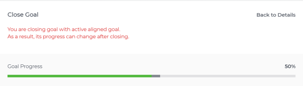

# Close and reopen goals in `Workfront Align` {#close-and-reopen-goals-in-workfront-align}

Your company must have a `Workfront Align` license in addition to a `Workfront` license to use this functionality. Contact your `Workfront` account manager to learn about a `Workfront Align` license. 

`Workfront Align` is available only in `the new Workfront experience`. 

For additional information about access to `Workfront Align`, see [Access needed to use Workfront Align](access-needed-for-wf-align.md).
You can close a goal when you want to indicate the following:

*  The goal is done, either because you achieved it, or because the time period elapsed.
* You are no longer working on it nor do you plan to do so in the immediate future.

You can close only active goals. For information about goal statuses, see [Goal status overview in Workfront Align](goal-status-overview.md). 

## Considerations when closing goals {#considerations-when-closing-goals}

*  Closing goals locks in its progress and allows you to rate how well you did in accomplishing it.

  ` `**Warning: **``When closing a goal that has active contributing goals, its progress changes after closing to indicate the progress of the contributing active goals. For information about aligning goals, see [Align goals by connecting them in Workfront Align](align-goals-by-connecting-them.md).

* Closing a goal removes it from your `Check-in` page, as you will no longer be responsible for updating the progress.
* Check in on your goal to update its progress indicators before you close the goal to ensure the goal closes with an accurate progress value. If all progress indicators have been achieved then the goal percent complete should be 100% and your goal has been achieved. For information about checking in on your goals, see [Check in on goals in Workfront Align](check-in-goals.md).
* Leave any final comments as an update to the goals that you close.&nbsp;For information about adding comments to goals, see [Manage goal comments in Workfront Align](manage-goal-comments.md). 
* You can no longer update the progress of results and activities on a goal you close. 
*  You can reopen a closed goal if you want to continue working on it. 
* If the goal has not been achieved, consider copying most of its information to the next time period (quarter or year). This is a great option for goals that are the same from one time period to the next or goals that you may still need to work on achieving in the next timeframe.&nbsp;For information about copying goals, see [Copy goals in Workfront Align](copy-goals.md).

## Close goals {#close-goals}

1.  Click the **Main Menu** icon  in the upper-right corner of `Workfront`, then click **Align**.

   The `Goal List` opens. 

1.  (Optional) Select **Active** in the **Goal Status** filter on the right to display active goals. 
1.  Click an active goal.

   The Goal Details panel displays on the right. 

1. (Optional and recommended) Click the **Updates** tab and add an update in the **Comment here** field about the reason you are closing the goal, then click **Post**. 

1.  Click the **gear** icon  to the right of the goal name, then click **Close**>**Close Goal**. 

   This closes the goal and saves the current progress on the goal and its results and activities. 

   >[!IMPORTANT] {type="important"}
   >
   >If the goal has contributing goals that are still active, the progress of the goal continues to update based on the progress of the aligned goals.
   >
   >
   >   >
   >

1. (Optional) Select **Closed** in the **Goal Status** field on the right in the **Filters** area to display closed goals. 

## Reopen goals {#reopen-goals}

You can reopen closed goals if you decided that they have become relevant again and that you need to continue updating their progress. 

1.  Click the **Main Menu** icon  in the upper-right corner of `Workfront`, then click **Align**.

   The `Goal List` opens. 

1.  (Optional) Select **Closed** in the **Goal Status** filter on the right. 

   Only closed goals display in the `Goal List`. 

1.  Click a closed goal.

   This opens the Goal Details panel. 

1.  Click the **gear** icon  to the right of the goal name, then click **Reopen**>**Reopen**.

   This reopens the goal in a status of Active. The progress of the goal is recalculated starting with the current date. 

1. (Optional) Select **Active** in the **Goal Status** field on the right in the **Filters** area to display active goals. 

