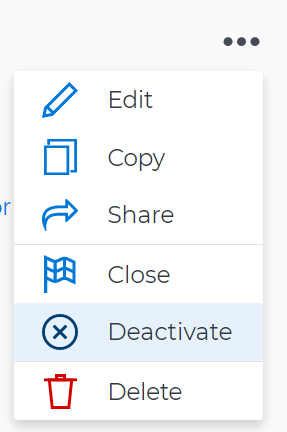

# Delete and deactivate goals in `Workfront Align` {#delete-and-deactivate-goals-in-workfront-align}

Your company must have a `Workfront Align` license in addition to a `Workfront` license to use this functionality. Contact your `Workfront` account manager to learn about a `Workfront Align` license. 

`Workfront Align` is available only in `the new Workfront experience`. 

For additional information about access to `Workfront Align`, see [Access needed to use Workfront Align](access-needed-for-wf-align.md).
When you start working on a goal and it becomes irrelevant in your organization, we recommend deactivating it, instead of deleting it. Deactivating a goal keeps its historical information and gives you a chance to reactivate it at a later time. There are times, however, when deleting a goal might make sense, to keep your goal list accurate. 

>[!IMPORTANT] {type="important"}
>
>Deleted goals cannot be recovered. 

## Deactivate goals {#deactivate-goals}

You can deactivate a goal that is no longer relevant and that you might want to reactivate in the future. 

* [Considerations when deactivating goals](#consider) 
* [Deactivate goals](#h3-deactivate-goals) 

### Considerations when deactivating goals {#considerations-when-deactivating-goals}

Remember the following when deactivating goals: 

*  You can only deactivate goals in an Active status. For information about activating a goal, see [Activate goals in Workfront Align](activate-goals.md).

  >[!TIP] {type="tip"}
  >
  >You cannot deactivate goals in a Draft status. 

* `Workfront` stops calculating the progress of deactivated goals. 
* Deactivated goals no longer display on or are taken into account in the following areas of `Workfront Align`:
    
    
    * The `Check-in` section. For information about the Check-in page, see [Check in on goals in Workfront Align](check-in-goals.md). 
    
    * The Graphs section. For information about `Workfront Align` graphs, see [Review graphs to understand goal progress trends in Workfront Align](review-goal-graphs.md).
    
    * The `Goal Alignment section`. For information about the Goal Alignment chart, see [Navigate the Goal Alignment chart in Workfront Align](navigate-goal-alignment-chart.md). 
    
    
    

* You can no longer make updates on deactivated goals. 
* You can edit information about the goal and its alignment. 
* You can reactivate a previously deactivated goal. 

### Deactivate goals {#deactivate-goals-1}

1.  Go to the goal that you want to deactivate. 

   For example, go to the `Goal List` and click the name of a goal. 

   The Goal Details panel opens on the right. 

   >[!TIP] {type="tip"}
   >
   >You can open goals from any sections of `Workfront Align`.

1.  Click the **gear** icon , then click **Deactivate**. 

   

   The goal status changes to Inactive. 

1. Click the **X** icon in the upper-right to close Goal Details. 

## Delete goals {#delete-goals}

You can delete goals that are no longer or might never be relevant. 

* [Considerations when deleting goals](#consider2) 
* [Delete goals](#h3-delete-goals) 

### Considerations when deleting goals {#considerations-when-deleting-goals}

* You can delete goals in any status. 
* You can delete goals that you or anyone else created, except the following goals:
    
    
    * Closed goals.
    * Goals from past periods. 
    
    
* You cannot recover deleted goals. 
* Results and `Manual progress bar` activities attached to the goal are also deleted. 
* Projects associated with goals are not deleted, but their association with the goal is removed. 

### Delete goals  {#delete-goals-1}

1.  Go to the goal that you want to delete. 

   For example, go to the `Goal List` and click a goal. 

   The Goal Details panel opens on the right. 

1.  Click the **gear** icon , then click **Delete**. 

   

1.  Click **Yes, delete**.

   The goal is removed from the `Goal List` and cannot be recovered. 

