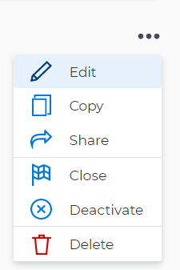

# Edit goals in `Workfront Align` {#edit-goals-in-workfront-align}

Your company must have a `Workfront Align` license in addition to a `Workfront` license to use this functionality. Contact your `Workfront` account manager to learn about a `Workfront Align` license. 

`Workfront Align` is available only in `the new Workfront experience`. 

For additional information about access to `Workfront Align`, see [Access needed to use Workfront Align](access-needed-for-wf-align.md).
You can edit existing goals in `Workfront Align` that you or anyone else created, regardless of their owners.

## Considerations about editing goals {#considerations-about-editing-goals}

* You cannot edit the following types of goals:
    
    
    * Goals from past periods
    * Closed goals
    
    
*  You cannot change the period or the start date after a goal has been active. You can modify the end date but you must select a date in the future. This applies to goals in the following statuses:

    
    
    * Active
    * Inactive
    * Closed 
    
    

*  You can edit the period of a goal in Draft status that is not from a past period.

## Edit goals {#edit-goals}

To edit a goal: 

1. Go to a goal that you want to edit and click the goal name to open the **Goal Details** panel. 
1.  Click the **gear icon** , then click **Edit**. 

   

1.  Update the name of the goal in the **Goal** field. 
1.  Select a time period when the goal should be executed in the **Period** drop-down menu. This is a prefilled field. The default is the current quarter. 

   Select from the following predefined options:

    
    
    * The current year
    * The quarters of the current year
    * The next two years
    * The quarters of the next two years
    
    
   Or

   Click **Define custom dates** to select a custom time frame. 

1.  (Conditional) Select a start and an end date for your goal, if you clicked **Define custom dates**. 

   ` `**Warning: **``You cannot create a goal with dates in the past. 

1.   (Optional) Click **Reset custom dates** to return to the predefined options. 

   >[!TIP] {type="tip"}
   >
   >We recommend that everyone in your organization selects the same time frames for similar goals or goals that are aligned. This provides better alignment between goals and ensures that everyone's work supports your over-arching strategy. 

1. Click the **Owner** field and select a new owner for the goal, if you want to indicate someone else as the owner of the goal. 
1. (Conditional)&nbsp;Start typing the name of a user, team, group, or the name of your organization in the **Owner** field, then select it when it displays in the list. You can have only one owner for a goal. 
1. Update the **Description** of the goal, then click **Save**. 

