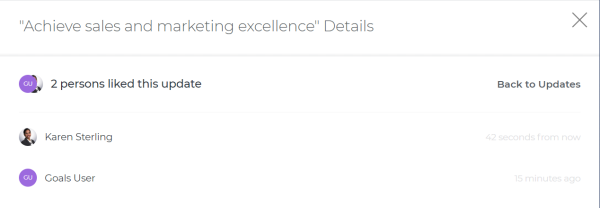
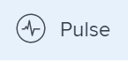

# Manage goal comments in `Workfront Align` {#manage-goal-comments-in-workfront-align}

Your company must have a `Workfront Align` license in addition to a `Workfront` license to use this functionality. Contact your `Workfront` account manager to learn about a `Workfront Align` license. `Workfront Align` is available only in `the new Workfront experience`. For additional information about access to `Workfront Align`, see [Access needed to use Workfront Align](access-needed-for-wf-align.md).

You can add comments to all goals you can view in  `Workfront Align`. 

You can add comments to goals in the following areas of `Workfront Align`:

* The Goal Details panel
* The `Check-in` section 
* The `Pulse` section

Although the process for adding comments to goals is similar in these areas, there are differences in being able to edit, delete, or react to a comment when using one area versus another. When you enter a comment in any of these areas, the comment is visible in all areas where goal comments display. 

>[!NOTE]
>
>You cannot add comments to results and activities. 

## Add comments to goals in the Goal Details panel {#add-comments-to-goals-in-the-goal-details-panel}

You can add comments to goals in the Goal&nbsp;Details panel, as part of updating an individual goal. 

You can edit or delete a comment that you entered in this area, or you can like comments. 

1.  Click the **Main Menu icon **  in the upper-right corner of your screen, then click **Align**.

   This opens the `Workfront Align` area. 

1. Locate the goal you want to add comments to, then click its name to open the Goal&nbsp;Details panel to the right. 
1. Click the **Updates** tab.
1.  Type your comment in the **Comment here** field, then click **Post**. 
1.  (Optional and conditional) Select the **Comments** option at the top of the list to view your comment at the top of the list. It is enabled by default and comments display here with the most recent comment first. 
1.  (Optional) Click&nbsp;**Edit** to edit your comment, then click&nbsp;**Save** to save your changes, or **Cancel** to revert to the original update. 

   ` `**Tip: **`` 
    
    
    * You can only edit comments you entered. 
    * There is no time limit for how long after you enter a comment you are allowed to edit it.
    
    

1.  (Optional)&nbsp;Click&nbsp;**Delete** to delete your comment, then click&nbsp;**Yes, Delete** to confirm. 

   ` `**Tip: **`` 
    
    
    * You can only delete comments you entered. 
    * There is no time limit for how long after you enter a comment you are allowed to delete it.
    
    

1. (Optional) Click the **Like icon**  to like a comment that someone else added. The icon updates with the number of likes. 

1.  (Optional)&nbsp;Click the number of likes next to a comment and a list with the names of the users who liked the comment displays in the right panel. 

   

1. (Conditional)&nbsp;Click **Back to Updates** to return to the Updates tab of the Goal Details panel, or click the **X icon** in the upper-right corner to close the right panel. 

## Add comments to goals in the `Check-in` section {#add-comments-to-goals-in-the-check-in-section}

You can add comments to goals in the `Check-in` section of `Workfront Align`, as part of updating your list of goals. For information about updating goals by checking in on them, see [Check in on goals in Workfront Align](check-in-goals.md). 

You can also like goal comments that other users have added to mark your approval of them in the `Check-in` section. 

1.  Click the **Main Menu icon **  in the upper-right corner of your screen, then click **Align**.

   This opens the `Workfront Align` area. 

1.  Click the `Check-in` section in the left panel. 

   

   Goals assigned to you or that have results and activities that are assigned to you display in this area. 

1. (Optional) Click the right-pointing arrow to the left of the goal name to expand the goal, if the goal is not already expanded. 
1.  Type your comment in the **Add a comment to this goal (optional)** field, then click&nbsp;**Post**. 

   Two most recent comments display by default under each goal.

1.  Click **Show all comments** to display all comments on a goal. A number of total comments for the goal also displays. Comments display in the order they were entered, with the most recent first. 
1. (Optional) Click the **Like icon**  to like a comment. The icon updates with the number of likes. 

1.  (Optional)&nbsp;Click the number of likes next to a comment and a list with the names of the users who liked the comment displays in the right panel. 

   

1. (Conditional)&nbsp;Click **Back to Updates** to return to the Updates tab of the Goal Details panel, or click the **X icon** in the upper-right corner to close the right panel. 

## Add comments to goals in the `Pulse` section {#add-comments-to-goals-in-the-pulse-section}

You can add comments to goals in the `Pulse` section of `Workfront Align`, as part of reviewing goals that might affect yours. For information about reviewing goals in the `Pulse` section, see [Review goals in the Workfront Align Pulse section](review-goals-in-pulse.md). 

You can also like goal comments that other users have added to mark your approval of them in the `Pulse` section. 

1.  Click the **Main Menu icon **  in the upper-right corner of your screen, then click **Align**.

   This opens the `Workfront Align` area. 

1.  Click the `Pulse` section in the left panel. 

   

   Any current goals display in this section., regardless of their status.

1.  Click&nbsp;**Add a comment**, then type your comment in the **Add a comment to this goal (optional)** field.
1.  Click&nbsp;**Post**. 

   Three comments display by default under each goal.

1. Click **Show all updates** to display all comments on a goal. A number of total comments for the goal also displays. Comments display in the order they were entered, with the most recent first. 
1. (Optional) Click the **Like icon**  to like a comment. The icon updates with the number of likes. 

1.  (Optional)&nbsp;Click the number of likes next to a comment and a list with the names of the users who liked the comment displays in the right panel. 

   

1. (Conditional)&nbsp;Click **Back to Updates** to return to the Updates tab of the Goal Details panel, or click the **X icon** in the upper-right corner to close the right panel. 

