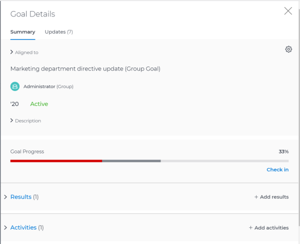
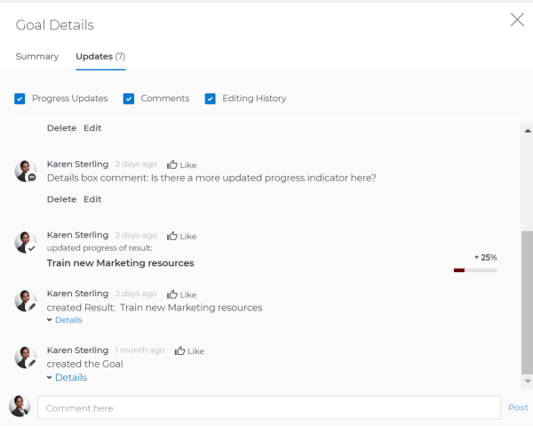
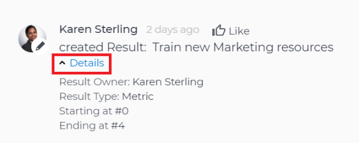

# Update goals in the Goal Details panel in  `Workfront Align` {#update-goals-in-the-goal-details-panel-in-workfront-align}

Your company must have a `Workfront Align` license in addition to a `Workfront` license to use this functionality. Contact your `Workfront` account manager to learn about a `Workfront Align` license. 

`Workfront Align` is available only in `the new Workfront experience`. 

For additional information about access to `Workfront Align`, see [Access needed to use Workfront Align](access-needed-for-wf-align.md).
You can update information for individual goals by accessing the Goal Details panel. 

You can access an individual goal which opens the Goal Details panel of the goal from the following sections of `Workfront Align`:

* `Goal List` 
* `Goal Alignment` 
* `Pulse` 
* `Check-in` 

1.  Click the **Main Menu icon **  in the upper-right corner of your screen, then click **Align**.

   This opens the `Workfront Align` area. 

1.  Click `Goal List`, `Goal Alignment`, `Pulse`, or `Check-in` in the left panel, then click the name of a goal. 

   This opens the Goal&nbsp;Details panel on the right. 

   

1. On the Summary tab, click the **Settings icon **  , then click&nbsp;any of the following options:
    
    
    1. **Edit**. For information about editing goals, see [Edit goals in Workfront Align](edit-goals.md).
    1. **Align**, then specify the name of a goal in the **Align to** field that you want to align the current goal to. The current goal becomes the child of the goal you align it to. For information about child and parent goals, see [Align goals by connecting them in Workfront Align](align-goals-by-connecting-them.md). 
    
    1. **Copy**. For information about copying goals, see [Copy goals in Workfront Align](copy-goals.md).
    1. **Activate**.&nbsp;This option is available only for drafted and inactive goals. 
    
    
       For information about activating goals, see [Access goals in Workfront Align](access-goals-in-wf-align.md). 
    
    1. **Close**.&nbsp;This option is available only for active goals. 
    
    
       For information about closing goals, see [Close and reopen goals in Workfront Align](close-and-reopen-goals.md). 
    
    1. **Deactivate**. This option is available only for active goals. This deactivates the goal immediately. 
    
    
       For information about deactivating goals, see [Delete and deactivate goals in Workfront Align](delete-and-deactivate-goals.md).
    
    1. **Delete**, then click **Yes, Delete**. 
    
    
       For information about deleting goals, see [Delete and deactivate goals in Workfront Align](delete-and-deactivate-goals.md).
    
    
       >[!NOTE]
       >
       >Deleted goals cannot be recovered.
    
    
    
    1. **Reopen**,&nbsp;then click&nbsp;**Reopen**. This option is available only for closed goals. 
    
    
       For information about reopening goals, see [Close and reopen goals in Workfront Align](close-and-reopen-goals.md). 
    
    1.  (Conditional) If you clicked any of the options between steps a-i above except Delete or Reopen, click **Save**. 
    1. Click&nbsp;**Add results**. Results drive the progress of your goal. For information about adding results, see [Add results to goals in Workfront Align](add-results-to-goals.md).
    
    1. Click **Add activities**. Activities drive the progress of your goal. For information about adding activities, see [Add activities to goals in Workfront Align](add-activities-to-goals.md). 
    
    
    

1.  Click the **Updates** tab. Here, you can view goal comments and review the entire editing history of the goal, activities, and results, to understand who changed what and when. 

   

1.  (Optional) Deselect any of the following options if you want to not display them in the Updates tab.&nbsp;They are selected by default: 

1.  (Optional)&nbsp;Click **Details** under a progress or an editing history update to display additional information about the update. 

   

