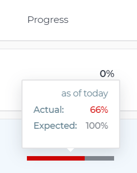
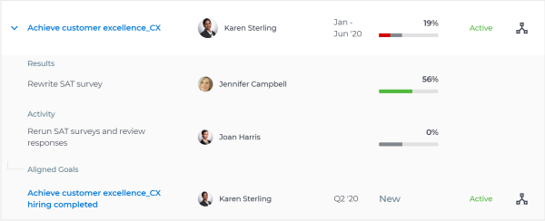

# View at-risk goals in  `Workfront Align` {#view-at-risk-goals-in-workfront-align}

Your company must have a `Workfront Align` license in addition to a `Workfront` license to use this functionality. Contact your `Workfront` account manager to learn about a `Workfront Align` license. 

`Workfront Align` is available only in `the new Workfront experience`. 

For additional information about access to `Workfront Align`, see [Access needed to use Workfront Align](access-needed-for-wf-align.md).
Goals with a Progress of At Risk are in danger of not being achieved. You should review your goals often and understand why the progress is lagging. For information about goal progress, see [Calculate goal progress in Workfront Align](calculate-goal-progress.md). 

## Recommendations for reviewing At Risk goals {#recommendations-for-reviewing-at-risk-goals}

When reviewing at risk goals, we recommend the following: 

* Review at risk goals that are assigned to you as well as organizational goals that are assigned to your teams, groups or to your organization which might be affected by the progress of your goals. You can review goals in any section of `Workfront Align` where a list of goals displays. For information about the `Workfront Align` sections, see [Overview of the Workfront Align sections](overview-of-wf-align-sections.md). This article describes how to review goals in the `Goal List`. 

* Review at-risk goals in the `Goal List` if you need to review goals that belong to your teams, groups, or to your organization. 
*  Review at-risk goals in the `Check-in` section if you want to review just goals where you are the owner and check them in to update their progress.&nbsp;For information about checking in on goals, see [Check in on goals in Workfront Align](check-in-goals.md).

## Review at-risk goals in the `Goal List` {#review-at-risk-goals-in-the-goal-list}

1.  Click the **Main Menu icon **  in the upper-right corner of your screen, then click **Align**.

   This opens the `Workfront Align` area. 

   The Personal tab on the `Goal List` displays by default. 

1. (Recommended) Click the **Company** tab and review organization-level goals that are at risk, then click the **My Teams**, **My Groups**, and **Personal** tabs to review at-risk goals, in this order. 

1.  Select **At Risk** in the **Progress** drop-down menu in the right panel to view goals with a progress of At Risk.

   The at-risk goals display in the selected tabs. 

1.  (Optional) Select a time period for which you want to view goals in the **Period** drop-down menu in the right panel. For more information about filtering goals using all other criteria in the right panel, see [Filter information in Workfront Align](filter-information-wf-align.md). 

   The goal list displays goals that have a progress of At Risk for the tab and the time period you selected. The progress bar indicator displays in red for each goal in the goal list.

1.  Hover over the progress bar indicator to see what the actual progress percentage is and what the expected value is for the current day. 

   

1.  (Optional) Click the **All** tab, then type the name of a user, group, or team in the **Owner** field.

   At-risk goals for the selected users display in the goal list. 

1.  Click **Expand All Goals** to view additional information about the goals and their contributing items. 
1.  A list of results, activities, and aligned goals display under each goal. Now, you can view which contributing item drives your goals behind. 

   

1.  (Optional) Click **Print Results** to export the list of the at-risk goals in various formats and share it with others. For information about printing goal lists, see [Print the Goal List in Workfront Align](print-the-goal-list.md). 
1. Click a goal name to open the Goal Details panel, then click **Check in** to update the progress of the Results or Activities associated with the goals at risk. This updates the goal's progress as well. For information about updating the progress of results and activities to check in a goal, see [Check in on goals in Workfront Align](check-in-goals.md).

