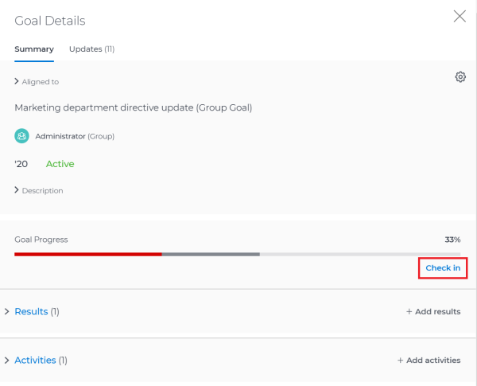
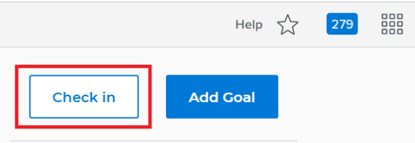
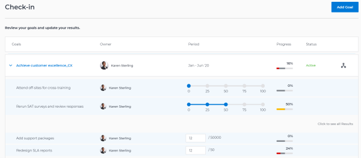

# Check in on goals in `Workfront Align` {#check-in-on-goals-in-workfront-align}

Your company must have a `Workfront Align` license in addition to a `Workfront` license to use this functionality. Contact your `Workfront` account manager to learn about a `Workfront Align` license. 

`Workfront Align` is available only in `the new Workfront experience`. 

For additional information about access to `Workfront Align`, see [Access needed to use Workfront Align](access-needed-for-wf-align.md).
You must review your goals periodically and update their progress to ensure that they are not falling behind or become in danger of not being achieved. You update the progress of your goals by providing a check-in for them. 

## Considerations for checking in on goals {#considerations-for-checking-in-on-goals}

Consider the following when checking in on your goals: 

*  `Workfront Align` automatically calculates the progress of a goal when you manually update the progress of the results and activities of the goal. 

  >[!TIP] {type="tip"}
  >
  >You cannot update progress directly on a goal. You must update the progress of activities and results which in turn update the progress of the goal. 

  See also the following articles:&nbsp;

    
    
    * For information about adding activities to goals, see [Add activities to goals in Workfront Align](add-activities-to-goals.md).
    * For information about adding results to goals, see [Add results to goals in Workfront Align](add-results-to-goals.md). 
    * For information about how `Workfront Align` calculates the progress on a goal, see [Calculate goal progress in Workfront Align](calculate-goal-progress.md). 
    
    
    

*  You must create goals and activate them before you can check in on them.

  See also the following articles:&nbsp;

    
    
    * For information about creating goals, see [Create goals in Workfront Align](create-goals.md).
    *  For information about activating goals, see the [Activate goals in Workfront Align](activate-goals.md).
    
    

  >[!IMPORTANT] {type="important"}
  >
  >You cannot check in on goals that are drafted, closed, or inactive. 

* The first time you or someone else updates the progress of a result or activity on a goal, the goal Progress changes from New and `Workfront Align` starts recording progress and progress status updates on the goal. 

## Check in on goals {#check-in-on-goals}

You can check in on goals at the individual goal level, or you can check in on multiple goals from the `Check-in` section of `Workfront Align`. 

* [Check in on individual goals](#check) 
* [Check in on goals in the Check-in section](#update) 

### Check in on individual goals {#check-in-on-individual-goals}

When you check in on a goal at the goal level, you can update the progress of the results and activities that are assigned to you or other users. 

For information about how to update additional information about results and activities, see [Edit results and activities in Workfront Align](edit-results-and-activities.md). 

1.  Click the **Main Menu** icon  in the upper-right corner of `Workfront`, then click **Align**.

   This opens the `Workfront Align` area.

   The Personal tab in the `Goal List` section displays by default. 

1.  (Optional)&nbsp;Click any of the following sections in the left panel to access a list of goals:

    
    
    * `Goal Alignment` 
    * `Pulse` 
    *  `Check-in` 
    
    
   Or

   From the `Goal List`, click the name of a goal to open the **Goal Details** panel on the right. 

1.  Click **Check in**.

   

   The progress of results and activities becomes editable.

1. Update the current progress on each of the results. Depending on what type of result you selected, you can do one of the following:
    
    
    * Update the quantity 
    * Update the currency amount
    * Update the percent complete
    
    
1.  Update the percent complete on the `Manual progress bar` activity. 

   >[!TIP] {type="tip"}
   >
   >When you add projects as activities to your goals, you cannot manually update projects at the goal level. `Workfront` automatically updates project progress based on the project of their tasks. When the project percent complete updates in  `Workfront`, the goal progress associated with the project also updates automatically.

1.  Click **Back to Summary** to return to the Goal Details panel. 

   Your goal progress updates as you update the results and activities of your goal. 

1. Click the **X&nbsp;icon** in the upper-right corner of the Goal Details panel to close it. 

### Check in on goals in the `Check-in` section {#check-in-on-goals-in-the-check-in-section}

You can use the `Check-in` section to check in on goals when you want to quickly provide updates for several goals at the same time. 

` `**Tip: **`` You can access the  `Check-in` section from any of the following sections:

* `Goal List` 
* `Goal Alignment` 
* `Pulse` 

When you check in on a goal in the `Check-in` section, you can update the progress of the results and activities that are assigned only to you. You cannot update the progress of results and activities that are assigned to other users in this section. 

1.  Click the **Main Menu** icon  in the upper-right corner of `Workfront`, then click **Align**.

   This opens the `Workfront Align` area.

   The Personal tab in the `Goal List` section displays by default. 

1.  Click `Check-in` in the left panel.

   Or

   (Conditional) If you are in the `Goal List`, `Goal Alignment`, or `Pulse` sections, click the **Check in** button in the upper-right of the screen. This opens the `Check-in` section. 

   

   Goals display in a list and results and activities are listed under each goal. 

   

1.  (Optional) Click **Click to see all Results**,&nbsp;**Click to see all&nbsp;Activities**, or **Click to see all&nbsp;Aligned Goals** to display all results, activities, and aligned goals of a goal whose progress you want to update. 

   ` `**Warning: **``You cannot directly update aligned goals, but you can update their results and activities. 

1.  Update the current progress on each of the results assigned to you. Depending on what type of result you selected, you can do one of the following:
    
    
    * Update the quantity 
    * Update the currency amount
    * Update the percent complete 
    
    
   The result and the goal progress updated automatically and you receive a confirmation of your changes.

1.   Update the percent complete on your `Manual progress bar` activity. 

   >[!TIP] {type="tip"}
   >
   >When you add projects as activities to your goals, you cannot manually update projects at the goal level. `Workfront` automatically updates project progress based on the project of their tasks. When the project percent complete updates in  `Workfront`, the goal progress associated with the project also updates automatically.

   The activity and the goal progress updated automatically and you receive a confirmation of your changes.

1. (Optional) Add a comment for your goal, then click **Post** to save your comment. 

