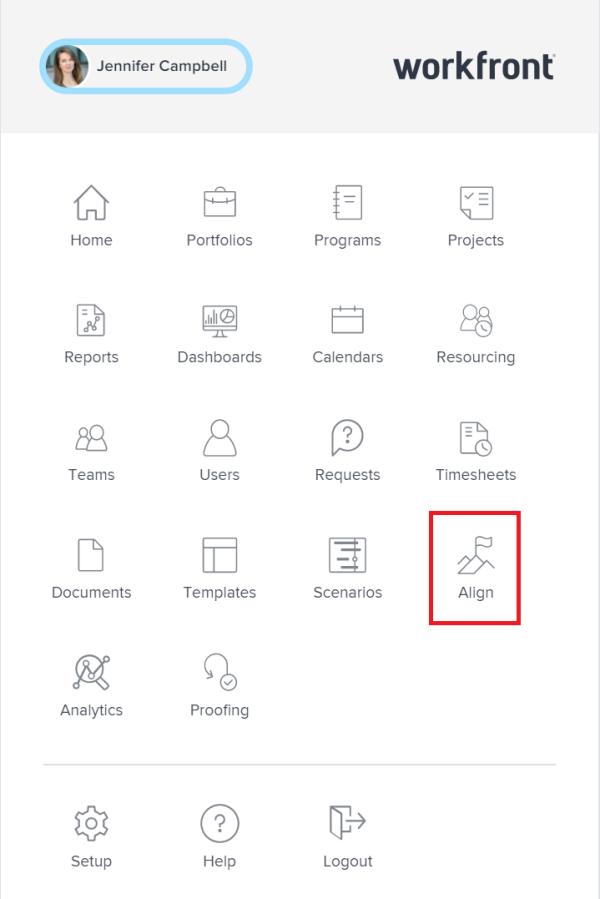
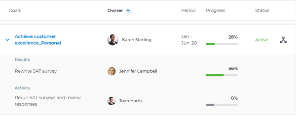

# Manage goals in the `Workfront Align` `Goal List` {#manage-goals-in-the-workfront-align-goal-list}

Your company must have a `Workfront Align` license in addition to a `Workfront` license to use this functionality. Contact your `Workfront` account manager to learn about a `Workfront Align` license. 

`Workfront Align` is available only in `the new Workfront experience`. 

For additional information about access to `Workfront Align`, see [Access needed to use Workfront Align](access-needed-for-wf-align.md).
You can view all goals in your organization, regardless of who the owner is. For information about creating goals, see [Create goals in Workfront Align](create-goals.md).

You can view and manage goals in the following sections of `Workfront Align`:

* `Goal List` 
* `Goal Alignment` 
* `Pulse` 
* `Check-in` 

Each section displays goals in slightly different formats. Which section you use depends on the purpose you want to achieve as you are working with goals.

You can use the `Goal List` to manage goals that you, your teams, groups, or organization own. 

For more information, see the section " `Goal List`" in the article [Overview of the Workfront Align sections](overview-of-wf-align-sections.md). 

To manage goals in the `Goal List`: 

1.  Click the **Main Menu** icon  in the upper-right corner, then click **Align**. 

   

   The Personal tab on the `Goal List` displays by default. Here, you can view goals where you are the owner. 

1.  (Optional)&nbsp;Click one of the following tabs to view goals: 

   A list of goals displays. The list contains the following columns with information about each goal: 

<table style="width: 100%;mc-table-style: url('../../Resources/TableStyles/TableStyle-List-options-in-steps.css');" class="TableStyle-TableStyle-List-options-in-steps" cellspacing="0"> 
 <col class="TableStyle-TableStyle-List-options-in-steps-Column-Column1"> 
 <col class="TableStyle-TableStyle-List-options-in-steps-Column-Column2"> 
 <tbody> 
  <tr class="TableStyle-TableStyle-List-options-in-steps-Body-LightGray"> 
   <td class="TableStyle-TableStyle-List-options-in-steps-BodyE-Column1-LightGray">Goals</td> 
   <td class="TableStyle-TableStyle-List-options-in-steps-BodyD-Column2-LightGray">The goal name.</td> 
  </tr> 
  <tr class="TableStyle-TableStyle-List-options-in-steps-Body-MediumGray"> 
   <td class="TableStyle-TableStyle-List-options-in-steps-BodyE-Column1-MediumGray">Owner</td> 
   <td class="TableStyle-TableStyle-List-options-in-steps-BodyD-Column2-MediumGray">The name of goal, result, or activity owner. </td> 
  </tr> 
  <tr class="TableStyle-TableStyle-List-options-in-steps-Body-LightGray"> 
   <td class="TableStyle-TableStyle-List-options-in-steps-BodyE-Column1-LightGray">Period</td> 
   <td class="TableStyle-TableStyle-List-options-in-steps-BodyD-Column2-LightGray">The time period for which the goal is scheduled.</td> 
  </tr> 
  <tr class="TableStyle-TableStyle-List-options-in-steps-Body-MediumGray"> 
   <td class="TableStyle-TableStyle-List-options-in-steps-BodyE-Column1-MediumGray">Progress</td> 
   <td class="TableStyle-TableStyle-List-options-in-steps-BodyD-Column2-MediumGray">The progress indicator for the goal which is typically a percentage value.</td> 
  </tr> 
  <tr class="TableStyle-TableStyle-List-options-in-steps-Body-LightGray"> 
   <td class="TableStyle-TableStyle-List-options-in-steps-BodyB-Column1-LightGray"> 
Status (includes alignment icon)
 
  
 </td> 
   <td class="TableStyle-TableStyle-List-options-in-steps-BodyA-Column2-LightGray"> 
The status of the goal which can be one of the following:
 
    <ul> 
     <li value="1">Active</li> 
     <li value="2">Draft</li> 
     <li value="3">Inactive</li> 
     <li value="4">Closed</li> 
    </ul> 
The alignment icon appears on goals that are aligned to other goals. For information about aligning goals, see <a href="align-goals-by-connecting-them.md" class="MCXref xref">Align goals by connecting them in Workfront Align</a>.
 </td> 
  </tr> 
 </tbody> 
</table>

1.  (Optional) Select the type of information you want to display by updating any of the following fields in the **Filters** area:

    
    
    * Period
    * Goal Status
    * Progress
    * Owner. This option is dimmed for all tabs except for the **All** tab. 
    
    
   For more information about filtering goals, see [Filter information in Workfront Align](filter-information-wf-align.md). 

   The goal list displays goals that match the criteria of your selected tabs and filters. 

1.  Click any of the fields in the column headers to sort it by that field. 

   A blue sort indicator displays to the right of the field by which the list is sorted. The list is sorted in ascending order by default. 

   

1. (Optional) Click the field in the column again to sort the same column in a descending order. 
1.  Click&nbsp;the right-pointing arrow to the left of the goal name to expand a goal

   Or

   Click **Expand All Goals** to expand all the goals in the list and view additional information about each goal, including any of the following:

    
    
    *  Results names, owners, and progress
    
    
      For information about results, see [Add results to goals in Workfront Align](add-results-to-goals.md).
    
    *  Activity names, owners, and progress
    
    
      For information about activities, see [Add activities to goals in Workfront Align](add-activities-to-goals.md).
    
    
    

1.  Click the name of a goal to open the **Goal Details** panel on the right and review more information about the goal as well as manage it. For information about reviewing individual goals, see [Update goals in the Goal Details panel in Workfront Align](update-goals-in-goal-details-panel.md).

&nbsp;
