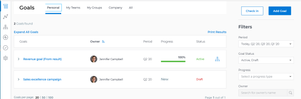
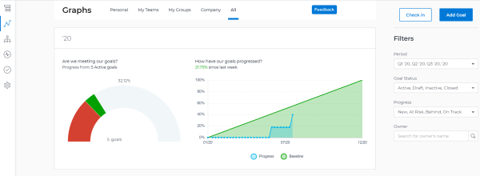
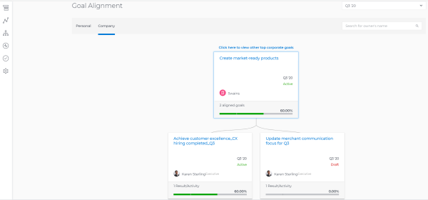
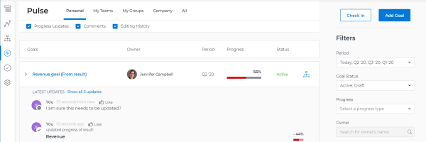
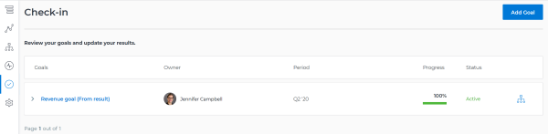
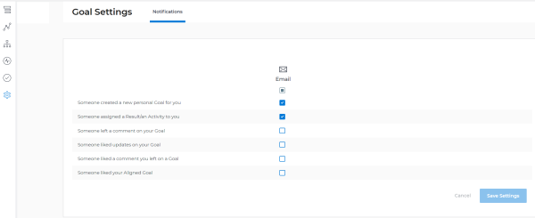

# Overview of the `Workfront Align` sections {#overview-of-the-workfront-align-sections}

Your company must have a `Workfront Align` license in addition to a `Workfront` license to use this functionality. Contact your `Workfront` account manager to learn about a `Workfront Align` license. 

`Workfront Align` is available only in `the new Workfront experience`. 

For additional information about access to `Workfront Align`, see [Access needed to use Workfront Align](access-needed-for-wf-align.md).
After your `Workfront administrator` has granted you access to `Workfront Align`, you can view goals that you or anyone else in your organization created in the `Workfront Align` area. 

You can access lists of goals or individual goals and manage them from several sections of `Workfront Align`. Which section you use depends on the purpose you want to achieve as you are working with goals. 

This article is a brief overview of the sections of `Workfront Align` and the options available on each one for managing goals. For more information about additional actions that you can perform within these sections, we also recommend the following articles:

* [Create goals in Workfront Align](create-goals.md) 
* [Check in on goals in Workfront Align](check-in-goals.md) 
* [Filter information in Workfront Align](filter-information-wf-align.md) 
* [Print the Goal List in Workfront Align](print-the-goal-list.md) 

## `Goal List`  {#goal-list}

You can use the `Goal List` to review your goals, or goals that belong to your teams, groups, or your organization. You can view goals in any status and from any time period in this section. 

For information about navigating the `Goal List` and managing goals here, see [Manage goals in the Workfront Align Goal List](manage-goals-in-goal-list.md).

Use the `Goal List` section to do the following: 

*  View goals that belong to your teams, groups, or organization. 
*  Review goals including aligned goals, their results, and activities. 
*  Add new goals. 

  For more information, see [Create goals in Workfront Align](create-goals.md).

*  Access the Goal&nbsp;Details panel and edit and update the goal, its results, or activities.

  For more information, see [Edit goals in Workfront Align](edit-goals.md).

*  Check in on goals 

  >[!TIP] {type="tip"}
  >
  >Clicking **Check in** opens the `Check-in` section in the left panel. 

  For more information, see [Check in on goals in Workfront Align](check-in-goals.md).

*  Update the filters in the right panel to determine which goals you display on the screen. 

  >[!TIP] {type="tip"}
  >
  >Filters updated here affect manage information displayed in the `Goal List`, Graphs, and `Pulse` sections. 

  For more information, see [Filter information in Workfront Align](filter-information-wf-align.md).

*  Print or export a list of goals. 

  For more information, see [Print the Goal List in Workfront Align](print-the-goal-list.md).

## Graphs {#graphs}

You can use the Graphs section to gain a holistic view of the health of goals that belong to you or to your company.&nbsp;You can view progress information of goals in nay status from any time period in this section. 

For information about using the Graphs section, see [Review graphs to understand goal progress trends in Workfront Align](review-goal-graphs.md). 

Use the Graphs section to do the following: 

* View goals that belong to you, your teams, groups, or organization. 
*  Update the filters in the right panel to select what goals you display on the screen. 

  >[!TIP] {type="tip"}
  >
  >Filters updated here affect manage information displayed in the `Goal List`, Graphs, and `Pulse` sections. 

* View the number of goals with a given progress status.
*  Understand how your goals perform on a weekly basis. 
* Add new goals. 
*  Check in on goals.

  >[!TIP] {type="tip"}
  >
  >Clicking **Check in** opens the `Check-in` section in the left panel. 

## `Goal Alignment`  {#goal-alignment}

If your goals are aligned, you can use the `Goal Alignment` section to display and review all goals in your organization and their alignment to one another. Goals that are aligned display here on connected cards to illustrate their alignment to one another. Parent goals display first, and children goals are stacked behind them. You can view goals in any status and from any time period in this section. 

For information about navigating the `Goal Alignment section` to manage goals, see [Navigate the Goal Alignment chart in Workfront Align](navigate-goal-alignment-chart.md).

For information about aligning goals, see the following articles:

* [Align goals by connecting them in Workfront Align](align-goals-by-connecting-them.md) 
* [Align goals by converting results and activities to goals in Workfront Align](align-goals-by-converting-results-activities.md) 

Use the `Goal Alignment` section to do the following: 

*  View goals that belong to you or your organization. 
*  Update the filters in the upper-right corner of the screen to update the time periods and the owner for which you want to see goals. 
* Display goal hierarchy and view aligned children goals. 
* Access the Goal&nbsp;Details panel and update the goal, its results, or activities.

## `Pulse`  {#pulse}

You can use the `Pulse` section to review and request updates to goals that might influence the progress of your goals. These could be your own goals, or goals that belong to your teams, groups, or your organization. You can view goals in any status and from any time period in this section. 

For information about reviewing goals using the `Pulse` section, see [Review goals in the Workfront Align Pulse section](review-goals-in-pulse.md).

Use the `Pulse` section to do the following: 

*  View goals that belong to your teams, groups, or organization. 
*  Update the filters in the right panel to select what goals you display on the screen. 

  >[!TIP] {type="tip"}
  >
  >Filters updated here manage information displayed in the `Goal List`, Graphs, and `Pulse` sections. 

* Review goal progress and updates, including aligned goals, their results, and activities. 
* Make or ask for updates to a goal by adding a comment. 
* Access the Goal&nbsp;Details panel and edit and update the goal, its results, or activities.
*  Add new goals. 
*  Check in on goals.

  >[!TIP] {type="tip"}
  >
  >Clicking Check in opens the `Check-in` section in the left panel. 

## `Check-in`  {#check-in}

You can use the `Check-in` section to update active goals and any results and activities that you are the owner of. You can primarily view only goals in an Active status in this section. Children goals aligned to active parents also display in the `Check-in` section, regardless of their status.

>[!IMPORTANT] {type="important"}
>
>
>
>
>* A goal displays in the `Check-in` section only if it is assigned to you or if it has a result or activity that is assigned to you. 
>* If a goal assigned to you is the child goal of a parent that is not assigned to you and your goal (the child goal) is closed, inactive, or a draft, the parent goal does not display in your  `Check-in` section. 
>
>

For information about managing goals in the `Goal List`, see [Manage goals in the Workfront Align Goal List](manage-goals-in-goal-list.md).

Use the `Check-in` section to do the following: 

*  Review goal progress and updates, including aligned goals, their results, and activities. 
*  Update the progress on the results and activities that are assigned to you. For information about updating goals by checking in on them, see [Check in on goals in Workfront Align](check-in-goals.md). 

  >[!IMPORTANT] {type="important"}
  >
  >You can check in only on the results and activities assigned to you in the `Check-in` section, and not those that are assigned to other entities.

* Add a comment to a goal, then click&nbsp;Post to make or ask for updates to a goal. 
* Access the Goal&nbsp;Details panel and edit and update the goal, its results, or activities.
* Add new goals. 

## Settings {#settings}

You can select what kind of email notifications you should receive from  `Workfront Align` in the Settings section. You can receive email notifications about goal, result, or activity assignments, as well as when someone comments on or likes one of your actions. 

For information about email notifications from `Workfront Align`, see [Workfront Align notifications](wf-align-notifications.md). 

