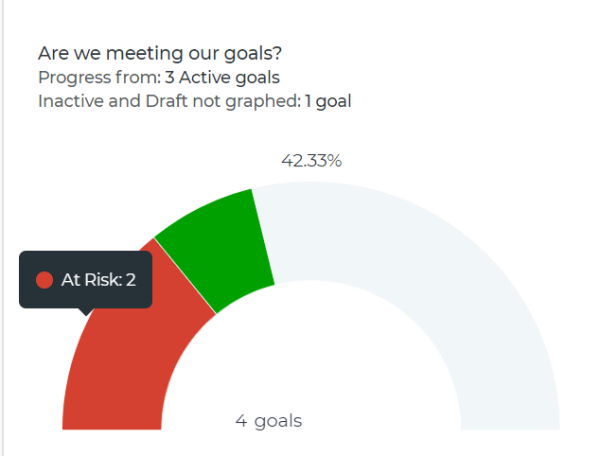
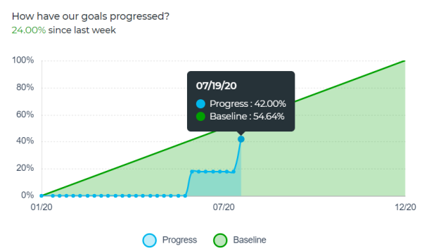

# Review graphs to understand goal progress trends in `Workfront Align` {#review-graphs-to-understand-goal-progress-trends-in-workfront-align}

Your company must have a `Workfront Align` license in addition to a `Workfront` license to use this functionality. Contact your `Workfront` account manager to learn about a `Workfront Align` license. 

`Workfront Align` is available only in `the new Workfront experience`. 

For additional information about access to `Workfront Align`, see [Access needed to use Workfront Align](access-needed-for-wf-align.md).
You can view the overall health of your goals and their progress trend in time in the Graphs section of `Workfront Align`. The charts in this section do not break down the progress of each goal, but instead give you a holistic snapshot of all goals' progress status as well as their progress trend in time during a specified period. 

>[!IMPORTANT] {type="important"}
>
>You can see a total count for your goals in the Graphs section for a selected period of time. However, `Workfront Align` takes into account only goals with a status of Active and Closed when calculating the overall goal progress status and percent complete. 

## Overview of `Workfront Align` graphs {#overview-of-workfront-align-graphs}

The following charts are available in the Graphs section or `Workfront Align`: 

<table style="width: 100%;mc-table-style: url('../../Resources/TableStyles/TableStyle-List-options-in-steps.css');" class="TableStyle-TableStyle-List-options-in-steps" cellspacing="0"> 
 <col class="TableStyle-TableStyle-List-options-in-steps-Column-Column1" style="width: 184px;"> 
 <col class="TableStyle-TableStyle-List-options-in-steps-Column-Column2"> 
 <tbody> 
  <tr class="TableStyle-TableStyle-List-options-in-steps-Body-LightGray"> 
   <td class="TableStyle-TableStyle-List-options-in-steps-BodyE-Column1-LightGray">The Goal&nbsp;Health Chart</td> 
   <td class="TableStyle-TableStyle-List-options-in-steps-BodyD-Column2-LightGray"> 
A gauge chart that displays the following:
 
    <ul> 
     <li value="1">A total number of goals for the selected period of time. Goals with any status are taken into account. </li> 
     <li value="2">The progress status of goals with a status of Active and Closed.</li> 
    </ul> 
For information about how Workfront Align calculates progress status, see <a href="calculate-goal-progress.md" class="MCXref xref">Calculate goal progress in Workfront Align</a>.
 </td> 
  </tr> 
  <tr class="TableStyle-TableStyle-List-options-in-steps-Body-MediumGray"> 
   <td class="TableStyle-TableStyle-List-options-in-steps-BodyB-Column1-MediumGray">The Goal Progress Chart</td> 
   <td class="TableStyle-TableStyle-List-options-in-steps-BodyA-Column2-MediumGray"> 
A line chart that displays the following:
 
    <ul> 
     <li value="1">An average expected and actual percent complete of all&nbsp;active and closed goals in the selected period.&nbsp;The percent complete progress is broken down into weekly increments marked by nodes. </li> 
     <li value="2">The overall average percentage of progress for active and&nbsp;closed goals since the previous week. </li> 
    </ul> </td> 
  </tr> 
 </tbody> 
</table>

## Review goal progress in graphs {#review-goal-progress-in-graphs}

1.  Click the **Main Menu icon **  in the upper-right corner of your screen, then click **Align**.

   This opens the `Workfront Align` area. 

1.  Click **Graphs** in the left panel. 

   

   The Graphs area displays. 

   By default, the filters and tabs in the Graphs section limit the goals displayed by the following criteria:&nbsp;

    
    
    * Goals that are assigned to you. 
    * Goals that have a time period of Today, meaning goals for the current quarter or the current year.
    *  Goals in a status of Active and Draft. 
    
    

1.  (Optional) Click one of the following tabs to view goals filtered by their owners: 

1.  (Optional) Select the type of information you want to display by updating any of the following fields in the **Filters** area:

    
    
    * Period
    * Goal Status
    * Progress
    * Owner. This option is dimmed for all tabs except for the **All** tab. 
    
    
   For more information about filtering goals, see [Filter information in Workfront Align](filter-information-wf-align.md). 

   >[!TIP] {type="tip"}
   >
   >If you selected to display more than one time period, a health chart (gauge) as well as a progress chart (line) displays for each time period. 

1.  Review the information in the table below when you review the Goal Health Chart.

   

1.  Review the information in the table below when you review the Goal&nbsp;Progress Chart. 

   

<table style="width: 100%;mc-table-style: url('../../Resources/TableStyles/TableStyle-List-options-in-steps.css');" class="TableStyle-TableStyle-List-options-in-steps" cellspacing="0"> 
 <col class="TableStyle-TableStyle-List-options-in-steps-Column-Column1" style="width: 346px;"> 
 <col class="TableStyle-TableStyle-List-options-in-steps-Column-Column2"> 
 <tbody> 
  <tr class="TableStyle-TableStyle-List-options-in-steps-Body-LightGray"> 
   <td class="TableStyle-TableStyle-List-options-in-steps-BodyE-Column1-LightGray">Baseline progress</td> 
   <td class="TableStyle-TableStyle-List-options-in-steps-BodyD-Column2-LightGray">The green slope line indicates the expected overall percent complete average of active and closed goals for the selected time period. All goals within a period are expected to complete, so the baseline progress is always 100% at the end of the period. </td> 
  </tr> 
  <tr class="TableStyle-TableStyle-List-options-in-steps-Body-MediumGray"> 
   <td class="TableStyle-TableStyle-List-options-in-steps-BodyB-Column1-MediumGray">Actual progress</td> 
   <td class="TableStyle-TableStyle-List-options-in-steps-BodyA-Column2-MediumGray"> 
The blue line indicates the actual overall percent complete average of active and closed goals for the selected time period in weekly increments. Each week during the duration of the goal is marked by a node in the line. 
 </td> 
  </tr> 
 </tbody> 
</table>

1.  Hover a week node in the goal progress chart and review the following:

    
    
    * **Week date**: The month, day, and year of the selected week.
    * **Progress**:&nbsp;An average of the actual percent complete of all goals for the selected week.
    * **Baseline**: An average of the expected percent complete of all goals for the selected week.
    
    

1.  (Optional)&nbsp;Click **Progress** at the bottom of the progress chart to remove the actual overall progress line

   Or

   Click **Baseline** at the bottom of the progress chart to remove the expected progress from the chart. 

&nbsp;
