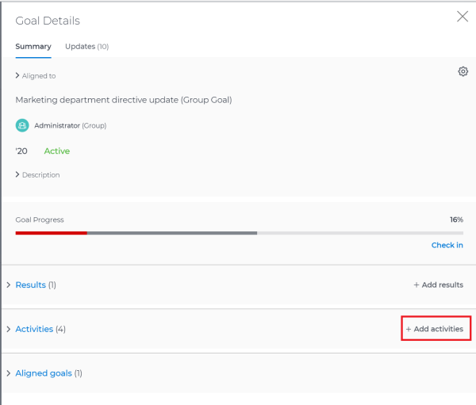

# Add activities to goals in  `Workfront Align` {#add-activities-to-goals-in-workfront-align}

Your company must have a `Workfront Align` license in addition to a `Workfront` license to use this functionality. Contact your `Workfront` account manager to learn about a `Workfront Align` license. 

`Workfront Align` is available only in `the new Workfront experience`. 

For additional information about access to `Workfront Align`, see [Access needed to use Workfront Align](access-needed-for-wf-align.md).
Activities measure the progress of a goal. Without associated results, activities, or aligned goals, a goal cannot be activated and progress cannot be recorded on it. 

You must create the goal before adding an activity to it. For information about creating goals, see [Create goals in Workfront Align](create-goals.md).

>[!IMPORTANT] {type="important"}
>
>A goal cannot have more than a total of 50 activities, results, or aligned goals.

For more information about activities, see [Get started with results and activities in Workfront Align](get-started-with-results-and-activities.md).

To add an activity to a goal:

1. Go to the goal for which you want to add an activity and click the name to open the **Goal&nbsp;Details** panel.
1.  Click **Add activities**.

   

1.  From the **Activity Type** drop-down menu, select the type of activity you want to associate with your goal. Select **`Manual progress bar`** or **Project**. Manual progress bar is the default selection. 
1. (Conditional) Depending on which activity type you selected, do the following:
    
    
    1. If you selected `Manual progress bar`:    
        
        
        1. Start typing a name for your activity in the **Activity** field. 
        1. (Optional) If you want to set the activity owner as someone other than yourself, click your name in the **Owner** field and begin typing the name of the user that you want to assign as the activity owner, then click it when it appears in the drop-down list.
        
        
           >[!NOTE]
           >
           >You cannot assign a team or group as an activity owner.
        
        
           When you update the progress of an activity, the progress of the goal automatically updates. 
        
        
        
    
    1. If you selected **Project**:    
        
        
        1. &nbsp;Click the **Connect projects** field.
        
        
           Existing projects that you have access to View display in the Connect projects list. Projects that are in a status of Dead do not display in the list. 
        
        1. &nbsp;Click the name of a project to add it as an activity to the goal. You can select several projects at one time.
        
        
           `Workfront` uses the project percent complete of all the attached projects to calculate the progress of the goal. 
        
        
           For more information about associating projects with goals, see [Overview of connecting projects to goals in Workfront Align](connect-projects-to-goals-overview.md).
        
           ` `**Tips: **``        
            
            
            * You cannot manually update the progress of a project. `Workfront` calculates the progress of the project based on the project percent complete. When the project percent completes in  `Workfront` this also updates the connected project in  `Workfront Align` including the percent complete of the goal. 
            
            * The owner of the project becomes the owner of this activity. If the project has no owner, then the activity has no owner. 
            
            
        
        
        
    
    
    
1.  Click **Save**.

   The activity is saved for the selected goal. After you activate the goal, the progress of the goal automatically updates when you update the progress of an activity or when the percent complete of a project updates. For information about activating a goal, see [Activate goals in Workfront Align](activate-goals.md).

