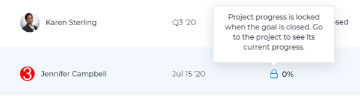

# Overview of connecting projects to goals in `Workfront Align` {#overview-of-connecting-projects-to-goals-in-workfront-align}

Your company must have a `Workfront Align` license in addition to a `Workfront` license to use this functionality. Contact your `Workfront` account manager to learn about a `Workfront Align` license. 

`Workfront Align` is available only in `the new Workfront experience`. 

For additional information about access to `Workfront Align`, see [Access needed to use Workfront Align](access-needed-for-wf-align.md).

>[!IMPORTANT] {type="important"}
>
>Project-level goals created in the Business Case area of a project are not connected to `Workfront Align` goals.&nbsp;For information about Business Case goals, see [Create Business Case goals](create-business-case-goals.md). 

To move your organization forward, you must create alignment between your outputs (executed work) and your outcomes (strategic goals). You can show how the work your groups, teams, and individual contributors are performing contributes to the progress of your organization’s goals. 

To this purpose, you can connect projects as activities (outputs) to your goals (outcomes). 

For information about connecting and disconnecting projects from goals, see the following articles: 

* [Add activities to goals in Workfront Align](add-activities-to-goals.md). 
* The "Disconnect projects from goals" section in the article [Remove results, activities, and projects from goals in Workfront Align](remove-results-activities-from-goals.md). 

Consider the following when adding projects to goals: 

* You can add a project that meets the following criteria to a goal: 
    
    
    * You must have at least permissions to&nbsp;View it. 
    
    
      >[!NOTE]
      >
      >If you lose your permissions to view the project after you have attached the project to the goal, you can still see project information on the goal, but you can no longer access the project. 
    
    
    
    * The project must not be in a status of Dead. 
    
    
* You can associate multiple projects with a goal.
* You can associate the same project with multiple goals. 
* Although the project is connected to the goal as a type of activity, you cannot manually update the progress of a project when you check in on your goal. Instead, `Workfront` calculates the percent complete of the project and `Workfront Align` calculates the goal progress using this percent complete. 

* The owner of the project becomes the owner of this activity.
*  The following project information is visible at the goal level: 

*  The project duration can be outside the time period of a goal. If a project lasts longer than the goal’s deadline, you can still close your goal and consider it completed, but the goal percent complete will not be 100%. The percent complete of the project no longer updates on the goal. There is an indication on the goal list that the project no longer updates progress for the goal. 

  

*  When you delete a project attached to a goal, the project is also deleted from the goal. 

  ` `**Warning: **``If the goal was active and there are no other progress indicators on the goal, the goal remains active but it does not show any progress. 

