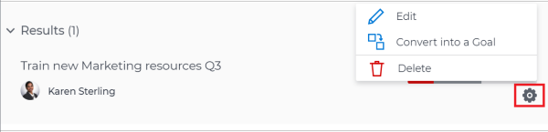
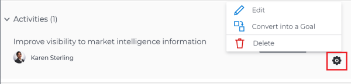

# Edit results and activities in  `Workfront Align` {#edit-results-and-activities-in-workfront-align}

Your company must have a `Workfront Align` license in addition to a `Workfront` license to use this functionality. Contact your `Workfront` account manager to learn about a `Workfront Align` license. 

`Workfront Align` is available only in `the new Workfront experience`. 

For additional information about access to `Workfront Align`, see [Access needed to use Workfront Align](access-needed-for-wf-align.md).
After your `Workfront administrator` has granted you the correct access to `Workfront Align`, you can create and edit goals, results, and activities.&nbsp;For information about creating goals, results and activities, see the following articles:

* [Create goals in Workfront Align](create-goals.md) 
* [Get started with results and activities in Workfront Align](get-started-with-results-and-activities.md) 
* [Add results to goals in Workfront Align](add-results-to-goals.md) 
* [Add activities to goals in Workfront Align](add-activities-to-goals.md) 

## Considerations when editing results and activities {#considerations-when-editing-results-and-activities}

* You can edit results and activities that belong to your goals, or to goals that have another user, a team, group, or the organization as owners.
*  You cannot edit projects that are connected to goals as activities. You can remove them from the goal by disconnecting them. For more information, see the "Disconnect projects"&nbsp;section in the article [Remove results, activities, and projects from goals in Workfront Align](remove-results-activities-from-goals.md). 

  >[!NOTE]
  >
  >If the following project information updates at the project level, `Workfront Align` automatically updates it at the goal level:
  >
  >    
  >    
  >    * Project owner
  >    * Project name
  >    *  Project percent complete
  >    
  >    
  >For information about connecting projects to goals, see [Overview of connecting projects to goals in Workfront Align](connect-projects-to-goals-overview.md).

* You can delete results and activities from goals when they are not longer relevant to the goal progress. Deleted results and activities cannot be recovered. For information about deleting results and activities, see [Remove results, activities, and projects from goals in Workfront Align](remove-results-activities-from-goals.md).
* You cannot edit results and activities associated with goals from past time periods. 
* Editing results and activities updates their settings and does not update their progress. You must update the progress of results and activities by checking in on goals. For information about checking in on goals, see [Check in on goals in Workfront Align](check-in-goals.md). 

## Edit results  {#edit-results}

1. Go to the goal for which you want to edit a result and click the goal name to open the **Goal&nbsp;Details** panel.
1.  Click **Results**.
1.  Click the **gear icon**  to the right of the result you want to edit.

   

1.  Click **Edit** to edit the following information:

    
    
    * Name
    * Owner
    * Measured value type and Starting At and Ending At values.
    
    

1. Click **Save**. 

## Edit activities {#edit-activities}

>[!TIP] {type="tip"}
>
>You cannot edit the&nbsp;Activity Type after you saved an activity on a goal.

1. Go to the goal for which you want to edit an activity and click the goal name to open the **Goal&nbsp;Details** panel.
1.  Click **Activities**.
1.  Click the **gear icon**  to the right of the activity you want to edit . 

   

1.  Click **Edit** to edit the following information:

    
    
    * Name
    * Owner
    
    

1. Click **Save**.

