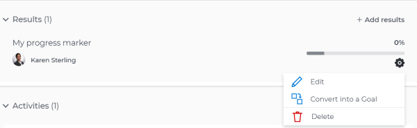
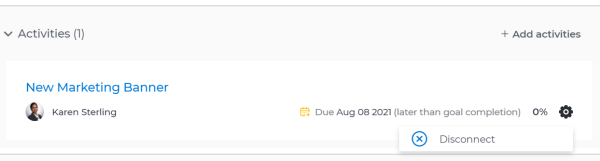

# Remove results, activities, and projects from goals in `Workfront Align` {#remove-results-activities-and-projects-from-goals-in-workfront-align}

Your company must have a `Workfront Align` license in addition to a `Workfront` license to use this functionality. Contact your `Workfront` account manager to learn about a `Workfront Align` license. `Workfront Align` is available only in `the new Workfront experience`. For additional information about access to `Workfront Align`, see [Access needed to use Workfront Align](access-needed-for-wf-align.md).

After the `Workfront administrator` has granted you the correct access to `Workfront Align`, you can create goals and associate results and activities to them. You can also associate and remove or disconnect results, activities, and projects to goals that belong to other users.

For information about creating goals, and adding results and activities to them, also see the following articles:

* [Create goals in Workfront Align](create-goals.md) 
* [Add activities to goals in Workfront Align](add-activities-to-goals.md) 
* [Add results to goals in Workfront Align](add-results-to-goals.md) 
* [Edit results and activities in Workfront Align](edit-results-and-activities.md) 

## Considerations for removing results, activities, and disconnecting projects from goals {#considerations-for-removing-results-activities-and-disconnecting-projects-from-goals}

* You can remove results and activities from a goal by deleting them. Deleted results and activities cannot be recovered. 
*  You cannot delete a project from a goal, but you can disconnect it. By disconnecting the project from the goal the percent complete of the project no longer affects the progress of the goal. 

  For information about how projects affect goal progress, see [Overview of connecting projects to goals in Workfront Align](connect-projects-to-goals-overview.md). 

*  You cannot remove or disconnect a result or an activity from a goal if they are the last progress indicator for the goal. 

  ` `**Warning: **``You can delete a project from a goal, even if it is the last progress indicator on the goal.&nbsp;The goal remains Active, but it shows no progress. 

## Delete results and activities from goals {#delete-results-and-activities-from-goals}

Removing results and activities from goals is identical. 

1.  Click the **Main Menu icon **  in the upper-right corner of your screen, then click **Align**.

   This opens the `Workfront Align` area. 

   The `Goal List` displays by default. 

1.  Click the name of a goal you want to remove results and activities from. 

   This opens the Goal Details panel on the right.

1. Click **Results** to remove results or **Activities** to remove activities. 

1.  Click the **gear icon**  to the right of the result or activity name, then click **Delete** > **Yes, delete**. 

   

   The result or activity is deleted and cannot be recovered. The percent complete of the goal updates to exclude the deleted activity or result. 

## Disconnect projects from goals {#disconnect-projects-from-goals}

1.  Click the **Main Menu icon **  in the upper-right corner of your screen, then click **Align**.

   This opens the `Workfront Align` area. 

   The `Goal List` displays by default. 

1.  Click the name of a goal you want to remove results and activities from. 

   This opens the Goal Details panel on the right.

1. Click the **right-pointing arrow** to the left of the Activities sections to expand it. 
1.  Click the **gear icon**  to the right of the project name, then click **Disconnect**.

   

   The project is disconnected from the goal. The percent complete of the goal updates to exclude the percent complete of the disconnected project.

