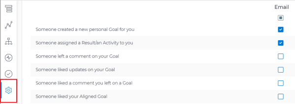
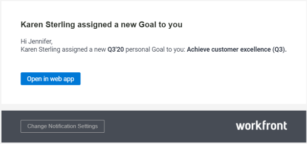

# `Workfront Align` notifications {#workfront-align-notifications}

Your company must have a `Workfront Align` license in addition to a `Workfront` license to use this functionality. Contact your `Workfront` account manager to learn about a `Workfront Align` license. 

`Workfront Align` is available only in `the new Workfront experience`. 

For additional information about access to `Workfront Align`, see [Access needed to use Workfront Align](access-needed-for-wf-align.md).
`Workfront Align` comes with a set of predefined event notifications that you can enable for your account. These event notifications trigger email communication every time the condition defined by the event is met. 

All users that have the correct access to  `Workfront Align` are eligible to receive email notifications about their goals. 

## Overview of `Workfront Align` notifications settings {#overview-of-workfront-align-notifications-settings}

Consider the following when configuring and receiving `Workfront Align` notifications:

* They are personal notifications which means that each user can manage their own notifications.
* The `Workfront administrator` does not need to enable event notifications before each user can select which ones they want to receive. 
* They trigger as soon as the defined events happen on goals, activities, or results and cannot be part of a daily digest. 
* They trigger regardless of the status of the goal. 
* They do not trigger when you are the initiator of the event described in the notification setting. 

## Configure email notifications for `Workfront Align` {#configure-email-notifications-for-workfront-align}

1.  Log in to `Workfront` and ensure that your `Workfront administrator` gave you access to  `Workfront Align`.

   For information about access to  `Workfront Align`, see [Access needed to use Workfront Align](access-needed-for-wf-align.md).

1.  Click the **Main Menu icon **  in the upper-right corner of your screen, then click **Align**.

   This opens the `Workfront Align` area. 

1.  Click **Goal Settings** in the left panel.

   

1.  Select any of the check boxes below to enable notifications for the following events:

<table style="width: 100%;mc-table-style: url('../../Resources/TableStyles/TableStyle-HeaderRow.css');" class="TableStyle-TableStyle-HeaderRow" cellspacing="0"> 
 <col style="width: 600px;" class="TableStyle-TableStyle-HeaderRow-Column-Column1"> 
 <thead> 
  <tr class="TableStyle-TableStyle-HeaderRow-Head-Header1"> 
   <th class="TableStyle-TableStyle-HeaderRow-HeadD-Column1-Header1">Notification </th> 
  </tr> 
 </thead> 
 <tbody> 
  <tr class="TableStyle-TableStyle-HeaderRow-Body-LightGray"> 
   <td class="TableStyle-TableStyle-HeaderRow-BodyD-Column1-LightGray"> 
Someone created a new personal Goal for you.
 
This is enabled by default.
 
Tip: A personal goal is a goal where you are designated as the owner.
 </td> 
  </tr> 
  <tr class="TableStyle-TableStyle-HeaderRow-Body-MediumGray"> 
   <td class="TableStyle-TableStyle-HeaderRow-BodyD-Column1-MediumGray"> 
Someone assigned a Result/ an Activity to you.
 
This is enabled by default. 
 </td> 
  </tr> 
  <tr class="TableStyle-TableStyle-HeaderRow-Body-LightGray"> 
   <td class="TableStyle-TableStyle-HeaderRow-BodyD-Column1-LightGray">Someone left a comment on your Goal </td> 
  </tr> 
  <tr class="TableStyle-TableStyle-HeaderRow-Body-MediumGray"> 
   <td class="TableStyle-TableStyle-HeaderRow-BodyD-Column1-MediumGray">Someone liked updates on your Goal</td> 
  </tr> 
  <tr class="TableStyle-TableStyle-HeaderRow-Body-LightGray"> 
   <td class="TableStyle-TableStyle-HeaderRow-BodyD-Column1-LightGray">Someone liked a comment you left on a Goal</td> 
  </tr> 
  <tr class="TableStyle-TableStyle-HeaderRow-Body-MediumGray"> 
   <td class="TableStyle-TableStyle-HeaderRow-BodyA-Column1-MediumGray">Someone liked your Aligned Goal</td> 
  </tr> 
 </tbody> 
</table>

1.  Click **Save Settings**. 

   When the event defined by the notification you enabled occurs, you receive an email describing the event. 

   

&nbsp;
