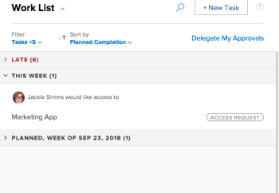
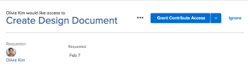

# Grant access to objects in the Home area

Users can request access to objects within *Adobe Workfront*. For more information about requesting access, see&nbsp; [Request access to objects in Adobe Workfront](../../workfront-basics/grant-and-request-access-to-objects/request-access.md).

If you are the owner of an object, you can grant or deny access to items from your Home area.

## Access requirements

You must have the following access to perform the steps in this article:

<table cellspacing="0"> 
 <col> 
 <col> 
 <tbody> 
  <tr> 
   <td role="rowheader"><em>Adobe Workfront</em> plan*</td> 
   <td> 
Any
 </td> 
  </tr> 
  <tr> 
   <td role="rowheader"><em>Adobe Workfront</em> license*</td> 
   <td> 
<em>Review</em> or higher
 </td> 
  </tr> 
  <tr> 
   <td role="rowheader">Access level configurations*</td> 
   <td> 
View access or higher to projects, tasks, issues, or documents
 
Note: If you still don't have access, ask your <em>Workfront administrator</em> if they set additional restrictions in your access level. For information on how a <em>Workfront administrator</em> can modify your access level, see <a href="../../administration-and-setup/add-users/configure-and-grant-access/create-modify-access-levels.md" class="MCXref xref">Create or modify custom access levels</a>.
 </td> 
  </tr> 
  <tr> 
   <td role="rowheader">Object permissions</td> 
   <td> 
View permissions or higher to projects, tasks, issues, or documents
 
For information on requesting additional access, see <a href="../../workfront-basics/grant-and-request-access-to-objects/request-access.md" class="MCXref xref">Request access to objects in Adobe Workfront</a>.
 </td> 
  </tr> 
 </tbody> 
</table>

&#42;To find out what plan, license type, or access you have, contact your *Workfront administrator*.

## Grant access to objects in the Home area

<ol> <draft-comment>
  <li value="1" data-mc-conditions="QuicksilverOrClassic.Quicksilver"> 
   
 
    
Click the Home icon  in the upper-left corner of <em>Adobe Workfront</em>.
 <note type="note"> 
     
Your <em>Workfront administrator</em> might make the following changes to the Home icon in your environment:
 
     <ul> 
      <li> 
Replace it with an image customized to illustrate your organization. In this case, the icon will look different that shown in this article. 
 </li> 
      <li> 
Replace the page linked to it with a different page. In this case, click the Main Menu  in the upper-right corner of the page, then click Home.
 </li> 
     </ul> 
    </note> 
   
 </li>
 </draft-comment>
 <li value="1" data-mc-conditions="QuicksilverOrClassic.Quicksilver"> 
  
 
   
Click the Home icon  in the upper-left corner of <em>Adobe Workfront</em>.
 <note type="note"> 
    
Your <em>Workfront administrator</em> might make the following changes to the Home icon in your environment:
 
    <ul> 
     <li> 
Replace it with an image customized to illustrate your organization. In this case, the icon will look different that shown in this article. 
 </li> 
     <li> 
Replace the page linked to it with a different page. In this case, click the Main Menu  in the upper-right corner of the page, then click Home.
 </li> 
    </ul> 
   </note> 
  
 </li> 
 <li value="2">In the Work List, select the access request you want to manage. </li> 
 <li value="3">In the upper-right corner, click the grant access button. Depending on the type of access requested, the button name changes.&nbsp;For example, if the requestor asks for View access, the button says&nbsp;Grant View Access. </li> 
 <li value="4">(Optional) To grant a different level of access than requested, click the arrow next to the grant access button and select the new access. A message appears confirming access was granted. OR Click Ignore to deny access. A message appears confirming access was ignored.</li> 
</ol>

## Configure Email Notifications for Requests

You can configure whether you receive email notifications for access requests. Your *Workfront administrator* can disable this functionality (as described in [Configure event notifications for everyone in the system](../../administration-and-setup/manage-workfront/emails/configure-event-notifications-for-everyone-in-the-system.md)).

<ol> <draft-comment>
  <li value="1" data-mc-conditions="QuicksilverOrClassic.Quicksilver">Click the Main Menu icon  in the upper-right corner of <em>Adobe Workfront</em>, then click Setup .</li>
 </draft-comment>
 <li value="1" data-mc-conditions="QuicksilverOrClassic.Quicksilver">Click the Main Menu icon  in the upper-right corner of <em>Adobe Workfront</em>, then click Setup .</li> 
 <li value="2">Click Preferences, or scroll to the Preferences section.</li> 
 <li value="3">In the Email Me When drop-down list, select or deselect Someone requests access from me, depending on whether you want to receive email notifications when another user requests access from you or not.</li> 
 <li value="4">Click Save Changes.</li> 
</ol>

