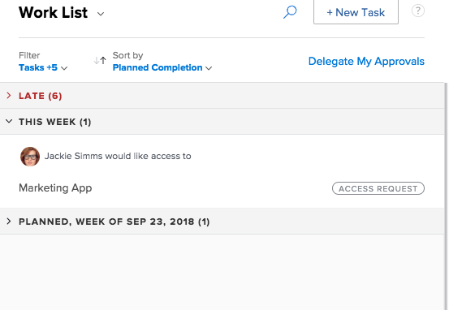
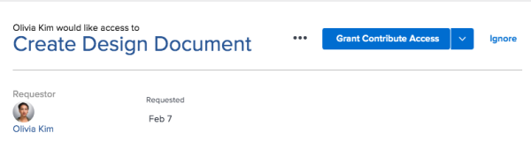

# Grant access to objects {#grant-access-to-objects}

Users can request access to objects within `Workfront`. For more information about requesting access, see&nbsp; [Request Access to objects](request-access.md).

If you are the owner of an object, you might be required to grant or deny access.

## Manage Access Requests in Home {#manage-access-requests-in-home}

1.  Click the **Home** icon  in the upper-left corner of `Workfront`.
1. In the **Work List**, select the access request you want to manage.  
   

1. In the upper-right corner, click the grant access button.  
   Depending on the type of access requested, the button name changes.&nbsp;For example, if the requestor asks for View access, the button says&nbsp;**Grant View Access**.  
   

1. (Optional) To grant a different level of access than requested, click the arrow next to the grant access button and select the new access.  
   A message appears confirming access was granted.  
   OR  
   Click **Ignore** to deny access.  
   A message appears confirming access was ignored.

## Configure Email Notifications for Requests {#configure-email-notifications-for-requests}

You can configure whether you receive email notifications for access requests. Your `Workfront administrator` can disable this functionality (as described in [Enable and disable event notifications](enable-and-disable-event-notification.md)).

1. Click the **Main Menu** icon  in the upper-right corner of `Workfront`, then click **Setup** .

1. Click **Preferences**, or scroll to the Preferences section. 
1. In the **Email Me When** drop-down list, select or deselect **Someone requests access from me**, depending on whether you want to receive email notifications when another user requests access from you or not.

1. Click **Save Changes**.

