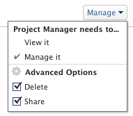

# Share reports, dashboards, and calendars in `Adobe Workfront`

Your `Adobe Workfront administrator` grants users access to view or edit reports, dashboards, and calendars when they assign access levels. For more information about granting access to reports, dashboards, and calendars, see [Grant access to reports, dashboards, and calendars](../../administration-and-setup/add-users/configure-and-grant-access/grant-access-reports-dashboards-calendars.md).

Along with the access level that users are granted, you can also grant them permissions to View or Manage specific reports, dashboards, or calendars that you have access to Share. For information about granting users sharing permissions on objects, see [Overview of sharing permissions on objects in Adobe Workfront](../../workfront-basics/grant-and-request-access-to-objects/sharing-permissions-on-objects-overview.md).

Permissions are specific to one item in `Workfront` and define what actions one can take on that item.

For information about what users in each access level can do with issues, see the section [Reports](../../administration-and-setup/add-users/access-levels-and-object-permissions/functionality-available-for-each-object-type.md#reports) in the article [Functionality available for each object type](../../administration-and-setup/add-users/access-levels-and-object-permissions/functionality-available-for-each-object-type.md).

## Considerations about sharing a report, dashboard, or calendar

In addition to the considerations below, also see [Overview of sharing permissions on objects in Adobe Workfront](../../workfront-basics/grant-and-request-access-to-objects/sharing-permissions-on-objects-overview.md).

>[!NOTE]
>
>A `Workfront administrator` can add or remove permissions to any items in the system, for all users, without being the owner of those items.

<ul> 
 <li> 
The creator of a report, dashboard, or calendar has Manage permissions to them, by default.
 </li> 
 <li> 
Sharing reports, dashboards, and calendars is similar to sharing any other object in Workfront.
 
For more information about how to share objects in Workfront, see <a href="../../workfront-basics/grant-and-request-access-to-objects/share-an-object.md" class="MCXref xref" xrefformat="{para}">Share an object in Adobe Workfront</a>. 
 
Also see the following articles to learn how to share reports, dashboards, and calendars: 
 
  <ul> 
   <li> 
<a href="../../reports-and-dashboards/reports/creating-and-managing-reports/share-report.md" class="MCXref xref" xrefformat="{para}">Share a report in Adobe Workfront</a> 
 </li> 
   <li> 
<a href="../../reports-and-dashboards/dashboards/creating-and-managing-dashboards/share-dashboard.md" class="MCXref xref" xrefformat="{para}">Share a dashboard in Adobe Workfront</a> 
 </li> 
   <li> 
<a href="../../reports-and-dashboards/reports/calendars/share-a-calendar-report.md" class="MCXref xref" xrefformat="{para}">Share a calendar report</a> 
 </li> 
  </ul> </li> 
 <li> 
You can share reports and dashboards individually, or you can share them in bulk. 
 
You can share calendars only individually. You cannot share them in bulk.
 </li> 
 <li> 
You cannot share built-in system reports. You can only share custom reports. 
 
For more information about saving a system report as a new custom report, see <a href="../../reports-and-dashboards/reports/creating-and-managing-reports/create-copy-report.md" class="MCXref xref" xrefformat="{para}">Create a copy of a report</a>.
 </li> 
 <li>You can grant the following permissions to reports, dashboards, and calendars:
  <ul>
   <li>
View

</li>
   <li>
Manage 

</li>
  </ul></li> 
 <li>When you share a dashboard, users have View permissions by default to all the reports, calendars, and external pages on the dashboard.</li> 
 <li>Users with a Request license cannot view a system-wide report. A report must be shared with the Requestors individually if they need to view it.</li> 
 <li>If a report has a prompt and you share it publicly, the users accessing the report must be logged in to Workfront to be able to run the report using the prompt. If they cannot log in to Workfront, they will see the report without the prompt applied to it. For more information about limitations of sharing reports with prompts, see the section <a href="../../reports-and-dashboards/reports/creating-and-managing-reports/add-prompt-report.md#limitations-of-running-public-prompted-reports" class="MCXref xref" xrefformat="{para}">Limitations of sharing prompted reports</a> in the article <a href="../../reports-and-dashboards/reports/creating-and-managing-reports/add-prompt-report.md" class="MCXref xref" xrefformat="{para}">Add a prompt to a report</a>.</li> 
 <li> 
You can remove inherited permissions from a report or calendar.
 
For more information about removing inherited permissions from objects, see <a href="../../workfront-basics/grant-and-request-access-to-objects/remove-permissions-from-objects.md" class="MCXref xref" xrefformat="{para}">Remove permissions from objects in Adobe Workfront</a>. 
 </li> 
 <li> 
You can also share a report or a calendar publicly or system-wide. 
 
You cannot share a dashboard publicly, but you can share it system-wide. 
 
Warning: </b>"><b>Warning: </b>We recommend that you use caution when sharing an object containing confidential information with external users. This allows them to view information without being a Workfront user or part of your organization. 
 </li> 
</ul>

