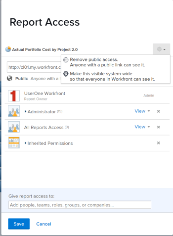

# Remove permissions from objects in *`Adobe Workfront`* {#remove-permissions-from-objects-in-adobe-workfront}

You can remove other users' permissions on objects that you have access to Share. Removing permissions from objects is identical for all objects that can be shared.&nbsp;

>[!NOTE]
>
>&nbsp;You cannot remove permissions when you share items in bulk. You can remove permissions only when selecting individual items.&nbsp;

Similar considerations as for sharing objects apply for removing permissions from objects.&nbsp;For more information, see the section [Considerations about sharing objects](sharing-permissions-on-objects-overview.md#consider) in the article [Overview of sharing permissions on objects in Adobe Workfront](sharing-permissions-on-objects-overview.md)

## Access requirements {#access-requirements}

You must have the following to share objects:

<table style="width: 100%;margin-left: 0;margin-right: auto;mc-table-style: url('../../Resources/TableStyles/TableStyle-List-options-in-steps.css');" class="TableStyle-TableStyle-List-options-in-steps" cellspacing="0"> 
 <col class="TableStyle-TableStyle-List-options-in-steps-Column-Column1"> 
 <col class="TableStyle-TableStyle-List-options-in-steps-Column-Column2"> 
 <tbody> 
  <tr class="TableStyle-TableStyle-List-options-in-steps-Body-LightGray"> 
   <td class="TableStyle-TableStyle-List-options-in-steps-BodyE-Column1-LightGray" role="rowheader">Adobe Workfront plan*</td> 
   <td class="TableStyle-TableStyle-List-options-in-steps-BodyD-Column2-LightGray"> 
Any 
 </td> 
  </tr> 
  <tr class="TableStyle-TableStyle-List-options-in-steps-Body-MediumGray"> 
   <td class="TableStyle-TableStyle-List-options-in-steps-BodyE-Column1-MediumGray" role="rowheader">Workfront license*</td> 
   <td class="TableStyle-TableStyle-List-options-in-steps-BodyD-Column2-MediumGray"> 
Work or higher
 </td> 
  </tr> 
  <tr class="TableStyle-TableStyle-List-options-in-steps-Body-LightGray"> 
   <td class="TableStyle-TableStyle-List-options-in-steps-BodyE-Column1-LightGray" role="rowheader">Access level configurations*</td> 
   <td class="TableStyle-TableStyle-List-options-in-steps-BodyD-Column2-LightGray"> 
View access or higher to the objects you want to share
 
Note: If you still don't have access, ask your Workfront administrator if they set additional restrictions in your access level. For information on how a Workfront administrator can modify your access level, see <a href="create-modify-access-levels.md" class="MCXref xref">Create or modify custom access levels</a>.
 </td> 
  </tr> 
  <tr class="TableStyle-TableStyle-List-options-in-steps-Body-MediumGray"> 
   <td class="TableStyle-TableStyle-List-options-in-steps-BodyB-Column1-MediumGray" role="rowheader">Object permissions</td> 
   <td class="TableStyle-TableStyle-List-options-in-steps-BodyA-Column2-MediumGray"> 
View permissions or higher to the objects you want to share
 
Manage permissions to remove inherited permissions on objects
 
For information on requesting additional access, see <a href="request-access.md" class="MCXref xref">Request access to objects in Adobe Workfront</a>.
 </td> 
  </tr> 
 </tbody> 
</table>

&#42;To find out what plan, license type, or access you have, contact your *`Workfront administrator`*.

## Remove entities from the sharing list of an object {#remove-entities-from-the-sharing-list-of-an-object}

You can remove entities (users, job roles, teams, groups, companies) from the sharing list of an object.&nbsp;This removes their permissions to the object.

1.  Go to the object you want to share. 

   For information about which objects can be shared, see [Overview of sharing permissions on objects in Adobe Workfront](sharing-permissions-on-objects-overview.md).

1.  `C`lick the `More` icon next to the object name, then click  `Sharing`or `Share.`

   

1.  Click the `x` next to the name of a user, team, group, company, job role to remove them in the object access box.  

   

1. In the `<User Name>'s *`Workfront`* access will be removed from this` drop-down menu, select whether you want their access to be removed just from the object you have selected, or from all children objects associated with it.  
   The following scenarios exist: 
    
    
    * If you remove the entity only from the object, that entity loses their permissions on the object, and their inherited permissions to the children objects. If they are granted permissions to the children items individually, they retain the same permissions on all children objects associated with it when you select this option.&nbsp;
    * If you remove the entity from the object and all the children objects, that entity loses their permissions to the object as well as all children objects, even when they have been given individual permission on each child object.&nbsp;
    
    

1. Click `Save`.

## Remove inherited permissions {#remove-inherited-permissions}

Inherited permissions can be removed from objects allowing for owners to specifically&nbsp;identify who will get access to children objects regardless of the access of a user to a parent object. 

>[!IMPORTANT] {type="important"}
>
>Only users with Manage permission are able to remove inherited permissions.

To remove inherited permissions:

1. Go to an object to which you have Manage permissions. For example, go to a task.   
1. Go to the object access box as described in the [Remove entities from the sharing list of an object](#removing) section in this article.
1.  Select the `x` next to `Inherited Permission`&nbsp;on the sharing box to remove&nbsp;anyone listed there.  

   

   This ensures that no one who is granted permissions to the parent object (for example, the project) has permissions to this task by default. You must list&nbsp; individual entities in the sharing list of the task to grant permissions on the task.

   >[!TIP] {type="tip"}
   >
   >You cannot remove individual entities from the Inherited Permissions list. You can only disable the Inherited Permissions for all entities listed.  

1.  Click `Save`.&nbsp;

## Make an object private {#make-an-object-private}

If you have shared an object system-wide, or you have shared it with external uses by making it public, you can make it private again by removing the system-wide or public permissions.&nbsp;

For more information about making an object available system-wide, or publicly, see [Share an object in Adobe Workfront](share-an-object.md). 

To make an object private:

1. Go to the object you want to make private.  
   For example, navigate to a report.
1.  Click `Report Actions`, then `Sharing`.  

      

1. Click `Remove public access` to remove the access of external users to viewing the report.
1. Click `Remove system-wide access` to stop sharing it with all *`Workfront`* users.&nbsp;

1. Click `Save`.

