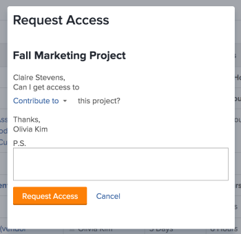
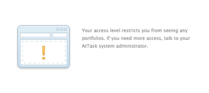
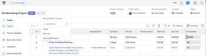

# Request access to objects in *`Adobe Workfront`* {#request-access-to-objects-in-adobe-workfront}

Your visibility to objects in  *`Adobe Workfront`* depends on your access to that type of object as well as your permissions on an individual object. 

>[!NOTE]
>
>`This article describes how you can request permissions to all objects except for plans in the` *`Adobe Workfront Scenario Planner`*. `For information about requesting access to plans, see` [Request access to a plan in the Adobe Workfront Scenario Planner](request-access-to-plan.md). This requires an additional license. 

Your *`Workfront administrator`* configures your access to a type of object in your access level.&nbsp;For more information, see [How access levels and permissions work together](how-access-levels-permissions-work-together.md). 

If you need permissions to specific objects within *`Workfront`*, you can request access to them. Rather than sending an email to the  *`Workfront administrator`* or object owner to explain your needs, you can request additional access (or permissions) within *`Workfront`*.

You can request initial access to objects if someone shares a link to the object with you, or you can request additional access to objects you cat at least view. 

For example, you might have View permissions to a project, but you need to add tasks to that project. In this case, you can request Contribute permissions to the project.

## Access requirements {#access-requirements}

You must have the following to share objects:

<table style="width: 100%;margin-left: 0;margin-right: auto;mc-table-style: url('../../Resources/TableStyles/TableStyle-List-options-in-steps.css');" class="TableStyle-TableStyle-List-options-in-steps" cellspacing="0"> 
 <col class="TableStyle-TableStyle-List-options-in-steps-Column-Column1"> 
 <col class="TableStyle-TableStyle-List-options-in-steps-Column-Column2"> 
 <tbody> 
  <tr class="TableStyle-TableStyle-List-options-in-steps-Body-LightGray"> 
   <td class="TableStyle-TableStyle-List-options-in-steps-BodyE-Column1-LightGray" role="rowheader">Adobe Workfront plan*</td> 
   <td class="TableStyle-TableStyle-List-options-in-steps-BodyD-Column2-LightGray"> 
Any 
 </td> 
  </tr> 
  <tr class="TableStyle-TableStyle-List-options-in-steps-Body-MediumGray"> 
   <td class="TableStyle-TableStyle-List-options-in-steps-BodyE-Column1-MediumGray" role="rowheader">Adobe Workfront license*</td> 
   <td class="TableStyle-TableStyle-List-options-in-steps-BodyD-Column2-MediumGray"> 
Work or higher
 </td> 
  </tr> 
  <tr class="TableStyle-TableStyle-List-options-in-steps-Body-LightGray"> 
   <td class="TableStyle-TableStyle-List-options-in-steps-BodyB-Column1-LightGray" role="rowheader">Access level configurations*</td> 
   <td class="TableStyle-TableStyle-List-options-in-steps-BodyA-Column2-LightGray"> 
View access or higher to the objects you request permissions to
 
Note: If you still don't have access, ask your Workfront administrator if they set additional restrictions in your access level. For information on how a Workfront administrator can modify your access level, see <a href="create-modify-access-levels.md" class="MCXref xref">Create or modify custom access levels</a>.
 </td> 
  </tr> 
 </tbody> 
</table>

&#42;To find out what plan, license type, or access you have, contact your *`Workfront administrator`*.

## Understand standard&nbsp;sharing rules {#understand-standard-sharing-rules}

The following standard sharing rules take effect automatically, as they are set up as default options in your *`Workfront`* system.&nbsp;

* Users assigned to a task have Contribute access on the task.&nbsp;
* Users assigned to an issue have Contribute access on the issue.&nbsp;
* Project, Portfolio, and Program managers have&nbsp;Manage&nbsp;access on the objects they own.
* Users included in a&nbsp;conversation have&nbsp;View access on the object where the conversation happens.
* Users assigned as approvers have View access on the object waiting to be approved.
* When sharing&nbsp;a&nbsp;dashboard, all reports on the dashboard are also&nbsp;shared with the same access to the same users.&nbsp;
* Object owners are unable to extend access to an object beyond their access on that object as defined by the administrator.

## Request&nbsp;access {#request-access}

You can request initial access to objects that you do not currently have access to, or you can request additional access to objects that you have only limited access to.

* [Request initial access](#requesting-initial-access) 
* [Request additional access](#requesting-additional-access) 

### Request initial&nbsp;access&nbsp; {#request-initial-access}

If you do not already have access to an object&nbsp;and you navigate to that object from a link,&nbsp;a screen is displayed informing you that you do not&nbsp;have access to view the information. &nbsp;

To request initial access to an object:

1. Click `Request Access`.  
   The `Request Access` dialog box is displayed.  

1. (Conditional) If more than one user has the appropriate access to grant you additional access, a drop-down arrow is displayed next to the name of the user.&nbsp;
1. Select the user from the drop-down list who you want to receive your access request.  
   Only 10 users are displayed in the drop-down list. The list is sorted alphabetically.  
   For more information on the order of the users listed in this&nbsp;drop-down menu, see&nbsp; [Hierarchy of the "Request Access" and "Request More Access" drop-down menus](#hierarchy-of-the-request-more-access-drop-down-menu).

1. From the drop-down list, select the type of access that you are requesting.
1. (Optional) In the `P.S.` field, specify a note to the user regarding why you need additional access.
1. Click `Request Access`.  
     

If you do not have access level rights to an object and you try to access that object from a link, a screen is displayed informing you to contact the *`Workfront administrator`*.&nbsp;

For example,&nbsp;if you do not&nbsp;have portfolio&nbsp;access, but you were&nbsp;given a link to a portfolio, you&nbsp;would see the following&nbsp;message:  

### Request additional&nbsp;access {#request-additional-access}

To request additional access to an object that you already have limited access to:

1. Go to the object for which you want to request additional access.  
  

1. Click the `More` menu inline with the project name, then click `Request More Access`.  
     

1. (Conditional) If more than one user has the appropriate access to grant you additional access, a drop-down arrow is displayed next to the name of the user.
1. Select the user from the drop-down list who you want to receive your access request.  
   Only 10 users are displayed in the drop-down list. The list is sorted alphabetically.  
   For more information on the order of the users listed in this&nbsp;drop-down menu, see&nbsp; [Hierarchy of the "Request Access" and "Request More Access" drop-down menus](#hierarchy-of-the-request-more-access-drop-down-menu).

1. From the drop-down list, select the level of access that you are requesting.
1. (Optional) In the `P.S.` field, specify a note regarding why you need additional access.
1. Click `Request Access`.  
     

## Hierarchy of the "Request Access" and "Request More Access" drop-down menus {#hierarchy-of-the-request-access-and-request-more-access-drop-down-menus}

* [Understand the hierarchy of users listed in the Request Access and Request More Access drop-down menus](#understanding-hierarchy-of-users-subsection) 
* [Understand the owner of an object](#understanding-the-owner-of-an-object) 

### Understand the hierarchy of users listed in the Request Access and&nbsp;Request More Access drop-down menus {#understand-the-hierarchy-of-users-listed-in-the-request-access-and-request-more-access-drop-down-menus}

When populating the "Request Access" or "Request More Access" lists on objects, *`Workfront`* selects a&nbsp;list of up to ten users that fulfill various roles in the sharing of the object as described below. These users can grant access to the object to the user requesting it.  
The resulting list is then is sorted by their name in ascending alphabetical order.   
*`Workfront`* displays up to 10 users in the "Request Access" and the "Request More Access" lists.&nbsp;

The order of the users in the "Request Access" or "Request More Access" drop-down menus is dictated by the following rules:&nbsp;

* The first user&nbsp;in the list is the object "owner", as described in [Understand the owner of an object](#understanding-the-owner-of-an-object).&nbsp;
* Then the list is populated with users with whom the object&nbsp;is shared individually. They are listed in alphabetical order.
* Then the list is further populated with users who get the required access through sharing with their teams, groups, or companies. They are listed in alphabetical order.
* If the list is empty, the *`Workfront administrator`*s are added so that there is always someone to request access from. They are listed in alphabetical order.&nbsp;
* Each of the users in the list must have the requested access to the object and access to share the object.&nbsp;

### Understand the owner of an object {#understand-the-owner-of-an-object}

The owner of an object is defined as follows: 

<table style="mc-table-style: url('../../Resources/TableStyles/TableStyle-HeaderRow.css');" class="TableStyle-TableStyle-HeaderRow" cellspacing="15"> 
 <col class="TableStyle-TableStyle-HeaderRow-Column-Column1"> 
 <col class="TableStyle-TableStyle-HeaderRow-Column-Column1"> 
 <thead> 
  <tr class="TableStyle-TableStyle-HeaderRow-Head-Header1"> 
   <th class="TableStyle-TableStyle-HeaderRow-HeadE-Column1-Header1">Object </th> 
   <th class="TableStyle-TableStyle-HeaderRow-HeadD-Column1-Header1">Definition of the Owner of the Object </th> 
  </tr> 
 </thead> 
 <tbody> 
  <tr class="TableStyle-TableStyle-HeaderRow-Body-LightGray"> 
   <td class="TableStyle-TableStyle-HeaderRow-BodyE-Column1-LightGray">Projects</td> 
   <td class="TableStyle-TableStyle-HeaderRow-BodyD-Column1-LightGray">The owner is&nbsp;the Project Owner&nbsp;or, if it is missing or they don't have the necessary&nbsp;access, the owner of the parent portfolio.&nbsp;
They might not be the same person as the project creator. 
</td> 
  </tr> 
  <tr class="TableStyle-TableStyle-HeaderRow-Body-MediumGray"> 
   <td class="TableStyle-TableStyle-HeaderRow-BodyE-Column1-MediumGray">Tasks</td> 
   <td class="TableStyle-TableStyle-HeaderRow-BodyD-Column1-MediumGray">The owner is the Primary Assignee or, if it is missing or they don't have the necessary&nbsp;access, the owner of project on which the task resides, as defined above.&nbsp;
They might not be the same person as the task creator. 
</td> 
  </tr> 
  <tr class="TableStyle-TableStyle-HeaderRow-Body-LightGray"> 
   <td class="TableStyle-TableStyle-HeaderRow-BodyE-Column1-LightGray">Issues</td> 
   <td class="TableStyle-TableStyle-HeaderRow-BodyD-Column1-LightGray"> 
The owner is the Primary Contact of the issue or, if it is missing or they don't have necessary&nbsp;access, the owner of&nbsp;the project on which the issue resides, as defined above. 
 
They might not be the same person as the issue creator. 
 </td> 
  </tr> 
  <tr class="TableStyle-TableStyle-HeaderRow-Body-MediumGray"> 
   <td class="TableStyle-TableStyle-HeaderRow-BodyE-Column1-MediumGray">Portfolios</td> 
   <td class="TableStyle-TableStyle-HeaderRow-BodyD-Column1-MediumGray">The owner is the Portfolio Owner. 
They might not be the same person as the portfolio creator. 
</td> 
  </tr> 
  <tr class="TableStyle-TableStyle-HeaderRow-Body-LightGray"> 
   <td class="TableStyle-TableStyle-HeaderRow-BodyE-Column1-LightGray">Documents</td> 
   <td class="TableStyle-TableStyle-HeaderRow-BodyD-Column1-LightGray">The owner is the Owner of the document (the user who uploaded the document) or, if it is missing or they don't have necessary&nbsp;access, the owner of the object on which the document resides.</td> 
  </tr> 
  <tr class="TableStyle-TableStyle-HeaderRow-Body-MediumGray"> 
   <td class="TableStyle-TableStyle-HeaderRow-BodyE-Column1-MediumGray">Reports and dashboards</td> 
   <td class="TableStyle-TableStyle-HeaderRow-BodyD-Column1-MediumGray">The owner is the creator or the report or the dashboard.&nbsp;</td> 
  </tr> 
  <tr class="TableStyle-TableStyle-HeaderRow-Body-LightGray"> 
   <td class="TableStyle-TableStyle-HeaderRow-BodyE-Column1-LightGray">Calendars</td> 
   <td class="TableStyle-TableStyle-HeaderRow-BodyD-Column1-LightGray">The owner is the creator of the calendar.&nbsp;All users have a calendar assigned to them by default.&nbsp;They are considered the owner of that calendar. </td> 
  </tr> 
  <tr class="TableStyle-TableStyle-HeaderRow-Body-MediumGray"> 
   <td class="TableStyle-TableStyle-HeaderRow-BodyE-Column1-MediumGray">Filters, views, and groupings</td> 
   <td class="TableStyle-TableStyle-HeaderRow-BodyD-Column1-MediumGray">The owner of a filter, view, or grouping is the creator. </td> 
  </tr> 
  <tr class="TableStyle-TableStyle-HeaderRow-Body-LightGray" data-mc-conditions="QuicksilverOrClassic.Quicksilver"> 
   <td class="TableStyle-TableStyle-HeaderRow-BodyE-Column1-LightGray">Plans </td> 
   <td class="TableStyle-TableStyle-HeaderRow-BodyD-Column1-LightGray"> 
The owner is the creator of the plan.  
 
This requires an additional license. 
 
For information about the Workfront Scenario Planner, see <a href="scenario-planner-overview.md" class="MCXref xref">The Adobe Workfront Scenario Planner overview</a>.
 </td> 
  </tr> 
  <tr class="TableStyle-TableStyle-HeaderRow-Body-MediumGray" data-mc-conditions="QuicksilverOrClassic.Quicksilver"> 
   <td class="TableStyle-TableStyle-HeaderRow-BodyB-Column1-MediumGray">Goals</td> 
   <td class="TableStyle-TableStyle-HeaderRow-BodyA-Column1-MediumGray"> 
The owner is the user designated as the Owner. They might not be the same person as the goal creator. 
 
This requires an additional license. 
 
For information about Workfront Goals, see <a href="wf-goals-overview.md" class="MCXref xref">Adobe Workfront Goals overview</a>. 
 </td> 
  </tr> 
 </tbody> 
</table>

&nbsp;
