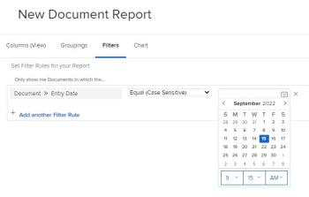

# Share a document folder {#share-a-document-folder}

The information on this page refers to functionality not yet generally available. It is available only in the Preview Sandbox environment.

>[!NOTE]
>
>`This functionality is delayed one week and will release to Preview on December 15, 2021`.

You can share a folder its contents from the Documents area.

>[!NOTE]
>
>Smart folders can't be shared.

## Access requirements {#access-requirements}

You must have the following access to perform the steps in this article:

<table style="width: 100%;margin-left: 0;margin-right: auto;mc-table-style: url('../../Resources/TableStyles/TableStyle-List-options-in-steps.css');" class="TableStyle-TableStyle-List-options-in-steps" cellspacing="0"> 
 <col class="TableStyle-TableStyle-List-options-in-steps-Column-Column1"> 
 <col class="TableStyle-TableStyle-List-options-in-steps-Column-Column2"> 
 <tbody> 
  <tr class="TableStyle-TableStyle-List-options-in-steps-Body-LightGray"> 
   <td class="TableStyle-TableStyle-List-options-in-steps-BodyE-Column1-LightGray" role="rowheader">Adobe Workfront plan*</td> 
   <td class="TableStyle-TableStyle-List-options-in-steps-BodyD-Column2-LightGray"> 
Any
 </td> 
  </tr> 
  <tr class="TableStyle-TableStyle-List-options-in-steps-Body-MediumGray"> 
   <td class="TableStyle-TableStyle-List-options-in-steps-BodyE-Column1-MediumGray" role="rowheader">Adobe Workfront license*</td> 
   <td class="TableStyle-TableStyle-List-options-in-steps-BodyD-Column2-MediumGray"> 
Review or higher
 </td> 
  </tr> 
  <tr class="TableStyle-TableStyle-List-options-in-steps-Body-LightGray"> 
   <td class="TableStyle-TableStyle-List-options-in-steps-BodyE-Column1-LightGray" role="rowheader">Access level configurations*</td> 
   <td class="TableStyle-TableStyle-List-options-in-steps-BodyD-Column2-LightGray"> 
Edit access to Documents
 
Note: If you still don't have access, ask your Workfront administrator if they set additional restrictions in your access level. For information on how a Workfront administrator can modify your access level, see <a href="create-modify-access-levels.md" class="MCXref xref">Create or modify custom access levels</a>.
 </td> 
  </tr> 
  <tr class="TableStyle-TableStyle-List-options-in-steps-Body-MediumGray" data-mc-conditions=""> 
   <td class="TableStyle-TableStyle-List-options-in-steps-BodyB-Column1-MediumGray" role="rowheader">Object permissions</td> 
   <td class="TableStyle-TableStyle-List-options-in-steps-BodyA-Column2-MediumGray"> 
View access to an object
 
For information on requesting additional access, see <a href="request-access.md" class="MCXref xref">Request access to objects in Adobe Workfront</a>.
 </td> 
  </tr> 
 </tbody> 
</table>

&#42;To find out what plan, license type, or access you have, contact your *`Workfront administrator`*.

## Share a folder {#share-a-folder}

1.   `<MadCap:conditionalText data-mc-conditions="QuicksilverOrClassic.Quicksilver"> Click  Documents in the Main Menu.  </MadCap:conditionalText>` 

   Or

   `<MadCap:conditionalText data-mc-conditions="QuicksilverOrClassic.Quicksilver"> With a  Workfront object open, click  Documents in the left panel.</MadCap:conditionalText>` 

1.  Select the folder, then click the Share icon  in the toolbar.

   If you are sharing from the main Documents area (after clicking **Documents** in the Main Menu), the folder you select must be under My Folders, not Smart Folders list.

1.  In the box that displays, under `Give *`folder`* access to`, start typing the name of the user, team, job role, group, or company you want to share the *`folder`* with, then press `Enter` when the name displays.
1.  To adjust access for the user, team, job role, group, or company you just added, click the drop-down menu to the right of the name, then configure one of the following available options and any of its advanced settings:

<table style="width: 100%;mc-table-style: url('../../Resources/TableStyles/TableStyle-List-options-in-steps.css');" class="TableStyle-TableStyle-List-options-in-steps" cellspacing="0"> 
 <col class="TableStyle-TableStyle-List-options-in-steps-Column-Column1"> 
 <col class="TableStyle-TableStyle-List-options-in-steps-Column-Column2"> 
 <tbody> 
  <tr class="TableStyle-TableStyle-List-options-in-steps-Body-LightGray"> 
   <td class="TableStyle-TableStyle-List-options-in-steps-BodyE-Column1-LightGray" role="rowheader">View it</td> 
   <td class="TableStyle-TableStyle-List-options-in-steps-BodyD-Column2-LightGray"> 
Ability to view the folder and its contents.
 
Click Advanced Settings to specify whether you want to allow the following:
 
    <ul> 
     <li>Download: Ability to download the folder and its contents as a ZIP file</li> 
     <li> 
Share: Ability to share the folder with others in the system
 </li> 
    </ul> </td> 
  </tr> 
  <tr class="TableStyle-TableStyle-List-options-in-steps-Body-MediumGray"> 
   <td class="TableStyle-TableStyle-List-options-in-steps-BodyB-Column1-MediumGray" role="rowheader">Manage it</td> 
   <td class="TableStyle-TableStyle-List-options-in-steps-BodyA-Column2-MediumGray"> 
Ability to view and edit the folder and its contents
 
Click Advanced Settings to specify whether you want to allow users to do the following:
 
    <ul> 
     <li>Delete: Delete the folder and its contents from the system</li> 
     <li><b>Download</b>: Download the folder and its contents as a ZIP file</li> 
     <li>Share: Share the folder and its contents with other users in the system</li> 
    </ul> </td> 
  </tr> 
 </tbody> 
</table>

1. (Optional) Repeat Steps 3-4 to add other names to the list and configure their options.
1.  (Optional) If you want everyone in the system to be able to view the folder and its contents, click the gear icon  in the upper right corner of the sharing box, then click `Make this visible system-wide.`

   If you change your mind, you can, click `Remove system-wide access` (the default option).

## How your recipients access the contents of a folder you share with them {#how-your-recipients-access-the-contents-of-a-folder-you-share-with-them}

Currently (temporarily), when you share a folder, your recipients do not see the folder in their Documents area. However, they can access its documents by running a document report.

For example, if you let your recipients know that you have shared a folder with them, they can run a report with Document as the object type and today's date as an Entry Date filter.

The resulting report will contain the documents in the shared folder. From there, a recipient can view and manage the documents using the sharing permissions that you granted for the folder.

## How inherited permissions work when you share a parent object containing a folder {#how-inherited-permissions-work-when-you-share-a-parent-object-containing-a-folder}

When you share the parent object where a document folder resides, your recipients also get access to the folder:

*  If you grant your recipients View access to the parent object, they have View access to the folder.
*  If you grant your recipients Contribute or Manage access to the parent object, they have Manage access to the folder.
*  If you grant one type of access (View, Contribute, or Manage) to the parent object, and another type to the folder, your recipients have the highest of those two types of access to documents within the folder

  For example, if you share the parent object with View access, and the folder with Manage access, your recipients have Manage to the documents in the folder.

*  After you share a folder, any documents you add to it inherit the sharing permissions that you granted for the folder.

