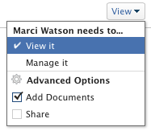

# Share a program in  *`Adobe Workfront`* {#share-a-program-in-adobe-workfront}

Your *`Adobe Workfront administrator`* can grant you access to view or edit programs when assigning your access level. You must have a Plan license to have access to edit a program. For more information, see [Grant access to programs](grant-access-programs.md).

Along with the access level that you are granted, you can also receive permissions to view or manage specific programs from users who can share them with you. For more information about access levels and permissions, see [How access levels and permissions work together](how-access-levels-permissions-work-together.md). 

Permissions are specific to each item in *`Workfront`* and define which actions users can take on that item.  

## Considerations about sharing a program {#considerations-about-sharing-a-program}

In addition to the considerations below, also see [Overview of sharing permissions on objects in Adobe Workfront](sharing-permissions-on-objects-overview.md). 

>[!NOTE]
>
>A *`Workfront administrator`* can add or remove permissions to any items in the system, for all users, without being the owner of those items.  

*  The creator of a program has Manage permissions to it, by default.

*  You can share programs individually, or you can share several of them at a time.

  For more information about sharing items in *`Workfront`*, see [Share an object in Adobe Workfront](share-an-object.md).

*  You can only grant View or Manage permissions on programs.  

  &nbsp; &nbsp; 

*  When you share a program, users inherit the same permissions to all the children objects associated with the program, by default.  

  For more information about the hierarchy of objects in *`Workfront`*, see [Understand objects in Adobe Workfront](understand-objects.md).  

* You can remove inherited permissions from the program. For more information about removing permissions from objects, see&nbsp; [Remove permissions from objects in Adobe Workfront](remove-permissions-from-objects.md).

## Program permissions {#program-permissions}

The following table displays what permissions you can grant users when allowing them to view or manage a program:

&#42; These permissions are controlled by the access level and permissions on other objects, like projects.&nbsp;
