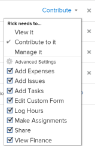

# Share a project in *`Adobe Workfront`* {#share-a-project-in-adobe-workfront}

Your *`Adobe Workfront administrator`* can grant you access to view or edit projects when assigning your access level. For more information, see [Grant access to projects](grant-access-projects.md).

Along with the access level that users are granted, you can also grant them permissions to View, Contribute, or Manage specific projects that you have access to share. 

Permissions are specific to one item in *`Workfront`* and define what actions one can take on that item. 

## Considerations about sharing projects {#considerations-about-sharing-projects}

In addition to the considerations below, also see [Overview of sharing permissions on objects in Adobe Workfront](sharing-permissions-on-objects-overview.md). 

*  By default, the creator of a project has permissions to manage the project and is also designated as the Project Owner. If the project is assigned to another owner, that user also has permissions to manage the project. When the project creator (or owner) shares the project with other users, they grant certain permissions to those users to control what they can do as they work on the project.

  However, if a project owner does not have a Planner license, they do not have full access to manage the project. Only a user with a Plan license can have permissions to manage a project. For more information, see [How access levels and permissions work together](how-access-levels-permissions-work-together.md).

* You can share projects individually, or you can share several of them at a time. Sharing projects is identical to sharing other objects. For more information about sharing items in *`Workfront`*, see [Share an object in Adobe Workfront](share-an-object.md). 

*  You can grant the following permissions to a project:&nbsp; 
    
    
    * View
    * Manage
    *  Contribute
    
    
          

    
    
    

*  When you share a project, all the tasks, issues, and documents inherit the same permissions, unless otherwise specified. 

  For information about managing the access to tasks and issues on the project based on a user's permissions to the project, see the  section in the article [Edit projects](edit-projects.md). 

  The *`Workfront administrator`* can specify whether documents should inherit permissions from higher objects in the user's access level. For more information about restricting inherited permissions on documents, see [Create or modify custom access levels](create-modify-access-levels.md).

*  You can remove inherited permissions from a project so that the children objects will not inherit them.&nbsp;For more information about removing inherited permissions from objects, see&nbsp; [Remove permissions from objects in Adobe Workfront](remove-permissions-from-objects.md). 

## Ways to share a project {#ways-to-share-a-project}

You can share a project in the following ways:

*  Manually by doing one of the following:

    
    
    *  Adding users to the project team. When you add users to the project team, they automatically obtain View permissions to the project.   
      For more information about adding users to a project team, see the "Adding Users to a Project Team" section in [Project Team overview](project-team-overview.md). 
    *  Individually or bulk-sharing the projects when using the `Sharing` option.
    
    
      Sharing a project is similar to sharing all other objects in *`Adobe Workfront`*.
    
    
      For information about sharing objects in *`Workfront`*, see [Share an object in Adobe Workfront](share-an-object.md). 
    
    
    

*  Automatically, by doing one of the following: 

    
    
    *  Place a project in a `Portfolio` or `Program` that is already shared with others. Users gain the same permissions to the project that they have for the portfolio or program.   
      For information about adding a project to a `Portfolio`, see [Add projects to a portfolio](add-projects-to-portfolios.md).  
      For information about adding a project to a `Program`, see [Add a project to a program](add-project-to-program.md).
    
    
      For information about viewing inherited permissions on an object, see [View inherited permissions on objects in Adobe Workfront](view-inherited-permissions-on-objects.md). 
    
    
    

    
    
    *  Add entities to Project Sharing on a template used to create the project. For information about sharing projects from templates, see [Share a template overview](share-a-template.md). 
    *  Define the project access template.
    
    
      To define the project access template, see [Share an object in Adobe Workfront](share-an-object.md). 
    
    
      >[!TIP] {type="tip"}
      >
      >When attaching or saving a template, you can clear the Template Project Sharing rules.
    
    
    
    *  Edit a project and defining the **When someone is given access to this project** setting.&nbsp;For more information, see [Edit projects](edit-projects.md). 
    
    

## Limitations for different license types  {#limitations-for-different-license-types}

*  Users with a Worker license don't have&nbsp;permissions to manage projects. For Workers, the highest sharing permission is Contribute. 
*  Users with a Request license can view project information, but they have limited project access. 
*  An exception to changing the status of a project occurs when a user with View or Contribute permissions is also included in an approval process. They can approve the project, which changes the status of the project, but the status is the predefined status for approval or for rejection. 
*  To be able to copy a project, a user must also have access to create projects in their Access Level.

## Project permission options {#project-permission-options}

The following table lists the permissions that users can grant when sharing a project. For more information about the access users get based on their license, see [Grant access to projects](grant-access-projects.md).

<table border="1" cellspacing="15" cellpadding="1" style="mc-table-style: url('../../Resources/TableStyles/TableStyle-HeaderRow.css');margin-left: 0;margin-right: auto;width: 100%;" class="TableStyle-TableStyle-HeaderRow"> 
 <col class="TableStyle-TableStyle-HeaderRow-Column-Column1" style="width: 566px;"> 
 <col class="TableStyle-TableStyle-HeaderRow-Column-Column1"> 
 <col class="TableStyle-TableStyle-HeaderRow-Column-Column1"> 
 <col class="TableStyle-TableStyle-HeaderRow-Column-Column1"> 
 <thead> 
  <tr class="TableStyle-TableStyle-HeaderRow-Head-Header1"> 
   <th class="TableStyle-TableStyle-HeaderRow-HeadE-Column1-Header1"> 
Actions 
 </th> 
   <th class="TableStyle-TableStyle-HeaderRow-HeadE-Column1-Header1"> 
Manage 
 </th> 
   <th class="TableStyle-TableStyle-HeaderRow-HeadE-Column1-Header1"> 
Contribute 
 </th> 
   <th class="TableStyle-TableStyle-HeaderRow-HeadD-Column1-Header1"> 
View 
 </th> 
  </tr> 
 </thead> 
 <tbody> 
  <tr class="TableStyle-TableStyle-HeaderRow-Body-LightGray"> 
   <td class="TableStyle-TableStyle-HeaderRow-BodyE-Column1-LightGray"> 
Add Custom Form
 </td> 
   <td class="TableStyle-TableStyle-HeaderRow-BodyE-Column1-LightGray"> 
✓
 </td> 
   <td class="TableStyle-TableStyle-HeaderRow-BodyE-Column1-LightGray"> 
&nbsp;
 </td> 
   <td class="TableStyle-TableStyle-HeaderRow-BodyD-Column1-LightGray"> 
&nbsp;
 </td> 
  </tr> 
  <tr class="TableStyle-TableStyle-HeaderRow-Body-MediumGray"> 
   <td class="TableStyle-TableStyle-HeaderRow-BodyE-Column1-MediumGray"> 
Update Custom Fields
 </td> 
   <td class="TableStyle-TableStyle-HeaderRow-BodyE-Column1-MediumGray"> 
✓
 </td> 
   <td class="TableStyle-TableStyle-HeaderRow-BodyE-Column1-MediumGray"> 
✓
 </td> 
   <td class="TableStyle-TableStyle-HeaderRow-BodyD-Column1-MediumGray"> 
&nbsp;
 </td> 
  </tr> 
  <tr class="TableStyle-TableStyle-HeaderRow-Body-LightGray"> 
   <td class="TableStyle-TableStyle-HeaderRow-BodyE-Column1-LightGray"> 
Add An Approval Process
 </td> 
   <td class="TableStyle-TableStyle-HeaderRow-BodyE-Column1-LightGray"> 
✓
 </td> 
   <td class="TableStyle-TableStyle-HeaderRow-BodyE-Column1-LightGray"> 
&nbsp;
 </td> 
   <td class="TableStyle-TableStyle-HeaderRow-BodyD-Column1-LightGray"> 
&nbsp;
 </td> 
  </tr> 
  <tr class="TableStyle-TableStyle-HeaderRow-Body-MediumGray"> 
   <td class="TableStyle-TableStyle-HeaderRow-BodyE-Column1-MediumGray"> 
Approve a Project
 </td> 
   <td class="TableStyle-TableStyle-HeaderRow-BodyE-Column1-MediumGray"> 
✓
 </td> 
   <td class="TableStyle-TableStyle-HeaderRow-BodyE-Column1-MediumGray"> 
✓
 </td> 
   <td class="TableStyle-TableStyle-HeaderRow-BodyD-Column1-MediumGray"> 
✓
 </td> 
  </tr> 
  <tr class="TableStyle-TableStyle-HeaderRow-Body-LightGray"> 
   <td class="TableStyle-TableStyle-HeaderRow-BodyE-Column1-LightGray"> 
Approve hours
 </td> 
   <td class="TableStyle-TableStyle-HeaderRow-BodyE-Column1-LightGray"> 
✓
 </td> 
   <td class="TableStyle-TableStyle-HeaderRow-BodyE-Column1-LightGray"> 
✓&nbsp;
 </td> 
   <td class="TableStyle-TableStyle-HeaderRow-BodyD-Column1-LightGray"> 
&nbsp;
 </td> 
  </tr> 
  <tr class="TableStyle-TableStyle-HeaderRow-Body-MediumGray"> 
   <td class="TableStyle-TableStyle-HeaderRow-BodyE-Column1-MediumGray"> 
Create A Project
 </td> 
   <td class="TableStyle-TableStyle-HeaderRow-BodyE-Column1-MediumGray"> 
✓
 </td> 
   <td class="TableStyle-TableStyle-HeaderRow-BodyE-Column1-MediumGray"> 
&nbsp;
 </td> 
   <td class="TableStyle-TableStyle-HeaderRow-BodyD-Column1-MediumGray"> 
&nbsp;
 </td> 
  </tr> 
  <tr class="TableStyle-TableStyle-HeaderRow-Body-LightGray"> 
   <td class="TableStyle-TableStyle-HeaderRow-BodyE-Column1-LightGray"> 
Add Document(s)
 </td> 
   <td class="TableStyle-TableStyle-HeaderRow-BodyE-Column1-LightGray"> 
✓
 </td> 
   <td class="TableStyle-TableStyle-HeaderRow-BodyE-Column1-LightGray"> 
✓
 </td> 
   <td class="TableStyle-TableStyle-HeaderRow-BodyD-Column1-LightGray"> 
✓
 </td> 
  </tr> 
  <tr class="TableStyle-TableStyle-HeaderRow-Body-MediumGray"> 
   <td class="TableStyle-TableStyle-HeaderRow-BodyE-Column1-MediumGray"> 
Add Issue(s)
 </td> 
   <td class="TableStyle-TableStyle-HeaderRow-BodyE-Column1-MediumGray"> 
✓
 </td> 
   <td class="TableStyle-TableStyle-HeaderRow-BodyE-Column1-MediumGray"> 
✓
 </td> 
   <td class="TableStyle-TableStyle-HeaderRow-BodyD-Column1-MediumGray"> 
✓
 </td> 
  </tr> 
  <tr class="TableStyle-TableStyle-HeaderRow-Body-LightGray"> 
   <td class="TableStyle-TableStyle-HeaderRow-BodyE-Column1-LightGray"> 
Add Task(s)
 </td> 
   <td class="TableStyle-TableStyle-HeaderRow-BodyE-Column1-LightGray"> 
✓
 </td> 
   <td class="TableStyle-TableStyle-HeaderRow-BodyE-Column1-LightGray"> 
✓
 </td> 
   <td class="TableStyle-TableStyle-HeaderRow-BodyD-Column1-LightGray"> 
&nbsp;
 </td> 
  </tr> 
  <tr class="TableStyle-TableStyle-HeaderRow-Body-MediumGray"> 
   <td class="TableStyle-TableStyle-HeaderRow-BodyE-Column1-MediumGray"> 
Copy Project
 </td> 
   <td class="TableStyle-TableStyle-HeaderRow-BodyE-Column1-MediumGray"> 
&nbsp;
 </td> 
   <td class="TableStyle-TableStyle-HeaderRow-BodyE-Column1-MediumGray"> 
✓
 </td> 
   <td class="TableStyle-TableStyle-HeaderRow-BodyD-Column1-MediumGray"> 
&nbsp;
 </td> 
  </tr> 
  <tr class="TableStyle-TableStyle-HeaderRow-Body-LightGray"> 
   <td class="TableStyle-TableStyle-HeaderRow-BodyE-Column1-LightGray"> 
Delete Project
 </td> 
   <td class="TableStyle-TableStyle-HeaderRow-BodyE-Column1-LightGray"> 
✓
 </td> 
   <td class="TableStyle-TableStyle-HeaderRow-BodyE-Column1-LightGray"> 
&nbsp;
 </td> 
   <td class="TableStyle-TableStyle-HeaderRow-BodyD-Column1-LightGray"> 
&nbsp;
 </td> 
  </tr> 
  <tr class="TableStyle-TableStyle-HeaderRow-Body-MediumGray"> 
   <td class="TableStyle-TableStyle-HeaderRow-BodyE-Column1-MediumGray"> 
Modify Planned Dates
 </td> 
   <td class="TableStyle-TableStyle-HeaderRow-BodyE-Column1-MediumGray"> 
✓
 </td> 
   <td class="TableStyle-TableStyle-HeaderRow-BodyE-Column1-MediumGray"> 
&nbsp;
 </td> 
   <td class="TableStyle-TableStyle-HeaderRow-BodyD-Column1-MediumGray"> 
&nbsp;
 </td> 
  </tr> 
  <tr class="TableStyle-TableStyle-HeaderRow-Body-LightGray"> 
   <td class="TableStyle-TableStyle-HeaderRow-BodyE-Column1-LightGray"> 
Share Project
 </td> 
   <td class="TableStyle-TableStyle-HeaderRow-BodyE-Column1-LightGray"> 
✓
 </td> 
   <td class="TableStyle-TableStyle-HeaderRow-BodyE-Column1-LightGray"> 
✓
 </td> 
   <td class="TableStyle-TableStyle-HeaderRow-BodyD-Column1-LightGray"> 
✓
 </td> 
  </tr> 
  <tr class="TableStyle-TableStyle-HeaderRow-Body-MediumGray"> 
   <td class="TableStyle-TableStyle-HeaderRow-BodyE-Column1-MediumGray"> 
Share System-wide
 </td> 
   <td class="TableStyle-TableStyle-HeaderRow-BodyE-Column1-MediumGray"> 
&nbsp;
 </td> 
   <td class="TableStyle-TableStyle-HeaderRow-BodyE-Column1-MediumGray"> 
&nbsp;
 </td> 
   <td class="TableStyle-TableStyle-HeaderRow-BodyD-Column1-MediumGray"> 
✓
 </td> 
  </tr> 
  <tr class="TableStyle-TableStyle-HeaderRow-Body-LightGray"> 
   <td class="TableStyle-TableStyle-HeaderRow-BodyE-Column1-LightGray"> 
View Project
 </td> 
   <td class="TableStyle-TableStyle-HeaderRow-BodyE-Column1-LightGray"> 
✓
 </td> 
   <td class="TableStyle-TableStyle-HeaderRow-BodyE-Column1-LightGray"> 
✓
 </td> 
   <td class="TableStyle-TableStyle-HeaderRow-BodyD-Column1-LightGray"> 
✓
 </td> 
  </tr> 
  <tr class="TableStyle-TableStyle-HeaderRow-Body-MediumGray"> 
   <td class="TableStyle-TableStyle-HeaderRow-BodyE-Column1-MediumGray"> 
Updates/ comments
 </td> 
   <td class="TableStyle-TableStyle-HeaderRow-BodyE-Column1-MediumGray"> 
✓
 </td> 
   <td class="TableStyle-TableStyle-HeaderRow-BodyE-Column1-MediumGray"> 
✓
 </td> 
   <td class="TableStyle-TableStyle-HeaderRow-BodyD-Column1-MediumGray"> 
✓
 </td> 
  </tr> 
  <tr class="TableStyle-TableStyle-HeaderRow-Body-LightGray"> 
   <td class="TableStyle-TableStyle-HeaderRow-BodyE-Column1-LightGray"> 
Change Status
 </td> 
   <td class="TableStyle-TableStyle-HeaderRow-BodyE-Column1-LightGray"> 
✓
 </td> 
   <td class="TableStyle-TableStyle-HeaderRow-BodyE-Column1-LightGray"> 
&nbsp;
 </td> 
   <td class="TableStyle-TableStyle-HeaderRow-BodyD-Column1-LightGray"> 
&nbsp;
 </td> 
  </tr> 
  <tr class="TableStyle-TableStyle-HeaderRow-Body-MediumGray"> 
   <td class="TableStyle-TableStyle-HeaderRow-BodyE-Column1-MediumGray"> 
Log Hours
 </td> 
   <td class="TableStyle-TableStyle-HeaderRow-BodyE-Column1-MediumGray"> 
✓
 </td> 
   <td class="TableStyle-TableStyle-HeaderRow-BodyE-Column1-MediumGray"> 
✓
 </td> 
   <td class="TableStyle-TableStyle-HeaderRow-BodyD-Column1-MediumGray"> 
&nbsp;
 </td> 
  </tr> 
  <tr class="TableStyle-TableStyle-HeaderRow-Body-LightGray"> 
   <td class="TableStyle-TableStyle-HeaderRow-BodyE-Column1-LightGray"> 
Edit Assignments
 </td> 
   <td class="TableStyle-TableStyle-HeaderRow-BodyE-Column1-LightGray"> 
✓
 </td> 
   <td class="TableStyle-TableStyle-HeaderRow-BodyE-Column1-LightGray"> 
✓
 </td> 
   <td class="TableStyle-TableStyle-HeaderRow-BodyD-Column1-LightGray"> 
&nbsp;
 </td> 
  </tr> 
  <tr class="TableStyle-TableStyle-HeaderRow-Body-MediumGray"> 
   <td class="TableStyle-TableStyle-HeaderRow-BodyE-Column1-MediumGray"> 
Manage Baseline
 </td> 
   <td class="TableStyle-TableStyle-HeaderRow-BodyE-Column1-MediumGray"> 
✓
 </td> 
   <td class="TableStyle-TableStyle-HeaderRow-BodyE-Column1-MediumGray"> 
&nbsp;
 </td> 
   <td class="TableStyle-TableStyle-HeaderRow-BodyD-Column1-MediumGray"> 
&nbsp;
 </td> 
  </tr> 
  <tr class="TableStyle-TableStyle-HeaderRow-Body-LightGray"> 
   <td class="TableStyle-TableStyle-HeaderRow-BodyE-Column1-LightGray"> 
Manage Risks*
 </td> 
   <td class="TableStyle-TableStyle-HeaderRow-BodyE-Column1-LightGray"> 
✓
 </td> 
   <td class="TableStyle-TableStyle-HeaderRow-BodyE-Column1-LightGray"> 
&nbsp;
 </td> 
   <td class="TableStyle-TableStyle-HeaderRow-BodyD-Column1-LightGray"> 
&nbsp;
 </td> 
  </tr> 
  <tr class="TableStyle-TableStyle-HeaderRow-Body-MediumGray"> 
   <td class="TableStyle-TableStyle-HeaderRow-BodyE-Column1-MediumGray"> 
Manage Finance*
 </td> 
   <td class="TableStyle-TableStyle-HeaderRow-BodyE-Column1-MediumGray"> 
✓
 </td> 
   <td class="TableStyle-TableStyle-HeaderRow-BodyE-Column1-MediumGray"> 
&nbsp;
 </td> 
   <td class="TableStyle-TableStyle-HeaderRow-BodyD-Column1-MediumGray"> 
&nbsp;
 </td> 
  </tr> 
  <tr class="TableStyle-TableStyle-HeaderRow-Body-LightGray"> 
   <td class="TableStyle-TableStyle-HeaderRow-BodyE-Column1-LightGray"> 
Add/ Edit Expenses*
 </td> 
   <td class="TableStyle-TableStyle-HeaderRow-BodyE-Column1-LightGray"> 
✓
 </td> 
   <td class="TableStyle-TableStyle-HeaderRow-BodyE-Column1-LightGray"> 
✓
 </td> 
   <td class="TableStyle-TableStyle-HeaderRow-BodyD-Column1-LightGray"> 
&nbsp;
 </td> 
  </tr> 
  <tr class="TableStyle-TableStyle-HeaderRow-Body-MediumGray"> 
   <td class="TableStyle-TableStyle-HeaderRow-BodyE-Column1-MediumGray"> 
View Finance*
 </td> 
   <td class="TableStyle-TableStyle-HeaderRow-BodyE-Column1-MediumGray"> 
✓
 </td> 
   <td class="TableStyle-TableStyle-HeaderRow-BodyE-Column1-MediumGray"> 
✓
 </td> 
   <td class="TableStyle-TableStyle-HeaderRow-BodyD-Column1-MediumGray"> 
✓
 </td> 
  </tr> 
  <tr class="TableStyle-TableStyle-HeaderRow-Body-LightGray"> 
   <td class="TableStyle-TableStyle-HeaderRow-BodyE-Column1-LightGray"> 
Attach Template
 </td> 
   <td class="TableStyle-TableStyle-HeaderRow-BodyE-Column1-LightGray"> 
✓
 </td> 
   <td class="TableStyle-TableStyle-HeaderRow-BodyE-Column1-LightGray"> 
&nbsp;
 </td> 
   <td class="TableStyle-TableStyle-HeaderRow-BodyD-Column1-LightGray"> 
&nbsp;
 </td> 
  </tr> 
  <tr class="TableStyle-TableStyle-HeaderRow-Body-MediumGray"> 
   <td class="TableStyle-TableStyle-HeaderRow-BodyE-Column1-MediumGray"> 
Save As Template
 </td> 
   <td class="TableStyle-TableStyle-HeaderRow-BodyE-Column1-MediumGray"> 
✓
 </td> 
   <td class="TableStyle-TableStyle-HeaderRow-BodyE-Column1-MediumGray"> 
✓
 </td> 
   <td class="TableStyle-TableStyle-HeaderRow-BodyD-Column1-MediumGray"> 
✓
 </td> 
  </tr> 
  <tr class="TableStyle-TableStyle-HeaderRow-Body-LightGray"> 
   <td class="TableStyle-TableStyle-HeaderRow-BodyE-Column1-LightGray"> 
Add/ Edit Business Case
 </td> 
   <td class="TableStyle-TableStyle-HeaderRow-BodyE-Column1-LightGray"> 
✓
 </td> 
   <td class="TableStyle-TableStyle-HeaderRow-BodyE-Column1-LightGray"> 
&nbsp;
 </td> 
   <td class="TableStyle-TableStyle-HeaderRow-BodyD-Column1-LightGray"> 
&nbsp;
 </td> 
  </tr> 
  <tr class="TableStyle-TableStyle-HeaderRow-Body-MediumGray"> 
   <td class="TableStyle-TableStyle-HeaderRow-BodyE-Column1-MediumGray"> 
Edit Project Details
 </td> 
   <td class="TableStyle-TableStyle-HeaderRow-BodyE-Column1-MediumGray"> 
✓
 </td> 
   <td class="TableStyle-TableStyle-HeaderRow-BodyE-Column1-MediumGray"> 
&nbsp;
 </td> 
   <td class="TableStyle-TableStyle-HeaderRow-BodyD-Column1-MediumGray"> 
&nbsp;
 </td> 
  </tr> 
  <tr class="TableStyle-TableStyle-HeaderRow-Body-LightGray"> 
   <td class="TableStyle-TableStyle-HeaderRow-BodyE-Column1-LightGray"> 
Edit Staffing
 </td> 
   <td class="TableStyle-TableStyle-HeaderRow-BodyE-Column1-LightGray"> 
✓
 </td> 
   <td class="TableStyle-TableStyle-HeaderRow-BodyE-Column1-LightGray"> 
&nbsp;
 </td> 
   <td class="TableStyle-TableStyle-HeaderRow-BodyD-Column1-LightGray"> 
&nbsp;
 </td> 
  </tr> 
  <tr class="TableStyle-TableStyle-HeaderRow-Body-MediumGray"> 
   <td class="TableStyle-TableStyle-HeaderRow-BodyE-Column1-MediumGray"> 
Export to MS Project
 </td> 
   <td class="TableStyle-TableStyle-HeaderRow-BodyE-Column1-MediumGray"> 
✓
 </td> 
   <td class="TableStyle-TableStyle-HeaderRow-BodyE-Column1-MediumGray"> 
✓
 </td> 
   <td class="TableStyle-TableStyle-HeaderRow-BodyD-Column1-MediumGray"> 
✓
 </td> 
  </tr> 
  <tr class="TableStyle-TableStyle-HeaderRow-Body-LightGray"> 
   <td class="TableStyle-TableStyle-HeaderRow-BodyE-Column1-LightGray"> 
Recalculate Finance/ Timeline*
 </td> 
   <td class="TableStyle-TableStyle-HeaderRow-BodyE-Column1-LightGray"> 
✓
 </td> 
   <td class="TableStyle-TableStyle-HeaderRow-BodyE-Column1-LightGray"> 
&nbsp;
 </td> 
   <td class="TableStyle-TableStyle-HeaderRow-BodyD-Column1-LightGray"> 
&nbsp;
 </td> 
  </tr> 
  <tr class="TableStyle-TableStyle-HeaderRow-Body-MediumGray"> 
   <td class="TableStyle-TableStyle-HeaderRow-BodyE-Column1-MediumGray"> 
Set Queue Properties
 </td> 
   <td class="TableStyle-TableStyle-HeaderRow-BodyE-Column1-MediumGray"> 
✓
 </td> 
   <td class="TableStyle-TableStyle-HeaderRow-BodyE-Column1-MediumGray"> 
&nbsp;
 </td> 
   <td class="TableStyle-TableStyle-HeaderRow-BodyD-Column1-MediumGray"> 
&nbsp;&nbsp;
 </td> 
  </tr> 
  <tr class="TableStyle-TableStyle-HeaderRow-Body-LightGray"> 
   <td class="TableStyle-TableStyle-HeaderRow-BodyB-Column1-LightGray"> 
Edit Project in Bulk in a List
 </td> 
   <td class="TableStyle-TableStyle-HeaderRow-BodyB-Column1-LightGray"> 
✓
 </td> 
   <td class="TableStyle-TableStyle-HeaderRow-BodyB-Column1-LightGray">&nbsp;</td> 
   <td class="TableStyle-TableStyle-HeaderRow-BodyA-Column1-LightGray">&nbsp;</td> 
  </tr> 
 </tbody> 
</table>

&#42;Users without access to financial data cannot manage risks and finances for projects, even if they have Edit access to projects. For information about access to financial data, see [Grant access to financial data](grant-access-financial.md).
