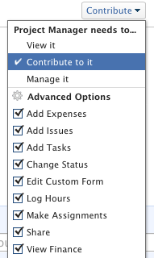

# Share a task in&nbsp;Adobe Workfront

Your Adobe Workfront administrator can grant you access to view or edit tasks when they assign access levels. For more information about granting access to tasks, see [Grant access to tasks](../../administration-and-setup/add-users/configure-and-grant-access/grant-access-tasks.md).

Along with the access level that users are granted, you can also grant them permissions to View, Contribute, or Manage specific tasks that you have access to share.

Permissions are specific to one item in Workfront and define what actions one can take on that item.

## Considerations when sharing a task

In addition to the considerations below, also see [Overview of sharing permissions on objects in Adobe Workfront](../../workfront-basics/grant-and-request-access-to-objects/sharing-permissions-on-objects-overview.md).

<ul> 
 <li>The creator of a task has Manage permissions to it, by default.</li> 
 <li>You can share tasks individually, or you can share several of them at a time, in bulk. Sharing tasks is identical to sharing other objects. For more information about sharing items in Workfront, see <a href="../../workfront-basics/grant-and-request-access-to-objects/share-an-object.md" class="MCXref xref">Share an object in Adobe Workfront</a>. </li> 
 <li> You can grant the following permissions to a task:&nbsp; 
  <ul> 
   <li>View</li> 
   <li>Manage</li> 
   <li>Contribute  </li> 
  </ul></li> 
 <li> 
When you share a task, users inherit the same permissions on all the children objects associated with the task, by default. For example, they inherit the same permissions on the children tasks, issues, and documents attached to the task.  For more information about the hierarchy of objects in Workfront, see&nbsp;<a href="../../workfront-basics/navigate-workfront/workfront-navigation/understand-objects.md" class="MCXref xref">Understand objects in Adobe Workfront</a>.
 
The Workfront administrator can specify whether documents should inherit permissions from higher objects in the user's access level. For more information about restricting inherited permissions on documents, see <a href="../../administration-and-setup/add-users/configure-and-grant-access/create-modify-access-levels.md" class="MCXref xref">Create or modify custom access levels</a>.
 </li> 
 <li>You can remove inherited permissions from a task. For more information about removing inherited permissions from objects, see&nbsp;<a href="../../workfront-basics/grant-and-request-access-to-objects/remove-permissions-from-objects.md" class="MCXref xref">Remove permissions from objects in Adobe Workfront</a>. </li> 
</ul>

## Ways to share a task

You can share a task in the following ways:

* Manually, either individually or in bulk. Manually sharing tasks is similar to sharing any other object in Workfront.

  For more information about sharing objects in Workfront, see&nbsp; [Share an object in Adobe Workfront](../../workfront-basics/grant-and-request-access-to-objects/share-an-object.md).

<ul> 
 <li> 
Automatically, by doing the following:
 
  <ul> 
   <li> 
Specify the permissions on any of the parent objects of the task: project, program, or portfolio. Tasks inherit the permissions from their parent objects. For information about viewing inherited permissions on objects, see <a href="../../workfront-basics/grant-and-request-access-to-objects/view-inherited-permissions-on-objects.md" class="MCXref xref">View inherited permissions on objects in Adobe Workfront</a>. 
 </li> 
   <li> 
Add entities to Project Sharing on a template used to create the project the task is on. For information about sharing projects from templates, see <a href="../../workfront-basics/grant-and-request-access-to-objects/share-a-template.md" class="MCXref xref">Sharing a template</a>. 
 </li> 
  </ul> 
  <ul> 
   <li> 
Specify the permissions on all tasks in a project when you edit the project.&nbsp;For information about managing the access to tasks on the project based on a user's permissions to the project, see the  section in the article <a href="../../manage-work/projects/manage-projects/edit-projects.md" class="MCXref xref">Edit projects</a>. 
 </li> 
  </ul> <note type="tip">
   If you don't specify what task permissions you want users to have when they are assigned to the tasks on the project, they receive the same permissions they have on the project, by default. 
  </note> </li> 
</ul>

## Task permissions

The following table displays what permissions you can grant users when allowing them to View, Contribute, or Manage a task:

<table border="2" cellspacing="15" cellpadding="1"> 
 <col> 
 <col> 
 <col> 
 <col> 
 <thead> 
  <tr> 
   <th>Action </th> 
   <th>Manage </th> 
   <th>Contribute </th> 
   <th>View </th> 
  </tr> 
 </thead> 
 <tbody> 
  <tr> 
   <td scope="row">Add Task(s)</td> 
   <td>✓</td> 
   <td>✓</td> 
   <td>&nbsp;</td> 
  </tr> 
  <tr> 
   <td scope="row">Add Predecessors</td> 
   <td>✓</td> 
   <td>&nbsp;</td> 
   <td>&nbsp;</td> 
  </tr> 
  <tr> 
   <td scope="row">Add Issue(s)</td> 
   <td>✓</td> 
   <td>✓</td> 
   <td>✓</td> 
  </tr> 
  <tr> 
   <td scope="row">Delete Task</td> 
   <td>✓</td> 
   <td>&nbsp;</td> 
   <td>&nbsp;</td> 
  </tr> 
  <tr> 
   <td scope="row"> 
General Task edit 
 </td> 
   <td>✓</td> 
   <td>✓</td> 
   <td>&nbsp;</td> 
  </tr> 
  <tr> 
   <td scope="row">Change Task Status</td> 
   <td>✓</td> 
   <td>✓</td> 
   <td>&nbsp;</td> 
  </tr> 
  <tr> 
   <td scope="row">Edit Task Constraint</td> 
   <td>✓</td> 
   <td>&nbsp;</td> 
   <td>&nbsp;</td> 
  </tr> 
  <tr> 
   <td scope="row">View Task</td> 
   <td>✓</td> 
   <td>✓</td> 
   <td>✓</td> 
  </tr> 
  <tr> 
   <td scope="row">Add Document(s)</td> 
   <td>✓</td> 
   <td>✓</td> 
   <td>✓</td> 
  </tr> 
  <tr> 
   <td scope="row">Copy Task*</td> 
   <td>✓</td> 
   <td>✓</td> 
   <td>✓</td> 
  </tr> 
  <tr> 
   <td scope="row">Move Task*</td> 
   <td>✓</td> 
   <td>&nbsp;</td> 
   <td>&nbsp;</td> 
  </tr> 
  <tr> 
   <td scope="row">Log Hours</td> 
   <td>✓</td> 
   <td>✓</td> 
   <td>&nbsp;</td> 
  </tr> 
  <tr> 
   <td scope="row">Modify Planned Dates</td> 
   <td>✓</td> 
   <td>&nbsp;</td> 
   <td>&nbsp;</td> 
  </tr> 
  <tr> 
   <td scope="row">Accept Assignment</td> 
   <td>✓</td> 
   <td>✓</td> 
   <td>&nbsp;</td> 
  </tr> 
  <tr> 
   <td scope="row">Make an Assignment</td> 
   <td>✓</td> 
   <td>✓</td> 
   <td>&nbsp;</td> 
  </tr> 
  <tr> 
   <td scope="row">Attach Custom Form</td> 
   <td>✓</td> 
   <td>&nbsp;</td> 
   <td>&nbsp;</td> 
  </tr> 
  <tr> 
   <td scope="row">Edit Custom Fields</td> 
   <td>✓</td> 
   <td>✓</td> 
   <td>&nbsp;</td> 
  </tr> 
  <tr> 
   <td scope="row">Create an Approval Process</td> 
   <td>✓</td> 
   <td>&nbsp;</td> 
   <td>&nbsp;</td> 
  </tr> 
  <tr> 
   <td scope="row">Approve A Task</td> 
   <td>✓</td> 
   <td>✓</td> 
   <td>✓</td> 
  </tr> 
  <tr> 
   <td scope="row">Edit Finance*</td> 
   <td>✓</td> 
   <td>&nbsp;</td> 
   <td>&nbsp;</td> 
  </tr> 
  <tr> 
   <td scope="row">Add/Edit Expenses</td> 
   <td>✓</td> 
   <td>✓</td> 
   <td>&nbsp;</td> 
  </tr> 
  <tr> 
   <td scope="row">View Finance</td> 
   <td>✓</td> 
   <td>✓</td> 
   <td>✓</td> 
  </tr> 
  <tr> 
   <td scope="row">Updates/Comments</td> 
   <td>✓</td> 
   <td>✓</td> 
   <td>✓</td> 
  </tr> 
  <tr> 
   <td scope="row">Share</td> 
   <td>✓</td> 
   <td>✓</td> 
   <td>✓</td> 
  </tr> 
  <tr> 
   <td scope="row">Share System-wide</td> 
   <td>&nbsp;</td> 
   <td>&nbsp;</td> 
   <td>✓</td> 
  </tr> 
 </tbody> 
</table>

&#42;Controlled by access level and the permissions on the project.
